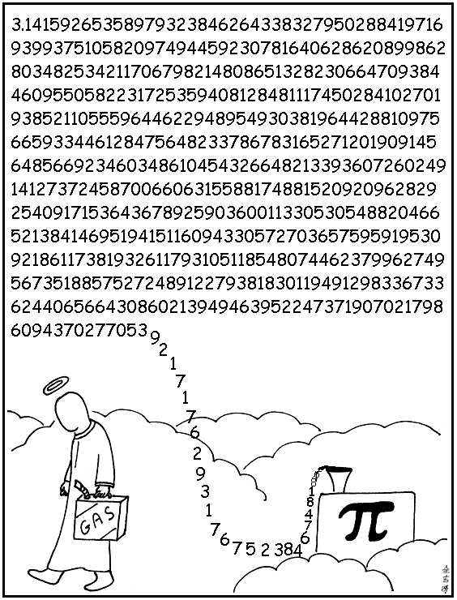

# Abstruse Goose Comic 216
## 3.141592653589793...

### Comment
Restate my assumptions: 1. Mathematics is the language of nature. 2. Everything around us can be represented and understood through numbers. 3. If you graph the numbers of any system, blah blah blah...
