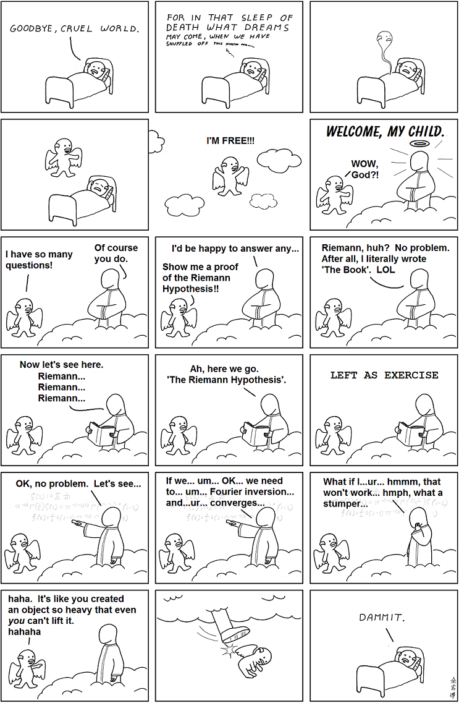

# Abstruse Goose Comic 395
## Proofs from THE BOOK

### Comment
...The danger already exists that mathematicians have made a covenant with the devil to darken the spirit and confine man in the bonds of Hell. ---St. Augustine
