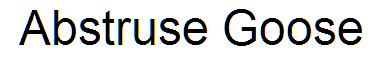

# Abstruse-Goose

In 2023 the [Abstruse Goose](https://abstrusegoose.com/) website went offline.
It hosted at the end 512 comics which were [XKCD](https://xkcd.com/) like.

This repository contains a mirror of the comics that were available on
the website around the time of the shutdown.
Another archive can still be found on the [Wayback Machine](https://web.archive.org/web/20230326160103/https://abstrusegoose.com/).

I cannot name the original authors as they are not known and the website does not 
contain any contact information.

# License

This work is licensed under the Creative Commons Attribution-NonCommercial 3.0 United States License. To view a copy of this license, visit http://creativecommons.org/licenses/by-nc/3.0/us/ or send a letter to Creative Commons, PO Box 1866, Mountain View, CA 94042, USA.

# Comics
 