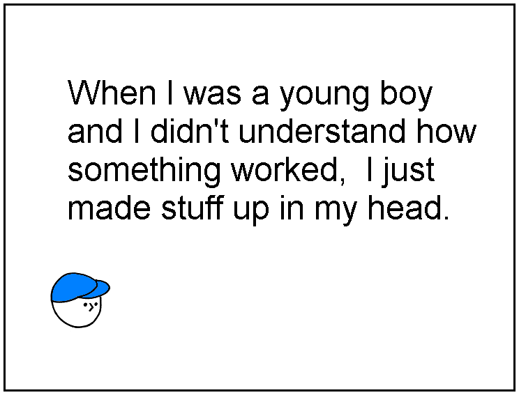
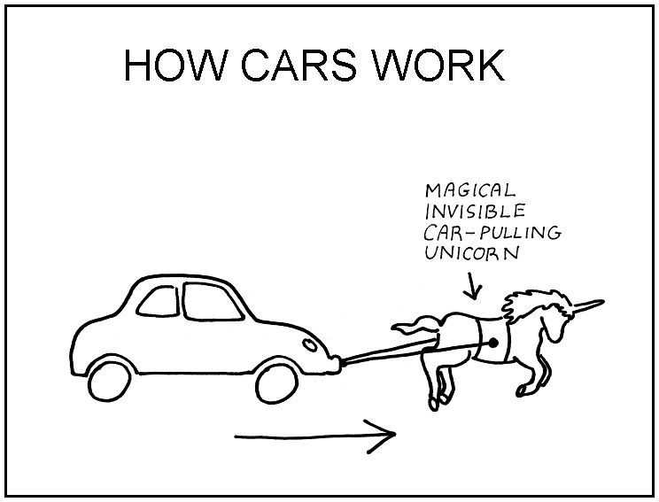
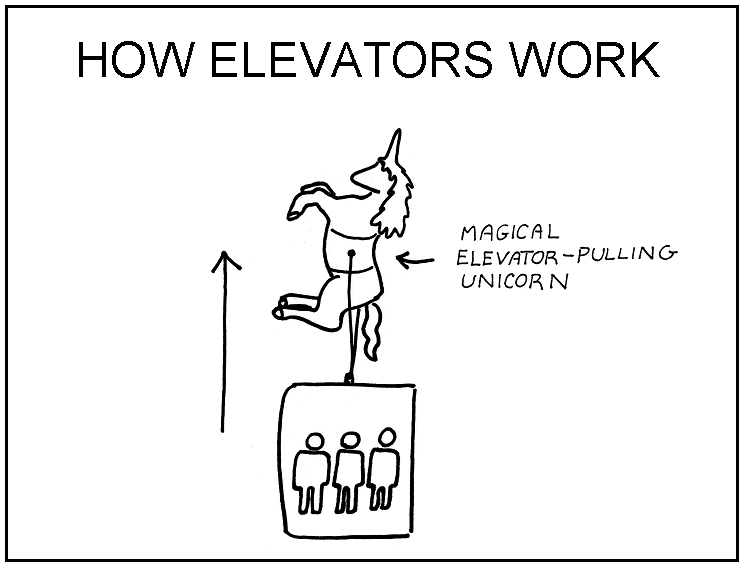
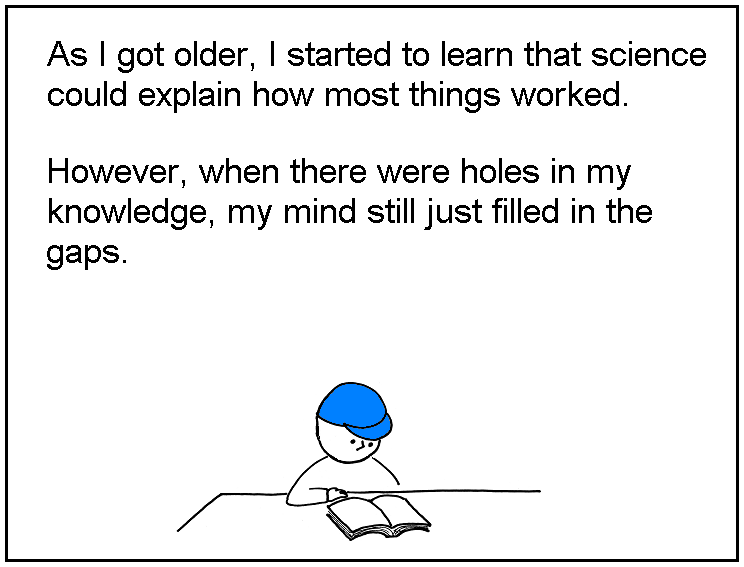
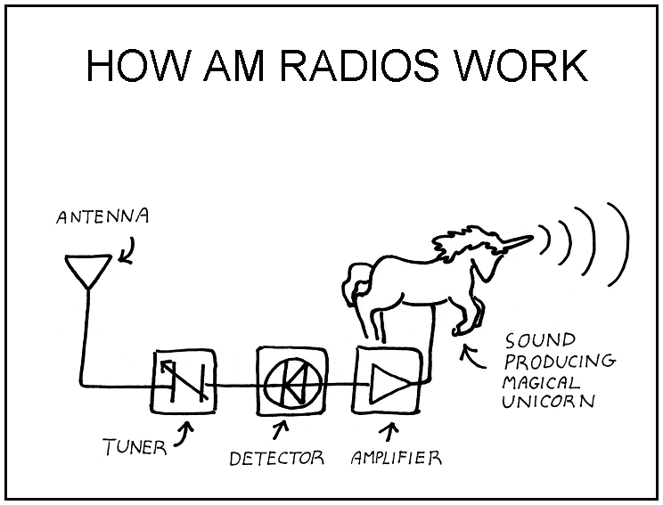
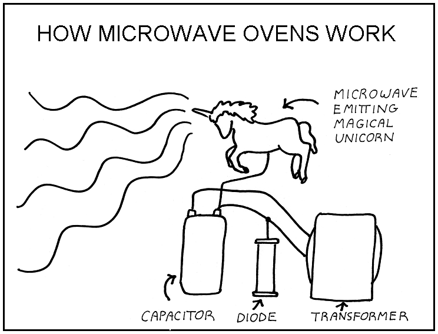
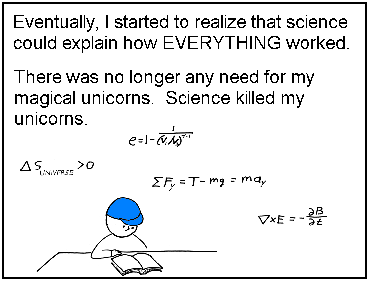
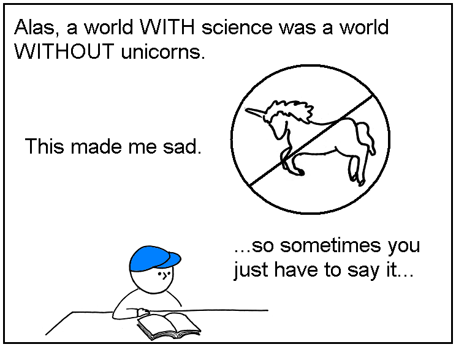
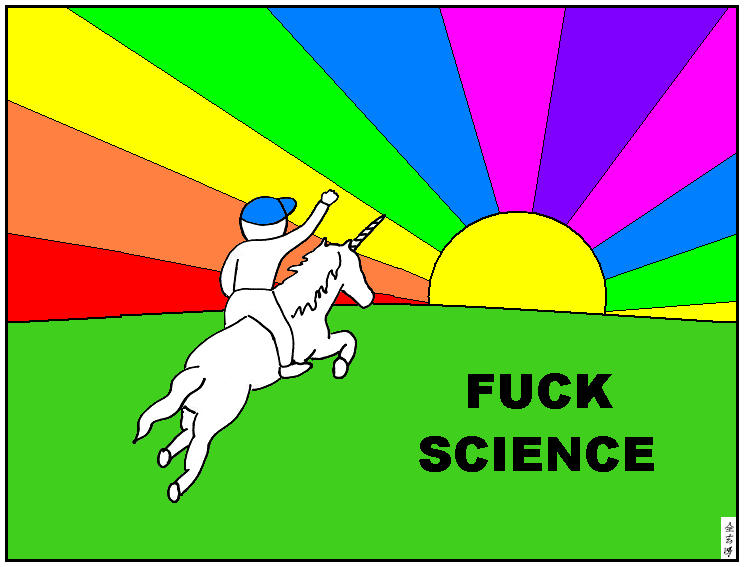

# Abstruse Goose Comic 120
## How Stuff Works

#### THE END
AND IN OTHER NEWS:

What do physicists do during their time off?

Why, they read Abstruse Goose, of course.

FOR EXAMPLE:

I've been a big fan of the [Cosmic Variance](https://web.archive.org/web/20110730073205/http://blogs.discovermagazine.com/cosmicvariance/) blog for years,

so I was pleased to learn that [JoAnne gave me a mention](https://web.archive.org/web/20110730073205/http://blogs.discovermagazine.com/cosmicvariance/2009/02/18/letter-to-the-higgs/) the other day.

I also got a [shout out from Julianne](https://web.archive.org/web/20110730073205/http://cosmicvariance.com/2008/10/06/web-comics/) a while back. Thanks, Julianne.

...and how many web cartoonists can claim the dubious honor of

having had one of their cartoon characters gettin' totally spanked by Luboš Motl? :)

### Comment
u better click me if you know what's good for ya.
