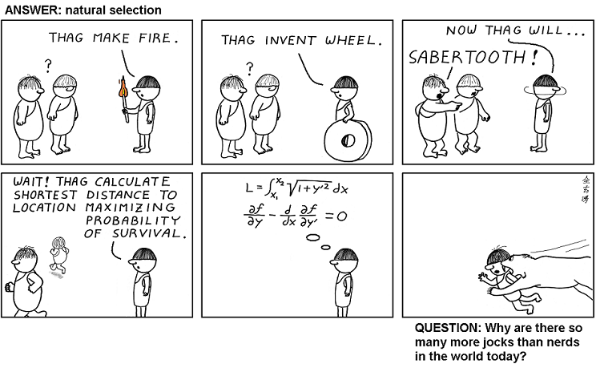

# Abstruse Goose Comic 231
## 30,000 BC

### Comment
Our brains didn't evolve to allow us to do higher mathematics.  That ability came only after our alien overlords genetically engineered us that way.
