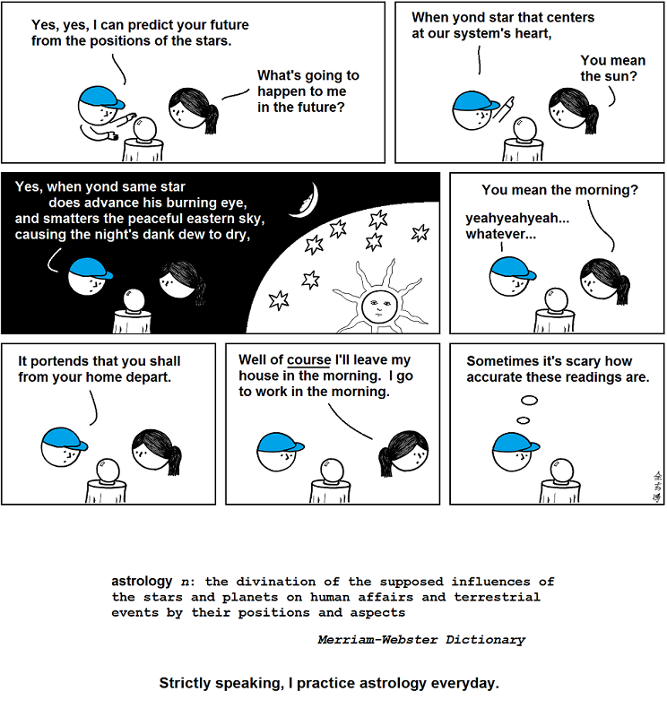

# Abstruse Goose Comic 519
## in the stars

### Comment
Brahe's observations of the motions of the planets lead to Kepler's laws of planetary motion which eventually lead to Newton's laws of motion and universal gravitation which eventually lead to our landing on the moon.  The motions of the planets indeed influence human affairs.  Astrology is for real!
