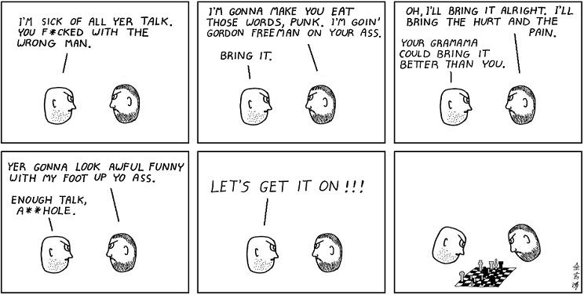

# Abstruse Goose Comic 1
## Convergent Subsequence

# Abstruse Goose Comic 3
## SETI Finally Receives a Signal

# Abstruse Goose Comic 4
## LOLCAT Backlash

# Abstruse Goose Comic 5
## There is No Spoon

# Abstruse Goose Comic 6
## Schrödinger's Infinitesimal Miscalculation

# Abstruse Goose Comic 7
## Schrödinger's Miscalculation - Part 2

# Abstruse Goose Comic 8
## Arguing With a String Theorist

# Abstruse Goose Comic 9
## Blind Date

# Abstruse Goose Comic 10
## The Red Button

# Abstruse Goose Comic 11
## Ubuntu Sucks

# Abstruse Goose Comic 12
## Math Text

# Abstruse Goose Comic 13
## Ask Me Why

# Abstruse Goose Comic 14
## I Never

# Abstruse Goose Comic 15
## The Opportunist

# Abstruse Goose Comic 16
## dckx

# Abstruse Goose Comic 17
## The Birth of ENIAC

# Abstruse Goose Comic 18
## I.I. Rabi's Question Answered?

# Abstruse Goose Comic 21
## Life Imitates Art

# Abstruse Goose Comic 23
## Pi

### Comment
If you don't already, you really should eat <a href="https://web.archive.org/web/20180130190030/http://www.toothpastefordinner.com/031208/how-many-digits-of-pi-do-you-know.gif" target="_blank">toothpaste for dinner</a> everyday.
# Abstruse Goose Comic 24
## Out of the Closet

# Abstruse Goose Comic 26
## Calc-zilla

### Comment
The union of the mathematician with the poet,

fervor with measure,

passion with correctness,

this surely is the ideal.

--William James, <em>Collected Essays</em>
# Abstruse Goose Comic 27
## Secrets and Lies

### Comment
LO KPI FG ZWXXB, JSU RVKMVY YK QRQQWQY.

And Caesar Vigenère says: "Easy as pi."
# Abstruse Goose Comic 28
## Math vs Physics

# Abstruse Goose Comic 29
## NSFW

# Abstruse Goose Comic 30
## The Hottie

# Abstruse Goose Comic 31
## Veritas Vos Liberabit

### Comment
"Wait, wait, wait...  is this making fun of fundamentalist christians or scientists?... or both?... or neither?"
# Abstruse Goose Comic 33
## The Inequivalence Principle

### Comment
There then occurred to me the 'glücklichste Gedanke meines Lebens,' the happiest thought of my life,...
# Abstruse Goose Comic 34
## Blind Date - Part 2

# Abstruse Goose Comic 35
## Particle in a Box

### Comment
I've always felt sorry for that little guy.
# Abstruse Goose Comic 36
## An Elegant Weapon...

### Comment
...for a more civilized age.

[Battles] of the future are the [battles] of the mind.

1. c4 e5  2. Nc3 Nc6  3. g3 f5  4. Bg2 Nf6  5. d3 Bc5  6. e3 f4  7. ef4 0-0  8. Nge2 Qe8  9. 0-0 d6  10. Na4 Bd4  11. Nd4 ed4  12. h3 h5  13. a3 a5  14. b3 Qg6  15. Nb2 Bf5  16. Qc2 Nd7  17. Re1 Nc5  18. Bf1 Ra6  19. Bd2 Rb6  20. Ba5 Rb3  21. Bd2 Ra8  22. a4 Ra6  23. a5 Kh7  24. Red1 b6  25. Be1 ba5  26. Na4 Rd3  27. Bd3 Bd3  28. Qa2 Nb4  29. Qa3 Nc2  30. Qb2 Na1  31. Ra1 Na4  32. Ra4 Qe4  33. Ba5 ?????????

# Abstruse Goose Comic 37
## Closed Timelike Curveball

# Abstruse Goose Comic 38
## Best Friends

### Comment
It is easier to destroy than to create.
# Abstruse Goose Comic 39
## The Exception

# Abstruse Goose Comic 40
## LiveCommentJournal

# Abstruse Goose Comic 41
## Today I Learned That...

### Comment
Have a good weekend everyone.
# Abstruse Goose Comic 42
## So Many Questions

# Abstruse Goose Comic 43
## The Curve

### Comment
NOTE: This cartoon is based on a true story entirely fictional.
Any similarity between the student in the comic and my friend Ben
from analysis class is slightly exaggerated purely coincidental.
# Abstruse Goose Comic 44
## The Most Popular Girl in School

# Abstruse Goose Comic 45
## I never lose this game

### Comment
I bet I can make you cringe.
# Abstruse Goose Comic 47
## A Wise Man Once Said...

### Comment
NOTE: Sorry.  No ST:TNG reference for comic #47.  Time to revoke my Trekkie license.
# Abstruse Goose Comic 48
## It could've been worse

# Abstruse Goose Comic 49
## Dear CERN

### Comment
You have been warned.
