# Abstruse Goose Comic 100
## The Pantheon

### Comment
Getting rid of a delusion makes us wiser than getting hold of a truth but no man is happy without a delusion of some kind.
# Abstruse Goose Comic 101
## some advice...

# Abstruse Goose Comic 102
## 10 Kinds of People

# Abstruse Goose Comic 103
## Father Knows Best

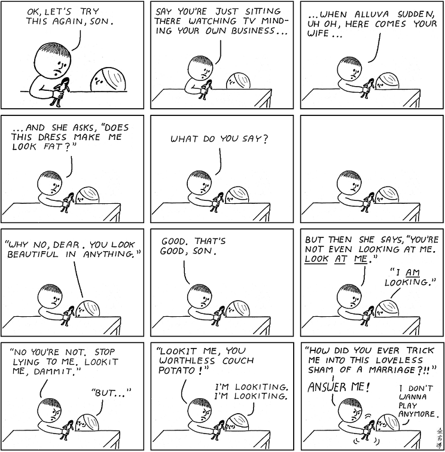
# Abstruse Goose Comic 104
## Do you believe in God?

### Comment
Learn Happiness.
# Abstruse Goose Comic 105
## Pure Mathematics

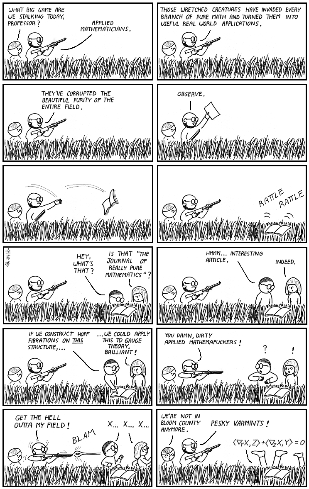
# Abstruse Goose Comic 106
## Lie of Omission - Part 2

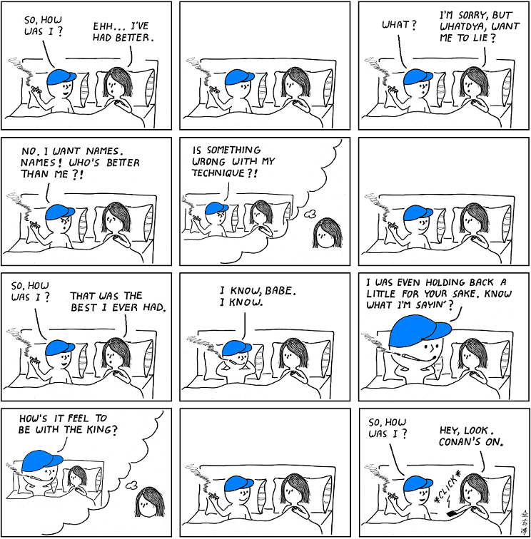
### Comment
Sorry, guys, but <a href="https://web.archive.org/web/20180119002518/http://abstrusegoose.com/99"><strong>I have sinned</strong></a> and this is my penance.
# Abstruse Goose Comic 107
## Practical Zen

### Comment
One windy day two monks were arguing about a flapping flag.

The first said, "I say the flag is moving, not the wind."  The

second said, "I say the wind is moving, not the flag."  A third

monk passed by and said, "The wind is not moving.  The

flag is not moving.  Your <em>minds</em> are moving."

--- Zen koan

# Abstruse Goose Comic 108
## The Secret Lives of Photons

### Comment
I feel Lorentz violated.
# Abstruse Goose Comic 109
## Unwritten

### Comment

Just for the record,

I will be at the <a href="https://web.archive.org/web/20180119012957/http://abstrusegoose.com/secretarchives/i-waited-all-day" target="_blank"><strong>Starbucks on the corner of 34th and Walnut</strong></a>

in Philadelphia tomorrow around 7-ish.

Just thought I'd throw that out there.

<strong>EDIT:</strong> Before there's any misunderstanding, I should probably say

that I will not actually be at the Starbucks... unless of course

you're the SnorgTees Girl... in which case I'll be sitting in the

far corner wearing a blue baseball cap reading the latest issue

of Wired... but not really.

# Abstruse Goose Comic 110
## Disclosure

### Comment
Help me!
# Abstruse Goose Comic 111
## Confession

### Comment

Once we have bitten the quantum apple,

our loss of innocence is permanent.

---R. Shankar,  <em>Principles of Quantum Mechanics</em>

# Abstruse Goose Comic 112
## At the Zoo

# Abstruse Goose Comic 113
## Alice and Bob

# Abstruse Goose Comic 114
## iScreener *

### Comment
...but remember, it goes both ways.
# Abstruse Goose Comic 115
## Is the Universe a Computer?

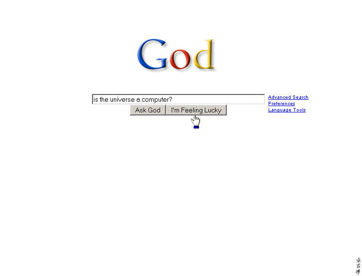
### Comment
are you feeling lucky?
# Abstruse Goose Comic 116
## date +%s

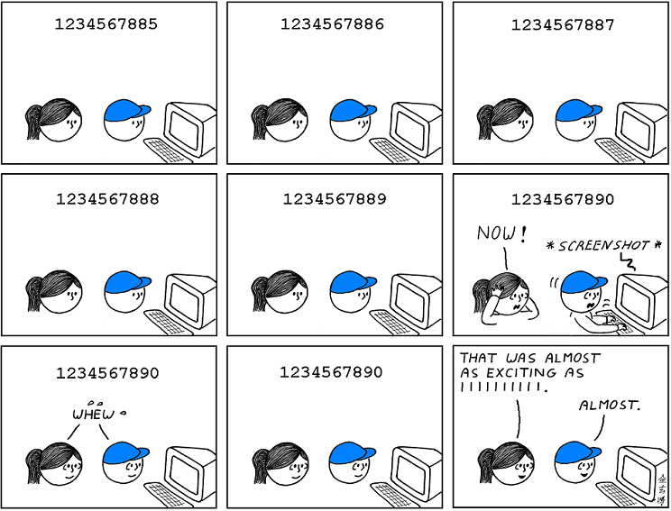
### Comment

How did <em>you</em> celebrate <a href="https://web.archive.org/web/20180125011927/http://coolepochcountdown.com/" target="_blank"><strong>when the time passed</strong></a>?

# Abstruse Goose Comic 117
## Countably Infinite

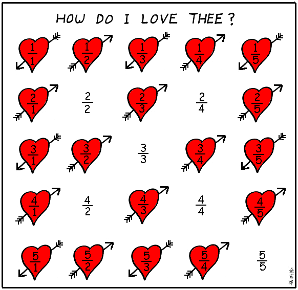
### Comment
I can count the ways.
# Abstruse Goose Comic 118
## Dear Higgs Boson

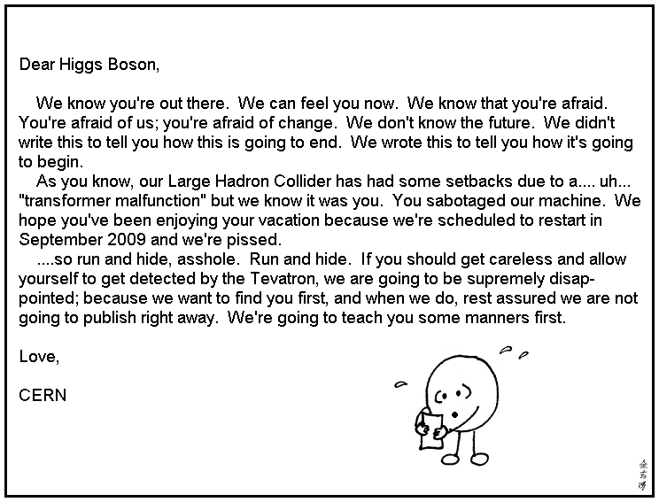
### Comment
It seemed <a href="https://web.archive.org/web/20171125134641/http://abstrusegoose.com/49" target="_blank">only fair</a>.
# Abstruse Goose Comic 119
## I know what you did last night

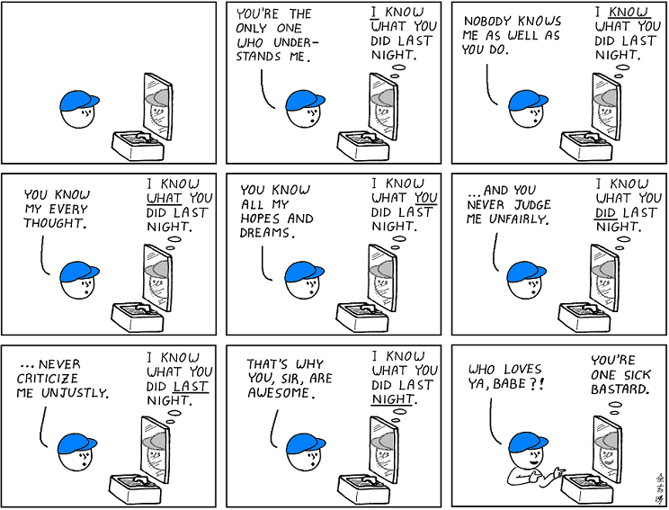
### Comment
What I did last night... had to be done.  I'm not saying I'm proud of it.
# Abstruse Goose Comic 120
## How Stuff Works

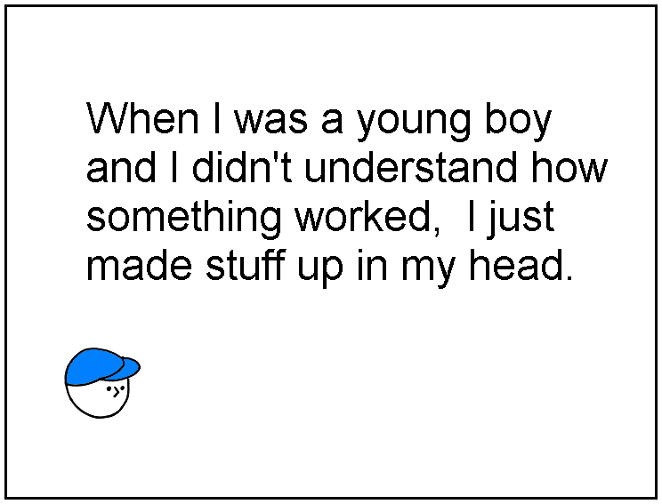
### Comment
u better click me if you know what's good for ya.
# Abstruse Goose Comic 121
## The Simply Connected Underwear Theorem

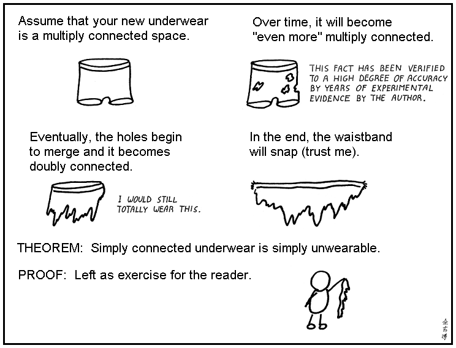
### Comment
Please do not email me about my abuse of mathematical terminology and lack of rigor or I will find you and compactify your ass.
# Abstruse Goose Comic 122
## Objective Observer

# Abstruse Goose Comic 123
## At the Bench

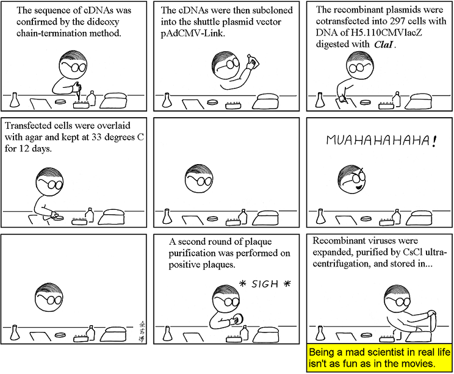
### Comment
Learn the real <a href="https://web.archive.org/web/20180130182856/http://cowbirdsinlove.com/46" target="_blank"><strong>truth about mad scientists</strong></a>.
# Abstruse Goose Comic 124
## A Beautiful Theorem

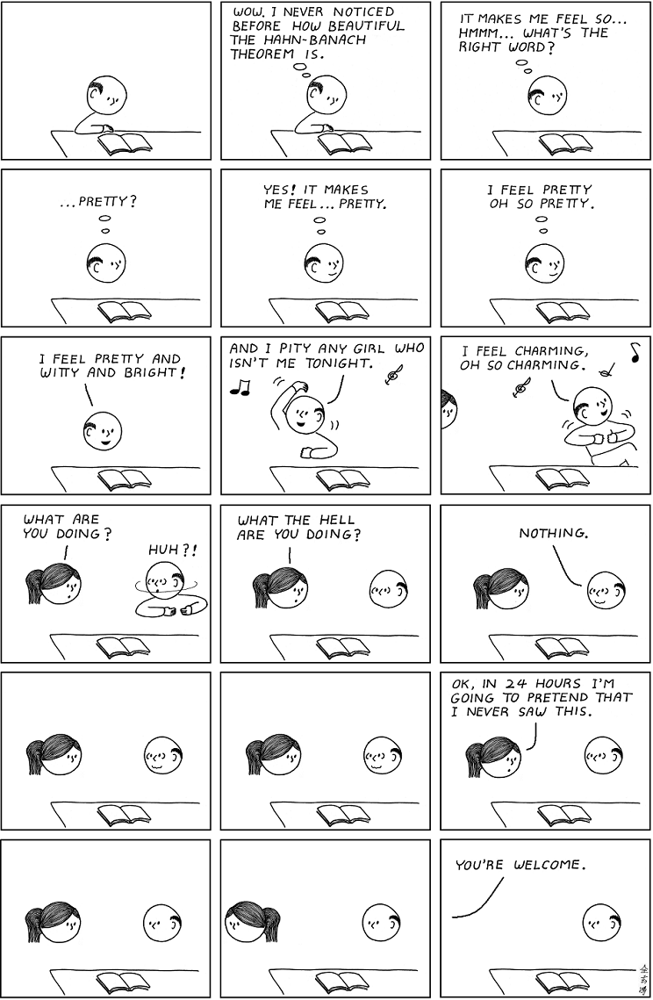
### Comment
I never get as excited about the Hahn-Banach theorem as this guy did, but sometimes the Gauss-Bonnet theorem makes me feel all tingly.
# Abstruse Goose Comic 125
## Gymnarchus niloticus

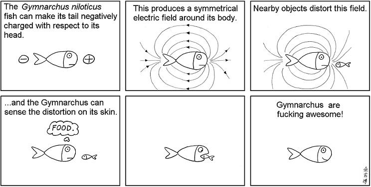
# Abstruse Goose Comic 126
## A Simple Puzzle 2

### Comment
EDIT: <a href="https://web.archive.org/web/20180125011804/http://abstrusegoose.com/secretarchives/a7427466391">solution</a>
# Abstruse Goose Comic 128
## Dear Physicists

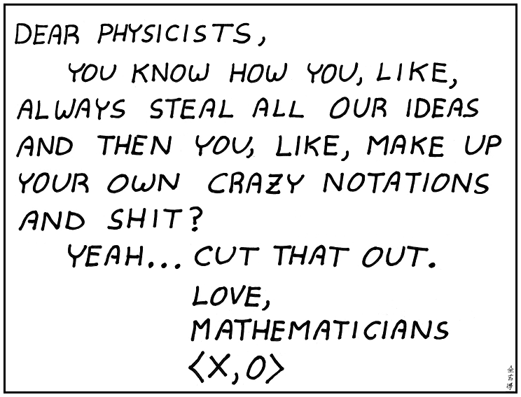
### Comment
Don't kill the messenger.
# Abstruse Goose Comic 129
## Dear Mathematicians

# Abstruse Goose Comic 130
## My Fellow Mathematicians and Physicists

# Abstruse Goose Comic 131
## War Stories

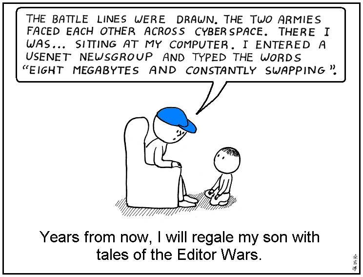
# Abstruse Goose Comic 132
## dis-disinhibition

### Comment

This one is dedicated to Courtney.
Don't worry.  The number of f*ckwads you attract is
directly proportional to your popularity... or so I've been told.

# Abstruse Goose Comic 133
## Zornaholic

### Comment

I had an algebra professor who couldn't go 3 days without using Zorn's Lemma.

Speaking of Zornaholics, <a href="https://web.archive.org/web/20180125012101/http://brownsharpie.courtneygibbons.org/?p=937" target="_blank"><strong>Courtney stole my blue hat</strong></a>,
the source of all my magical powers.

# Abstruse Goose Comic 134
## Message

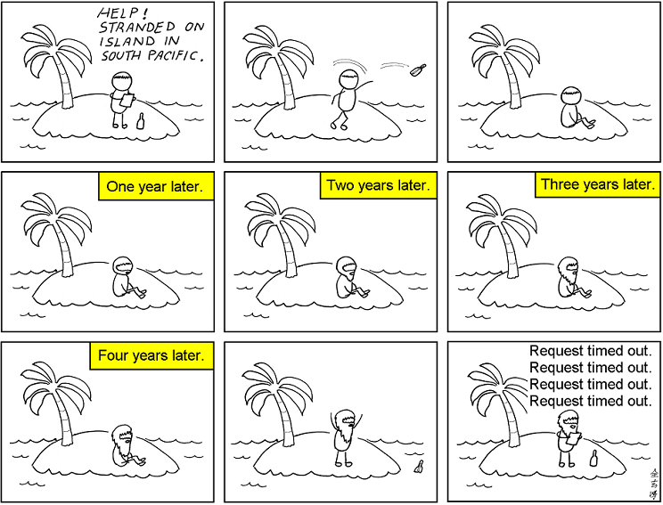
### Comment
ping!
# Abstruse Goose Comic 135
## My Million Dollar Idea

### Comment
Douglas Hofstadter would be proud.
# Abstruse Goose Comic 136
## Technical Assistance

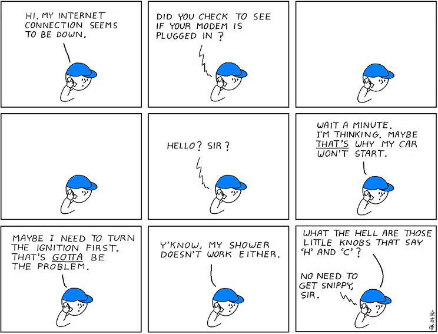
### Comment
Don't blame the customer service reps.  They're just doing their jobs... but the fact that they even ask that question means that sometimes THAT really IS the problem.
# Abstruse Goose Comic 137
## The String Theory Landscape

### Comment
Dontcha know?  April is national poetry month in the U.S. and Canada.
# Abstruse Goose Comic 138
## why are you reading this?

### Comment
Relax! The NSA isn't spying on you.  You're not that interesting.  EDIT 2013: Never mind.
# Abstruse Goose Comic 139
## A Simple Puzzle 3

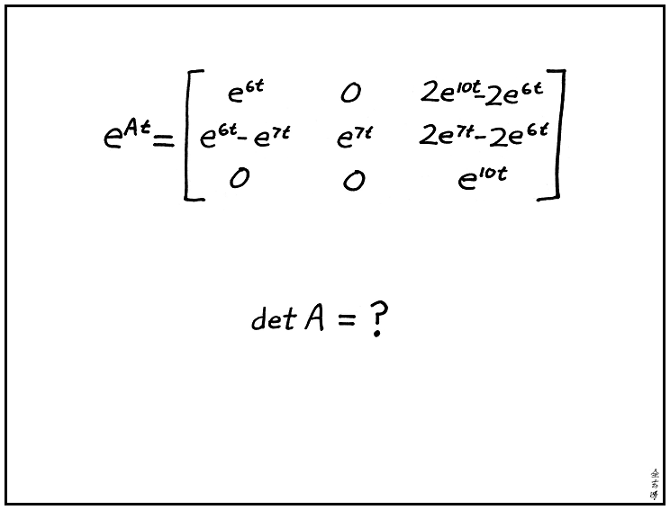
### Comment
OK, now this one is due to Boris.  Thanks, Boris.

<strong>EDIT:</strong> <a href="https://web.archive.org/web/20171127172147/http://abstrusegoose.com/doublesecretarchives/p3s.pdf">solution</a>

# Abstruse Goose Comic 140
## Friends

# Abstruse Goose Comic 141
## Cross

### Comment

How quickly can you do this in your head?

No cheating.  No printing out and no scissors.

<strong>EDIT:</strong> <strong><a href="https://web.archive.org/web/20171228152541/http://www.youtube.com/watch?v=6s6_A4ogm00" target="_blank" onclick="javascript: pageTracker._trackPageview('/outgoing/cube');">This</a></strong> is kinda cool.  Thanks, Joshua.

# Abstruse Goose Comic 142
## Life Path Integral

### Comment
The tricky part is calculating the Lagrangian.
# Abstruse Goose Comic 143
## Enter the Mathematician

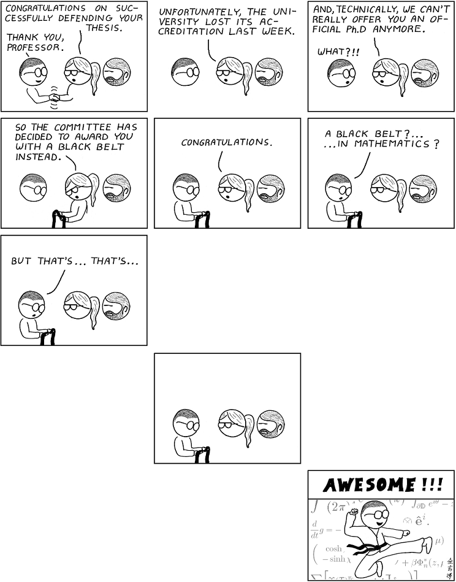
### Comment
Professor Strang has taught you well,,... but you're not a mathematician... yet.
# Abstruse Goose Comic 144
## Leibniz and Newton

### Comment
Discuss.
# Abstruse Goose Comic 146
## Touriste Amèricain

### Comment
Oui, je suis coupable de cela.  Il s'agit d'une histoire vraie.
# Abstruse Goose Comic 147
## Blueprint

### Comment
I'm a simple man. The Beowulf cluster is optional.
# Abstruse Goose Comic 148
## The Game

### Comment
The porcelain iguana incident was... unpleasant.  I'm not ready to talk about it yet.
# Abstruse Goose Comic 100
## The Pantheon

### Comment
Getting rid of a delusion makes us wiser than getting hold of a truth but no man is happy without a delusion of some kind.
# Abstruse Goose Comic 101
## some advice...

# Abstruse Goose Comic 102
## 10 Kinds of People

# Abstruse Goose Comic 103
## Father Knows Best

# Abstruse Goose Comic 104
## Do you believe in God?

### Comment
Learn Happiness.
# Abstruse Goose Comic 105
## Pure Mathematics

# Abstruse Goose Comic 106
## Lie of Omission - Part 2

### Comment
Sorry, guys, but <a href="https://web.archive.org/web/20180119002518/http://abstrusegoose.com/99"><strong>I have sinned</strong></a> and this is my penance.
# Abstruse Goose Comic 107
## Practical Zen

### Comment
One windy day two monks were arguing about a flapping flag.

The first said, "I say the flag is moving, not the wind."  The

second said, "I say the wind is moving, not the flag."  A third

monk passed by and said, "The wind is not moving.  The

flag is not moving.  Your <em>minds</em> are moving."

--- Zen koan

# Abstruse Goose Comic 108
## The Secret Lives of Photons

### Comment
I feel Lorentz violated.
# Abstruse Goose Comic 109
## Unwritten

### Comment

Just for the record,

I will be at the <a href="https://web.archive.org/web/20180119012957/http://abstrusegoose.com/secretarchives/i-waited-all-day" target="_blank"><strong>Starbucks on the corner of 34th and Walnut</strong></a>

in Philadelphia tomorrow around 7-ish.

Just thought I'd throw that out there.

<strong>EDIT:</strong> Before there's any misunderstanding, I should probably say

that I will not actually be at the Starbucks... unless of course

you're the SnorgTees Girl... in which case I'll be sitting in the

far corner wearing a blue baseball cap reading the latest issue

of Wired... but not really.

# Abstruse Goose Comic 110
## Disclosure

### Comment
Help me!
# Abstruse Goose Comic 111
## Confession

### Comment

Once we have bitten the quantum apple,

our loss of innocence is permanent.

---R. Shankar,  <em>Principles of Quantum Mechanics</em>

# Abstruse Goose Comic 112
## At the Zoo

# Abstruse Goose Comic 113
## Alice and Bob

# Abstruse Goose Comic 114
## iScreener *

### Comment
...but remember, it goes both ways.
# Abstruse Goose Comic 115
## Is the Universe a Computer?

### Comment
are you feeling lucky?
# Abstruse Goose Comic 116
## date +%s

### Comment

How did <em>you</em> celebrate <a href="https://web.archive.org/web/20180125011927/http://coolepochcountdown.com/" target="_blank"><strong>when the time passed</strong></a>?

# Abstruse Goose Comic 117
## Countably Infinite

### Comment
I can count the ways.
# Abstruse Goose Comic 118
## Dear Higgs Boson

### Comment
It seemed <a href="https://web.archive.org/web/20171125134641/http://abstrusegoose.com/49" target="_blank">only fair</a>.
# Abstruse Goose Comic 119
## I know what you did last night

### Comment
What I did last night... had to be done.  I'm not saying I'm proud of it.
# Abstruse Goose Comic 120
## How Stuff Works

### Comment
u better click me if you know what's good for ya.
# Abstruse Goose Comic 121
## The Simply Connected Underwear Theorem

### Comment
Please do not email me about my abuse of mathematical terminology and lack of rigor or I will find you and compactify your ass.
# Abstruse Goose Comic 122
## Objective Observer

# Abstruse Goose Comic 123
## At the Bench

### Comment
Learn the real <a href="https://web.archive.org/web/20180130182856/http://cowbirdsinlove.com/46" target="_blank"><strong>truth about mad scientists</strong></a>.
# Abstruse Goose Comic 124
## A Beautiful Theorem

### Comment
I never get as excited about the Hahn-Banach theorem as this guy did, but sometimes the Gauss-Bonnet theorem makes me feel all tingly.
# Abstruse Goose Comic 125
## Gymnarchus niloticus

# Abstruse Goose Comic 126
## A Simple Puzzle 2

### Comment
EDIT: <a href="https://web.archive.org/web/20180125011804/http://abstrusegoose.com/secretarchives/a7427466391">solution</a>
# Abstruse Goose Comic 128
## Dear Physicists

### Comment
Don't kill the messenger.
# Abstruse Goose Comic 129
## Dear Mathematicians

# Abstruse Goose Comic 130
## My Fellow Mathematicians and Physicists

# Abstruse Goose Comic 131
## War Stories

# Abstruse Goose Comic 132
## dis-disinhibition

### Comment

This one is dedicated to Courtney.
Don't worry.  The number of f*ckwads you attract is
directly proportional to your popularity... or so I've been told.

# Abstruse Goose Comic 133
## Zornaholic

### Comment

I had an algebra professor who couldn't go 3 days without using Zorn's Lemma.

Speaking of Zornaholics, <a href="https://web.archive.org/web/20180125012101/http://brownsharpie.courtneygibbons.org/?p=937" target="_blank"><strong>Courtney stole my blue hat</strong></a>,
the source of all my magical powers.

# Abstruse Goose Comic 134
## Message

### Comment
ping!
# Abstruse Goose Comic 135
## My Million Dollar Idea

### Comment
Douglas Hofstadter would be proud.
# Abstruse Goose Comic 136
## Technical Assistance

### Comment
Don't blame the customer service reps.  They're just doing their jobs... but the fact that they even ask that question means that sometimes THAT really IS the problem.
# Abstruse Goose Comic 137
## The String Theory Landscape

### Comment
Dontcha know?  April is national poetry month in the U.S. and Canada.
# Abstruse Goose Comic 138
## why are you reading this?

### Comment
Relax! The NSA isn't spying on you.  You're not that interesting.  EDIT 2013: Never mind.
# Abstruse Goose Comic 139
## A Simple Puzzle 3

### Comment
OK, now this one is due to Boris.  Thanks, Boris.

<strong>EDIT:</strong> <a href="https://web.archive.org/web/20171127172147/http://abstrusegoose.com/doublesecretarchives/p3s.pdf">solution</a>

# Abstruse Goose Comic 140
## Friends

# Abstruse Goose Comic 141
## Cross

### Comment

How quickly can you do this in your head?

No cheating.  No printing out and no scissors.

<strong>EDIT:</strong> <strong><a href="https://web.archive.org/web/20171228152541/http://www.youtube.com/watch?v=6s6_A4ogm00" target="_blank" onclick="javascript: pageTracker._trackPageview('/outgoing/cube');">This</a></strong> is kinda cool.  Thanks, Joshua.

# Abstruse Goose Comic 142
## Life Path Integral

### Comment
The tricky part is calculating the Lagrangian.
# Abstruse Goose Comic 143
## Enter the Mathematician

### Comment
Professor Strang has taught you well,,... but you're not a mathematician... yet.
# Abstruse Goose Comic 144
## Leibniz and Newton

### Comment
Discuss.
# Abstruse Goose Comic 146
## Touriste Amèricain

### Comment
Oui, je suis coupable de cela.  Il s'agit d'une histoire vraie.
# Abstruse Goose Comic 147
## Blueprint

### Comment
I'm a simple man. The Beowulf cluster is optional.
# Abstruse Goose Comic 148
## The Game

### Comment
The porcelain iguana incident was... unpleasant.  I'm not ready to talk about it yet.
