# Abstruse Goose Comic 200
## for my last comic...

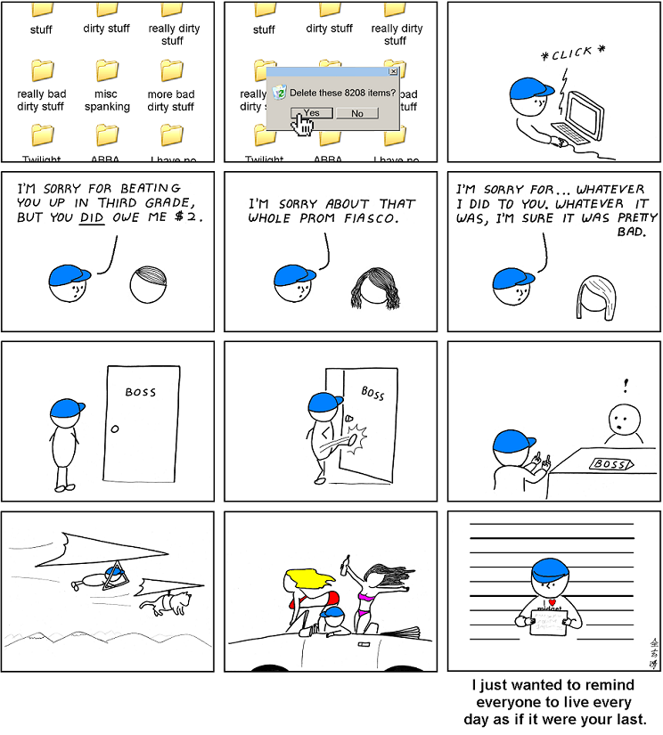
### Comment
At the very least, live every day as if it were Friday.  Have a great weekend.
# Abstruse Goose Comic 202
## processes

### Comment
Where the other 1 percent goes, nobody knows.
# Abstruse Goose Comic 203
## Lollipop

### Comment
But when you poke me, I feel violated.
# Abstruse Goose Comic 204
## Robots

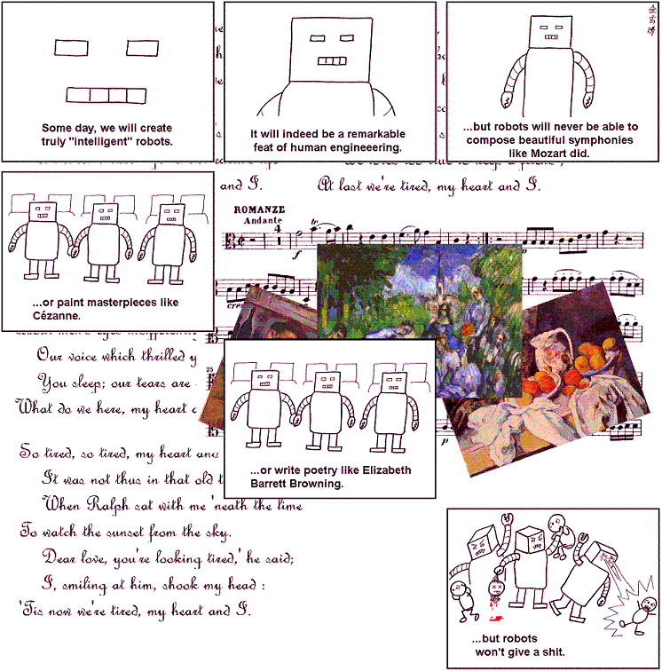
### Comment
Only the the first two panels are true.
# Abstruse Goose Comic 205
## Robots - part 2

### Comment
In order to destroy the one true enemy, you must destroy its place to exist.
# Abstruse Goose Comic 206
## Rite of Passage

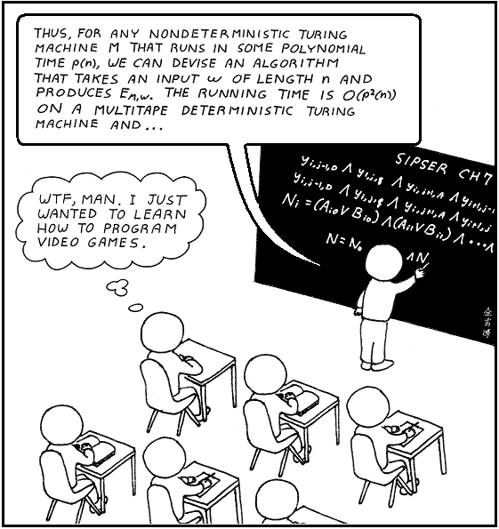
### Comment
You'd be surprised how many times the Cook-Levin theorem was used in making the Halo 3 Engine.
# Abstruse Goose Comic 207
## THERE ARE FOUR LIGHTS!!!

### Comment
How many of the episodes can you name?
# Abstruse Goose Comic 208
## Molecule

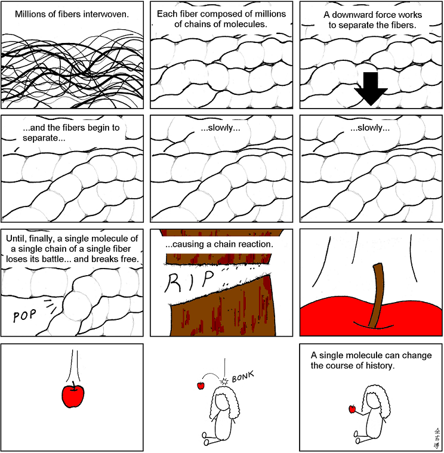
### Comment
Exaggeration for the sake of science is a crime, but exaggeration for the sake of entertainment is highly encouraged.
# Abstruse Goose Comic 209
## Law of Large Numbers

### Comment
FYI, there is a strong statistical correlation between RBIs and strikeouts.
# Abstruse Goose Comic 210
## We Give Up

### Comment
Experimental mathematics FTW.
# Abstruse Goose Comic 211
## Landscape

### Comment
Oh, I'm sorry.  You must have me confused with someone that gives a shit about your branch of mathematics.
# Abstruse Goose Comic 212
## The Quiet One

### Comment
Those who know don't speak.  Those who speak don't know.
# Abstruse Goose Comic 213
## HP R2-D2

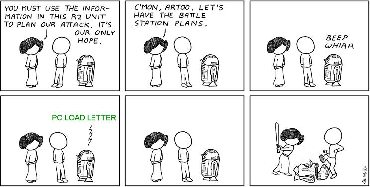
### Comment
The Hewlett Packard acquisition of Industrial Automaton had unforeseen consequences.
# Abstruse Goose Comic 215
## Artificial

### Comment
Artificial and a bit pretentious.
# Abstruse Goose Comic 216
## 3.141592653589793...

### Comment
Restate my assumptions: 1. Mathematics is the language of nature. 2. Everything around us can be represented and understood through numbers. 3. If you graph the numbers of any system, blah blah blah...
# Abstruse Goose Comic 217
## Penrose Chess

# Abstruse Goose Comic 218
## y=e^x

# Abstruse Goose Comic 219
## The Ultimate

### Comment
This could explain why I keep seeing penis monsters everywhere.
# Abstruse Goose Comic 220
## Good News

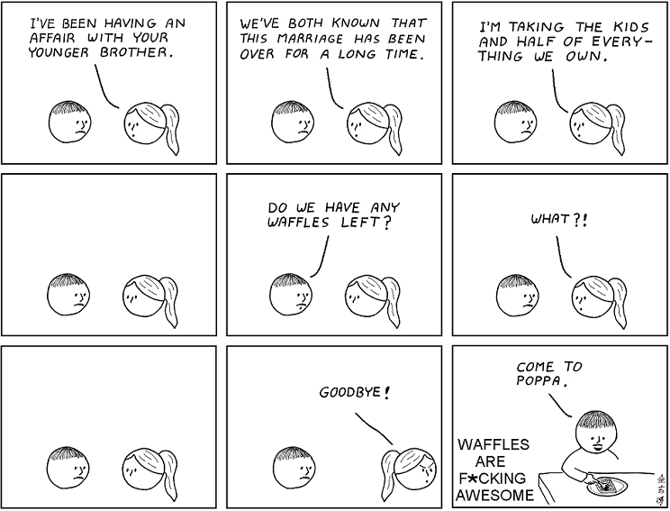
### Comment
...waffles are like pancakes with syrup traps. ---Mitch Hedberg
# Abstruse Goose Comic 221
## Truecolor

### Comment
I was always partial to Burnt Sienna (234, 126, 93).
# Abstruse Goose Comic 223
## Scandal

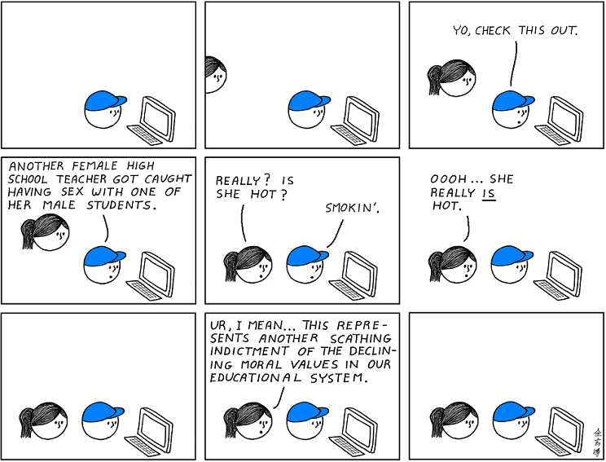
### Comment
I am appalled.
# Abstruse Goose Comic 224
## Target Demographic

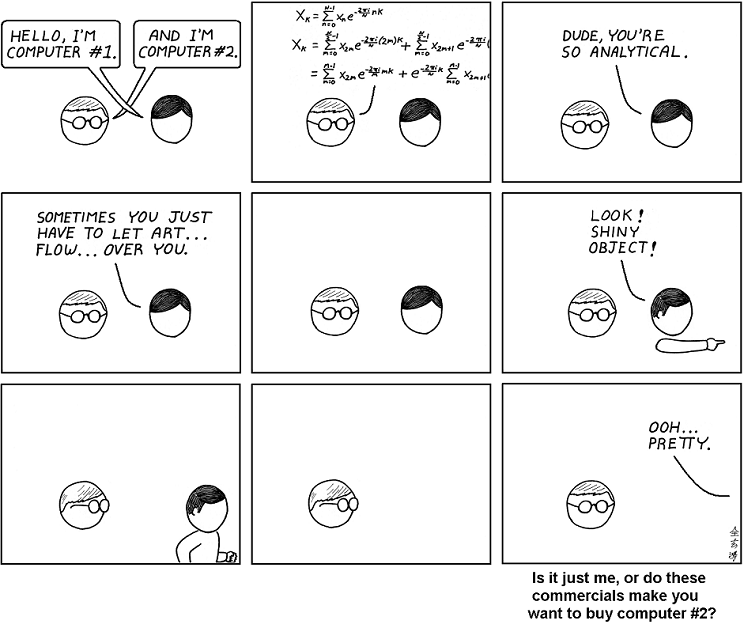
### Comment
As a part-time Mac user, I am highly offended by the implication of these commercials.
# Abstruse Goose Comic 225
## Nucleosynthesis

### Comment
For we have seen His star in the East and.. oh shit!!!
# Abstruse Goose Comic 227
## the FM

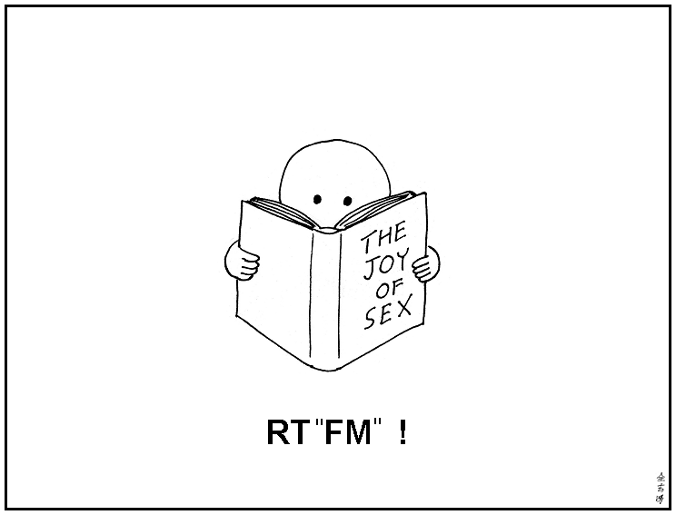
### Comment
What? There's a manual for that?
# Abstruse Goose Comic 228
## Future Light Cone

### Comment
May your future (light cone) be filled with, like, happiness and stuff.
# Abstruse Goose Comic 230
## Obvious

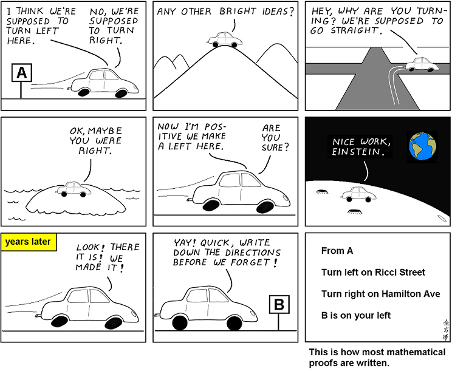
### Comment
After working on this proof for years, I have finally decided that it IS, in fact, obvious.
# Abstruse Goose Comic 231
## 30,000 BC

### Comment
Our brains didn't evolve to allow us to do higher mathematics.  That ability came only after our alien overlords genetically engineered us that way.
# Abstruse Goose Comic 232
## 30,001 BC

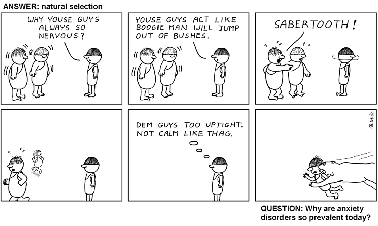
### Comment
Sometimes, when you experience anxiety, it just means that your Spidey senses be tinglin'.
# Abstruse Goose Comic 233
## reverse traceroute

# Abstruse Goose Comic 234
## A Love Story

# Abstruse Goose Comic 235
## The Creation

### Comment
God is not only stranger than we suppose, but stranger than we CAN suppose... or something like that.
# Abstruse Goose Comic 236
## Zoo

### Comment
So don't forget to thank your brothers and sisters today for being such morons all those years.
# Abstruse Goose Comic 237
## Line

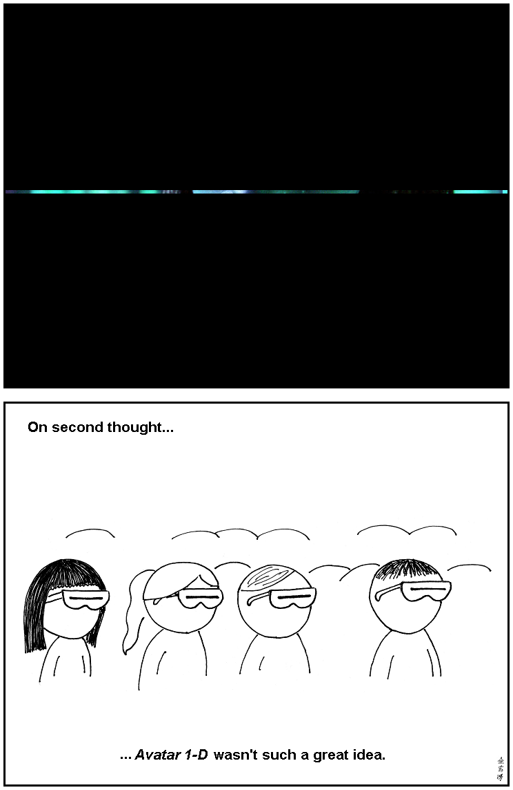
# Abstruse Goose Comic 238
## Rejecta Physica

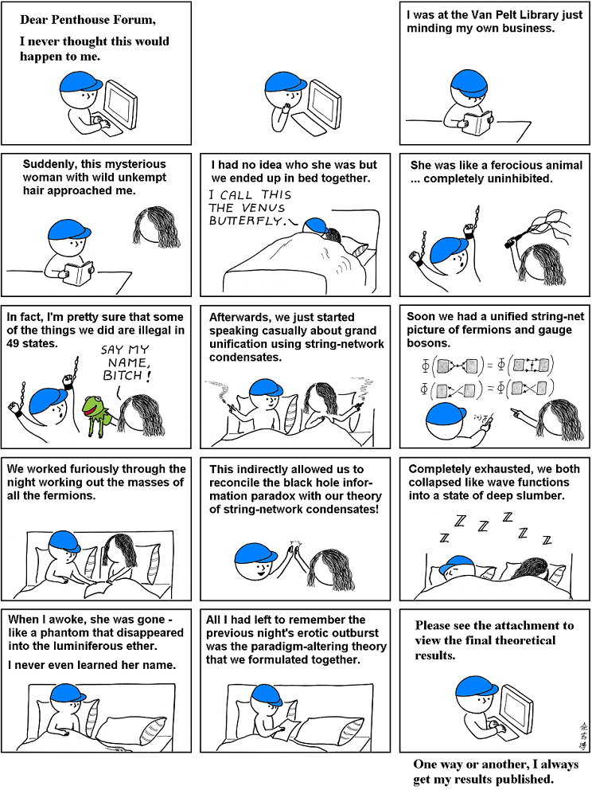
### Comment
FUN FACT: This is exactly how the Schrödinger equation was formulated.
# Abstruse Goose Comic 239
## Wall Street

### Comment
Blue Horseshoe loves Anacott Steel.
# Abstruse Goose Comic 240
## Many Worlds

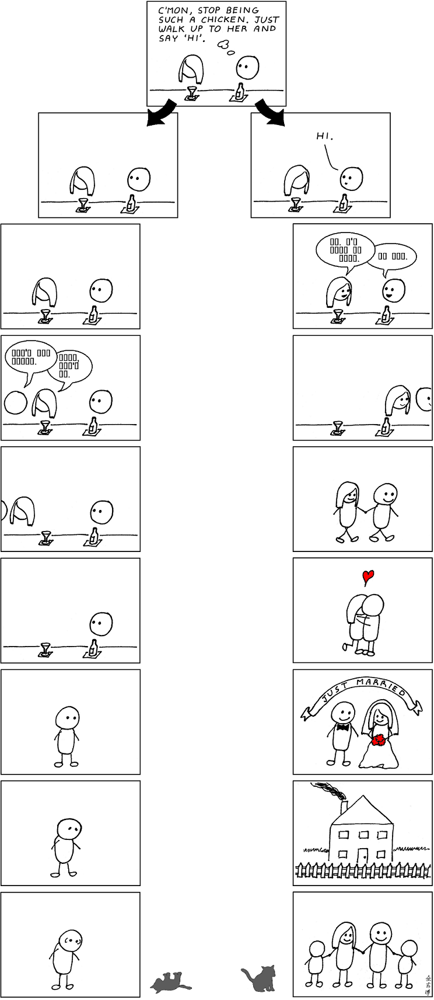
### Comment
TODAY'S FORECAST: Partly cloudy with a 90 percent chance of Imma be chickenshit.
# Abstruse Goose Comic 242
## Einstein's Love Equation

### Comment
Gravitation cannot be held responsible for people falling in love, but it can cause you to accidentally call someone fat.
# Abstruse Goose Comic 243
## Earth Ink

### Comment
This comic is not secretly about white people.
# Abstruse Goose Comic 244
## The Creation - part 2

### Comment
The following sentence is false.  The preceding sentence is true.
# Abstruse Goose Comic 245
## The Little Engine

### Comment
I think I'm channeling a little bit of Kris, Rob, Matt, and Dave.
# Abstruse Goose Comic 246
## Cute Baby

### Comment
To be fair, that guy's porn mustache ain't helping matters much.
# Abstruse Goose Comic 247
## Anatomy of a Traffic Jam

### Comment
...a level they reserve for people who make me late for work and for people who talk at the theater.
# Abstruse Goose Comic 248
## It's Like Magic

### Comment
We all have a magical genie and her name is compound interest.
# Abstruse Goose Comic 249
## How to Teach Yourself Programming

### Comment
hmmm.  There seems to be a common theme underlying my last two comics.
# Abstruse Goose Comic 200
## for my last comic...

### Comment
At the very least, live every day as if it were Friday.  Have a great weekend.
# Abstruse Goose Comic 202
## processes

### Comment
Where the other 1 percent goes, nobody knows.
# Abstruse Goose Comic 203
## Lollipop

### Comment
But when you poke me, I feel violated.
# Abstruse Goose Comic 204
## Robots

### Comment
Only the the first two panels are true.
# Abstruse Goose Comic 205
## Robots - part 2

### Comment
In order to destroy the one true enemy, you must destroy its place to exist.
# Abstruse Goose Comic 206
## Rite of Passage

### Comment
You'd be surprised how many times the Cook-Levin theorem was used in making the Halo 3 Engine.
# Abstruse Goose Comic 207
## THERE ARE FOUR LIGHTS!!!

### Comment
How many of the episodes can you name?
# Abstruse Goose Comic 208
## Molecule

### Comment
Exaggeration for the sake of science is a crime, but exaggeration for the sake of entertainment is highly encouraged.
# Abstruse Goose Comic 209
## Law of Large Numbers

### Comment
FYI, there is a strong statistical correlation between RBIs and strikeouts.
# Abstruse Goose Comic 210
## We Give Up

### Comment
Experimental mathematics FTW.
# Abstruse Goose Comic 211
## Landscape

### Comment
Oh, I'm sorry.  You must have me confused with someone that gives a shit about your branch of mathematics.
# Abstruse Goose Comic 212
## The Quiet One

### Comment
Those who know don't speak.  Those who speak don't know.
# Abstruse Goose Comic 213
## HP R2-D2

### Comment
The Hewlett Packard acquisition of Industrial Automaton had unforeseen consequences.
# Abstruse Goose Comic 215
## Artificial

### Comment
Artificial and a bit pretentious.
# Abstruse Goose Comic 216
## 3.141592653589793...

### Comment
Restate my assumptions: 1. Mathematics is the language of nature. 2. Everything around us can be represented and understood through numbers. 3. If you graph the numbers of any system, blah blah blah...
# Abstruse Goose Comic 217
## Penrose Chess

# Abstruse Goose Comic 218
## y=e^x

# Abstruse Goose Comic 219
## The Ultimate

### Comment
This could explain why I keep seeing penis monsters everywhere.
# Abstruse Goose Comic 220
## Good News

### Comment
...waffles are like pancakes with syrup traps. ---Mitch Hedberg
# Abstruse Goose Comic 221
## Truecolor

### Comment
I was always partial to Burnt Sienna (234, 126, 93).
# Abstruse Goose Comic 223
## Scandal

### Comment
I am appalled.
# Abstruse Goose Comic 224
## Target Demographic

### Comment
As a part-time Mac user, I am highly offended by the implication of these commercials.
# Abstruse Goose Comic 225
## Nucleosynthesis

### Comment
For we have seen His star in the East and.. oh shit!!!
# Abstruse Goose Comic 227
## the FM

### Comment
What? There's a manual for that?
# Abstruse Goose Comic 228
## Future Light Cone

### Comment
May your future (light cone) be filled with, like, happiness and stuff.
# Abstruse Goose Comic 230
## Obvious

### Comment
After working on this proof for years, I have finally decided that it IS, in fact, obvious.
# Abstruse Goose Comic 231
## 30,000 BC

### Comment
Our brains didn't evolve to allow us to do higher mathematics.  That ability came only after our alien overlords genetically engineered us that way.
# Abstruse Goose Comic 232
## 30,001 BC

### Comment
Sometimes, when you experience anxiety, it just means that your Spidey senses be tinglin'.
# Abstruse Goose Comic 233
## reverse traceroute

# Abstruse Goose Comic 234
## A Love Story

# Abstruse Goose Comic 235
## The Creation

### Comment
God is not only stranger than we suppose, but stranger than we CAN suppose... or something like that.
# Abstruse Goose Comic 236
## Zoo

### Comment
So don't forget to thank your brothers and sisters today for being such morons all those years.
# Abstruse Goose Comic 237
## Line

# Abstruse Goose Comic 238
## Rejecta Physica

### Comment
FUN FACT: This is exactly how the Schrödinger equation was formulated.
# Abstruse Goose Comic 239
## Wall Street

### Comment
Blue Horseshoe loves Anacott Steel.
# Abstruse Goose Comic 240
## Many Worlds

### Comment
TODAY'S FORECAST: Partly cloudy with a 90 percent chance of Imma be chickenshit.
# Abstruse Goose Comic 242
## Einstein's Love Equation

### Comment
Gravitation cannot be held responsible for people falling in love, but it can cause you to accidentally call someone fat.
# Abstruse Goose Comic 243
## Earth Ink

### Comment
This comic is not secretly about white people.
# Abstruse Goose Comic 244
## The Creation - part 2

### Comment
The following sentence is false.  The preceding sentence is true.
# Abstruse Goose Comic 245
## The Little Engine

### Comment
I think I'm channeling a little bit of Kris, Rob, Matt, and Dave.
# Abstruse Goose Comic 246
## Cute Baby

### Comment
To be fair, that guy's porn mustache ain't helping matters much.
# Abstruse Goose Comic 247
## Anatomy of a Traffic Jam

### Comment
...a level they reserve for people who make me late for work and for people who talk at the theater.
# Abstruse Goose Comic 248
## It's Like Magic

### Comment
We all have a magical genie and her name is compound interest.
# Abstruse Goose Comic 249
## How to Teach Yourself Programming

### Comment
hmmm.  There seems to be a common theme underlying my last two comics.
