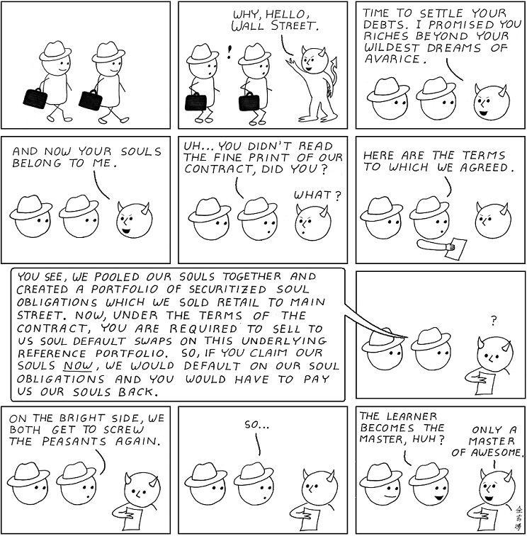
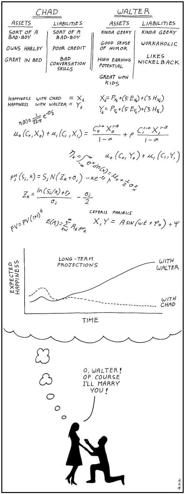
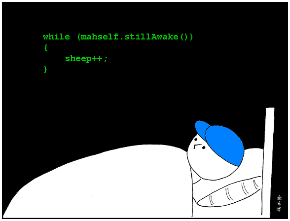
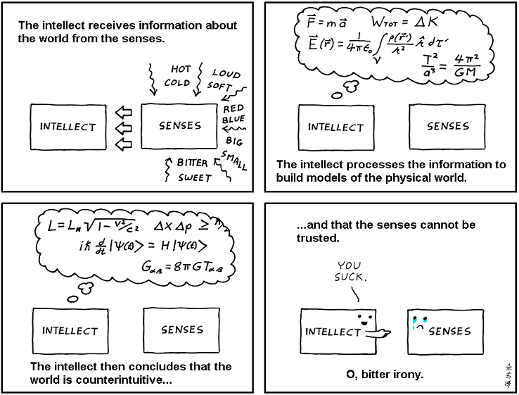
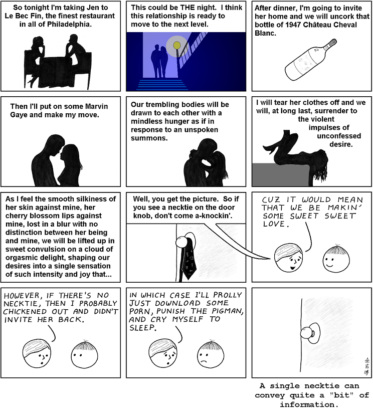
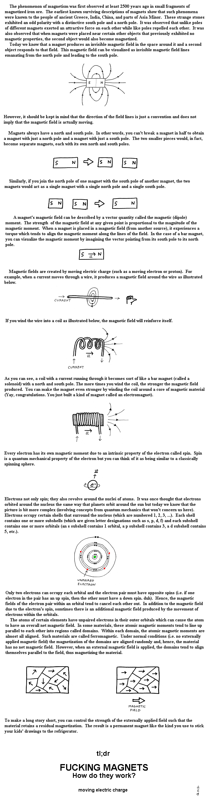
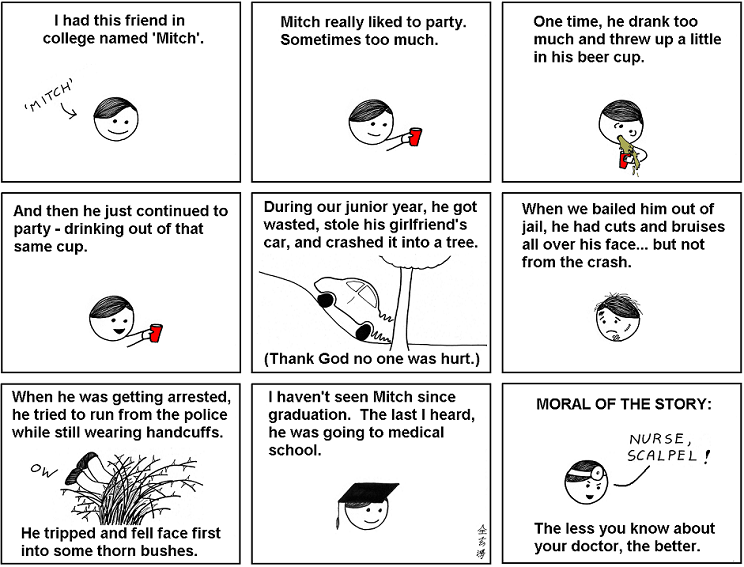
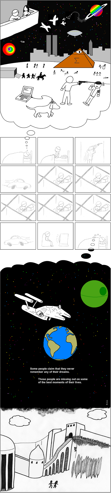
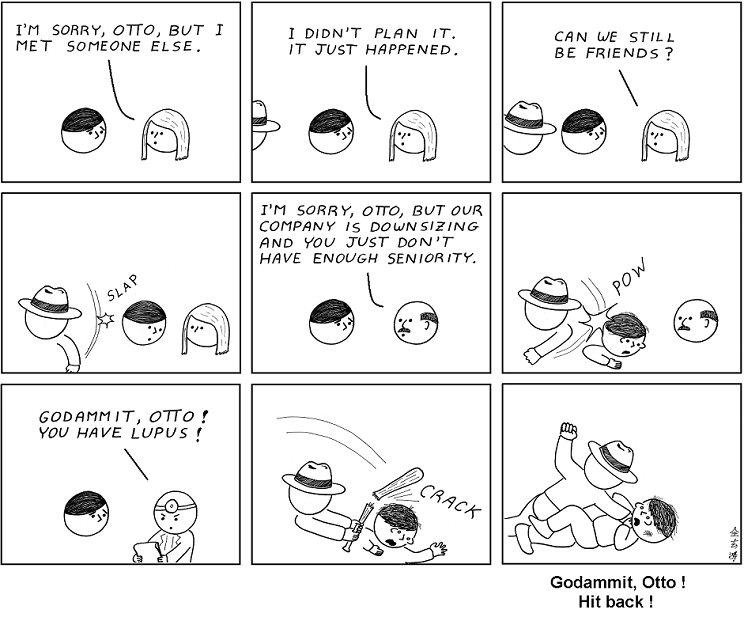

# Abstruse Goose Comic 250
## Reasonable Expectation

### Comment
Big deal.  You can get all that information from my Facebook and Twitter accounts anyway.
# Abstruse Goose Comic 251
## all I see is code

### Comment
Jack IN to jack... never mind.
# Abstruse Goose Comic 253
## Wizards

### Comment
Back off, man.  I'm a topologist.
# Abstruse Goose Comic 254
## Wizards - part 2

### Comment
Any sufficiently advanced technology is indistinguishable from blah blah blah...
# Abstruse Goose Comic 255
## Telegraphy

### Comment
This is the part you won't read about in the history books
# Abstruse Goose Comic 256
## C Average

### Comment
...Life, Liberty, and the Pursuit of Mediocrity.
# Abstruse Goose Comic 257
## Pants

### Comment
...or how I learned to stop worrying and love the boner-pants.
# Abstruse Goose Comic 258
## Pascal's Wager

# Abstruse Goose Comic 259
## 1040-HARD

### Comment
da fedrul gubment
# Abstruse Goose Comic 260
## Diary of a Dumb Jock Kid

### Comment
Zoo-Wee Mama!
# Abstruse Goose Comic 261
## The Smartest Man in Babylon

### Comment
In the beginning was the command line...
# Abstruse Goose Comic 262
## root

### Comment
R2-D2.  Great hacker?  Or the GREATEST hacker?
# Abstruse Goose Comic 263
## The Devil Went Down to Wall Street

### Comment
...credit default swaps on double-A tranches of subprime-backed collateralized debt obligations... WUT?
# Abstruse Goose Comic 264
## iPad

### Comment
woulda shoulda coulda
# Abstruse Goose Comic 267
## Opportunity Cost

### Comment
Whether we know it or not, we all make these kinds of calculations before entering into a long-term commitment.  Personally, I think she should have gone with Chad.
# Abstruse Goose Comic 268
## Sleepless

### Comment
Truth be told, almost all of my waking thought processes could easily be replaced by short snippets of code.
# Abstruse Goose Comic 270
## Nature in the Park

### Comment
Everything I need to know about life I learned from Star Trek.
# Abstruse Goose Comic 271
## Victoria's Secret

### Comment
Hey, don't judge me, lady.
# Abstruse Goose Comic 272
## Prerequisites

### Comment
click me
# Abstruse Goose Comic 273
## Criticism

### Comment
Go read Sigmund Freud's 'The Interpretation of Dreams'.  It won't teach you anything about dreams, but it will teach you a lot about Freud.
# Abstruse Goose Comic 274
## Oxymoronic Incompossibility

### Comment
I award you no points, and may God have mercy on your soul.
# Abstruse Goose Comic 275
## World View

### Comment
Poor bastards.
# Abstruse Goose Comic 276
## Atoms and the Void

### Comment
Foolish intellect! Do you seek to overthrow us, while it is from us that you take your evidence?  Your victory is your own fall.
# Abstruse Goose Comic 277
## The Sum of All Knowledge

### Comment
That the geographic location of 'Social Sciences' corresponds to the land of Mordor should not be construed as a reflection of the author's opinion on the social sciences.
# Abstruse Goose Comic 278
## At the Bus Stop

### Comment
Meanwhile, at the Googleplex: 'Hey, look, that guy at IP address **.**.***.** is asking questions about vaginas again.'
# Abstruse Goose Comic 279
## External Validation

### Comment
Please love my comic.
# Abstruse Goose Comic 280
## A Mathematical Theory of Communication

### Comment
However, I'm pretty sure that this is not what Claude Shannon meant by 'the engineering problem'.
# Abstruse Goose Comic 281
## A Mini Tutorial

### Comment
I'm gonna have to side with Insane Clown Posse on this one.  Magnets ARE a miracle.  Magic everywhere in this bitch.
# Abstruse Goose Comic 282
## it was a dark and stormy night...

### Comment
Suddenly, a shot rang out!  A door slammed.  The maid screamed.  Suddenly, a pirate ship appeared on the horizon!
# Abstruse Goose Comic 283
## Puny Humans

# Abstruse Goose Comic 284
## College Friend

### Comment
Think Spencer Pratt with a medical degree... (shudder)
# Abstruse Goose Comic 285
## Die Traumdeutung

### Comment
Dreaming permits each and every one of us to be quietly and safely insane every night of our lives.  ---William Dement
# Abstruse Goose Comic 286
## Common Descent

### Comment
Communing with nature is like a family reunion of sorts.
# Abstruse Goose Comic 287
## Elegant Proof

### Comment
S = k logW
# Abstruse Goose Comic 288
## Harold

### Comment
FUN FACT: 'Harold and the Purple Crayon' was originally entitled 'Introduction to Differential Geometry for Kids'.
# Abstruse Goose Comic 289
## The Secret Lives of Cats

### Comment
...which is three more than I gave today.
# Abstruse Goose Comic 291
## Astronaut

### Comment
#define LIFE what_ur_doing_right_now
# Abstruse Goose Comic 293
## Sunshine and Rainbows

### Comment
The world ain't all sunshine and rainbows. It's a very mean and nasty place and I don't care how tough you are; it will beat you to your knees and keep you there permanently if you let it. ---Sly
# Abstruse Goose Comic 294
## Ouija

### Comment
You never forget your first computer.  Intel 75MHz, 32MB RAM, 500MB HD, 28000 baud dial-up modem; ahh... good times.
# Abstruse Goose Comic 295
## Something Borrowed, Something Blew

### Comment
This one isn't a comic so much as it is an autobiography.
# Abstruse Goose Comic 296
## Wizards - part 3

### Comment
The Elvish word for 'friend' is the 19,031st word in the Elvish dictionary.  At one word per second, YOU do the math.
# Abstruse Goose Comic 297
## Superhero

### Comment
:(
# Abstruse Goose Comic 298
## FOR SCIENCE!

### Comment
...but this EEG device is getting really awkward.
# Abstruse Goose Comic 299
## demand curve

### Comment
Our evil mass deception is happening exactly as we have foreseen.
# Abstruse Goose Comic 250
## Reasonable Expectation

### Comment
Big deal.  You can get all that information from my Facebook and Twitter accounts anyway.
# Abstruse Goose Comic 251
## all I see is code

### Comment
Jack IN to jack... never mind.
# Abstruse Goose Comic 253
## Wizards

### Comment
Back off, man.  I'm a topologist.
# Abstruse Goose Comic 254
## Wizards - part 2

### Comment
Any sufficiently advanced technology is indistinguishable from blah blah blah...
# Abstruse Goose Comic 255
## Telegraphy

### Comment
This is the part you won't read about in the history books
# Abstruse Goose Comic 256
## C Average

### Comment
...Life, Liberty, and the Pursuit of Mediocrity.
# Abstruse Goose Comic 257
## Pants

### Comment
...or how I learned to stop worrying and love the boner-pants.
# Abstruse Goose Comic 258
## Pascal's Wager

# Abstruse Goose Comic 259
## 1040-HARD

### Comment
da fedrul gubment
# Abstruse Goose Comic 260
## Diary of a Dumb Jock Kid

### Comment
Zoo-Wee Mama!
# Abstruse Goose Comic 261
## The Smartest Man in Babylon

### Comment
In the beginning was the command line...
# Abstruse Goose Comic 262
## root

### Comment
R2-D2.  Great hacker?  Or the GREATEST hacker?
# Abstruse Goose Comic 263
## The Devil Went Down to Wall Street

### Comment
...credit default swaps on double-A tranches of subprime-backed collateralized debt obligations... WUT?
# Abstruse Goose Comic 264
## iPad

### Comment
woulda shoulda coulda
# Abstruse Goose Comic 267
## Opportunity Cost

### Comment
Whether we know it or not, we all make these kinds of calculations before entering into a long-term commitment.  Personally, I think she should have gone with Chad.
# Abstruse Goose Comic 268
## Sleepless

### Comment
Truth be told, almost all of my waking thought processes could easily be replaced by short snippets of code.
# Abstruse Goose Comic 270
## Nature in the Park

### Comment
Everything I need to know about life I learned from Star Trek.
# Abstruse Goose Comic 271
## Victoria's Secret

### Comment
Hey, don't judge me, lady.
# Abstruse Goose Comic 272
## Prerequisites

### Comment
click me
# Abstruse Goose Comic 273
## Criticism

### Comment
Go read Sigmund Freud's 'The Interpretation of Dreams'.  It won't teach you anything about dreams, but it will teach you a lot about Freud.
# Abstruse Goose Comic 274
## Oxymoronic Incompossibility

### Comment
I award you no points, and may God have mercy on your soul.
# Abstruse Goose Comic 275
## World View

### Comment
Poor bastards.
# Abstruse Goose Comic 276
## Atoms and the Void

### Comment
Foolish intellect! Do you seek to overthrow us, while it is from us that you take your evidence?  Your victory is your own fall.
# Abstruse Goose Comic 277
## The Sum of All Knowledge

### Comment
That the geographic location of 'Social Sciences' corresponds to the land of Mordor should not be construed as a reflection of the author's opinion on the social sciences.
# Abstruse Goose Comic 278
## At the Bus Stop

### Comment
Meanwhile, at the Googleplex: 'Hey, look, that guy at IP address **.**.***.** is asking questions about vaginas again.'
# Abstruse Goose Comic 279
## External Validation

### Comment
Please love my comic.
# Abstruse Goose Comic 280
## A Mathematical Theory of Communication

### Comment
However, I'm pretty sure that this is not what Claude Shannon meant by 'the engineering problem'.
# Abstruse Goose Comic 281
## A Mini Tutorial

### Comment
I'm gonna have to side with Insane Clown Posse on this one.  Magnets ARE a miracle.  Magic everywhere in this bitch.
# Abstruse Goose Comic 282
## it was a dark and stormy night...

### Comment
Suddenly, a shot rang out!  A door slammed.  The maid screamed.  Suddenly, a pirate ship appeared on the horizon!
# Abstruse Goose Comic 283
## Puny Humans

# Abstruse Goose Comic 284
## College Friend

### Comment
Think Spencer Pratt with a medical degree... (shudder)
# Abstruse Goose Comic 285
## Die Traumdeutung

### Comment
Dreaming permits each and every one of us to be quietly and safely insane every night of our lives.  ---William Dement
# Abstruse Goose Comic 286
## Common Descent

### Comment
Communing with nature is like a family reunion of sorts.
# Abstruse Goose Comic 287
## Elegant Proof

### Comment
S = k logW
# Abstruse Goose Comic 288
## Harold

### Comment
FUN FACT: 'Harold and the Purple Crayon' was originally entitled 'Introduction to Differential Geometry for Kids'.
# Abstruse Goose Comic 289
## The Secret Lives of Cats

### Comment
...which is three more than I gave today.
# Abstruse Goose Comic 291
## Astronaut

### Comment
#define LIFE what_ur_doing_right_now
# Abstruse Goose Comic 293
## Sunshine and Rainbows

### Comment
The world ain't all sunshine and rainbows. It's a very mean and nasty place and I don't care how tough you are; it will beat you to your knees and keep you there permanently if you let it. ---Sly
# Abstruse Goose Comic 294
## Ouija

### Comment
You never forget your first computer.  Intel 75MHz, 32MB RAM, 500MB HD, 28000 baud dial-up modem; ahh... good times.
# Abstruse Goose Comic 295
## Something Borrowed, Something Blew

### Comment
This one isn't a comic so much as it is an autobiography.
# Abstruse Goose Comic 296
## Wizards - part 3

### Comment
The Elvish word for 'friend' is the 19,031st word in the Elvish dictionary.  At one word per second, YOU do the math.
# Abstruse Goose Comic 297
## Superhero

### Comment
:(
# Abstruse Goose Comic 298
## FOR SCIENCE!

### Comment
...but this EEG device is getting really awkward.
# Abstruse Goose Comic 299
## demand curve

### Comment
Our evil mass deception is happening exactly as we have foreseen.
