# Abstruse Goose Comic 300
## Now and Then

### Comment
I have a theory that everything you wish for as a kid comes true when you are an adult.  And then life laughs at you.
# Abstruse Goose Comic 301
## DSM IV

### Comment
Also true for Cookie Monster and (of course) corporations.
# Abstruse Goose Comic 302
## be excellent to each other

### Comment
But at least we can all agree to hate the gays, amirite?
# Abstruse Goose Comic 303
## In the Neutral Zone

# Abstruse Goose Comic 304
## One Revolution

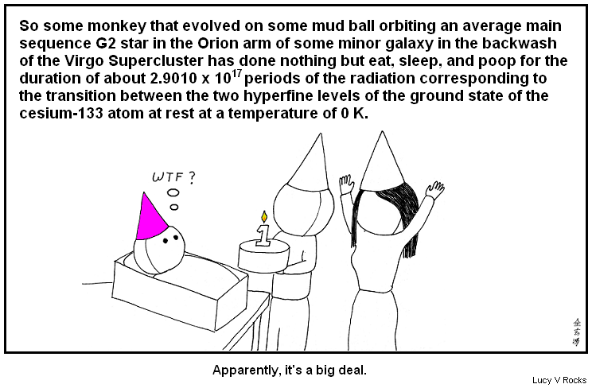
### Comment
In the time it takes you to read this sentence, the Earth will have moved about 150 km along its orbit.
# Abstruse Goose Comic 305
## The Biggest Loser

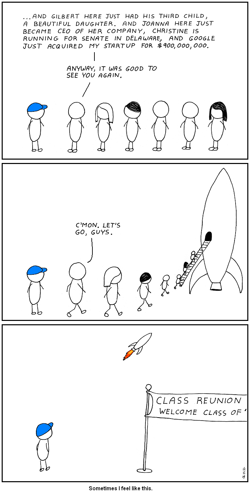
### Comment
I didn't know that life was a contest but, apparently, high school reunions are where we keep score.
# Abstruse Goose Comic 306
## Hello

### Comment
That two human beings can communicate with each other at all is rather remarkable, but cell phones (still) leave me trippin' balls.
# Abstruse Goose Comic 307
## The Purposeful Use of Science

### Comment
Hug an engineer today!
# Abstruse Goose Comic 308
## The Age of Discovery

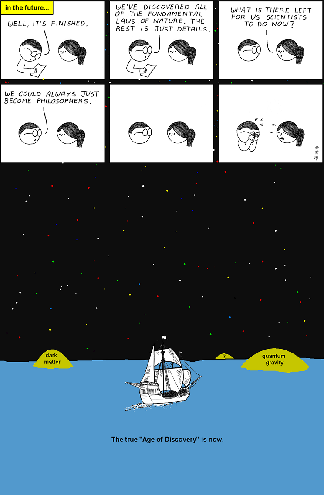
### Comment
And when Alexander saw the breadth of his domain, he wept, for there were no more worlds to conquer.   ---Me quoting Hans Gruber
# Abstruse Goose Comic 309
## Open-Delta

### Comment
The relationship between Megatron and Optimus Prime is a complicated one.
# Abstruse Goose Comic 313
## years ago in college...

### Comment
SPOILER: I'm awesome in bed.
# Abstruse Goose Comic 314
## Annus Mirabilis

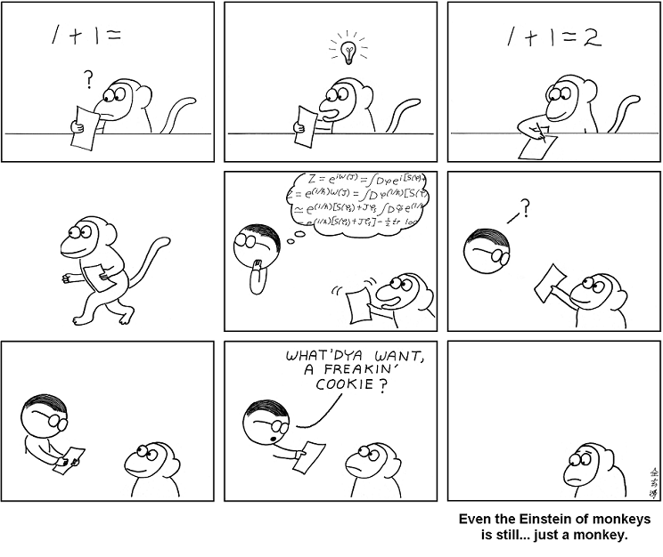
### Comment
Now the Ed Witten of monkeys?... that's a different story.
# Abstruse Goose Comic 315
## package

### Comment
Don't even act like you don't do this too.
# Abstruse Goose Comic 316
## The Horizon Problem

### Comment
Because REAL mathematicians can't be bothered with all those annoying laws of physics.
# Abstruse Goose Comic 317
## Confidence

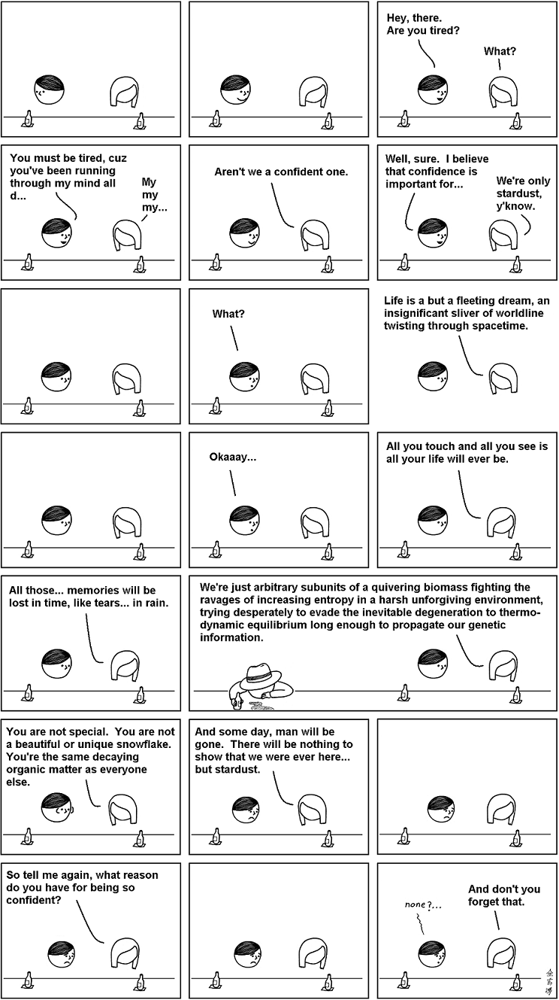
### Comment
Learn your place, puny carbon units!
# Abstruse Goose Comic 319
## Demonic Encounter

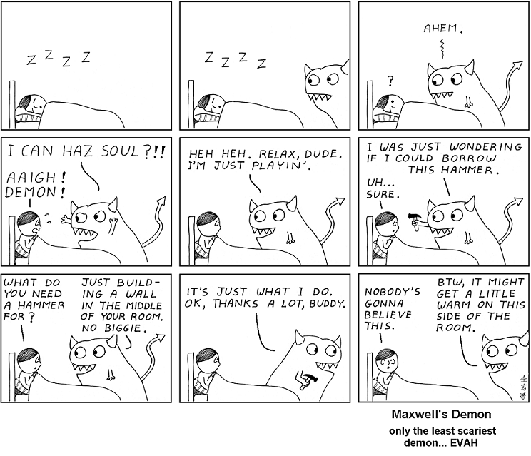
### Comment
THE 2nd LAW OF THERMODYNAMICS COMPELS YOU!!!  THE 2nd LAW OF THERMODYNAMICS COMPELS YOU!!!  THE 2nd LAW OF THERMODYNAMICS COMPELS YOU!!!
# Abstruse Goose Comic 320
## The Flash

### Comment
Comics never follow the laws of physics - unless they do.
# Abstruse Goose Comic 321
## Special Relativity Simply Explained

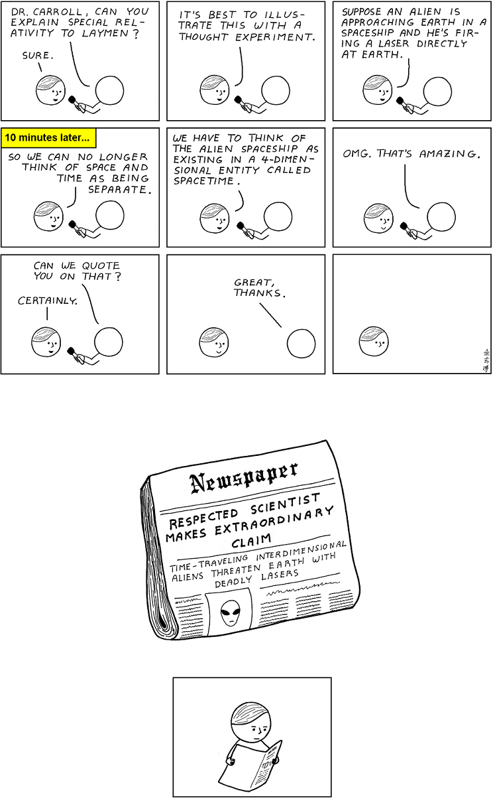
### Comment
And the scientific community never took him seriously ever again.  The End.
# Abstruse Goose Comic 322
## Reasons

### Comment
Stay in school, kids.
# Abstruse Goose Comic 323
## in the 24th century...

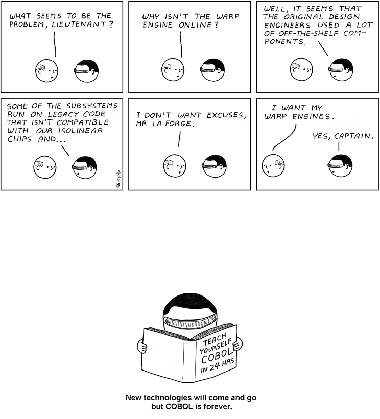
### Comment
The over 220 billion lines of COBOL in existence ain't going away any time soon.
# Abstruse Goose Comic 324
## Band of Brothers

### Comment
We few, we happy few, we band of leptons;
# Abstruse Goose Comic 325
## Storming Fort Riemann

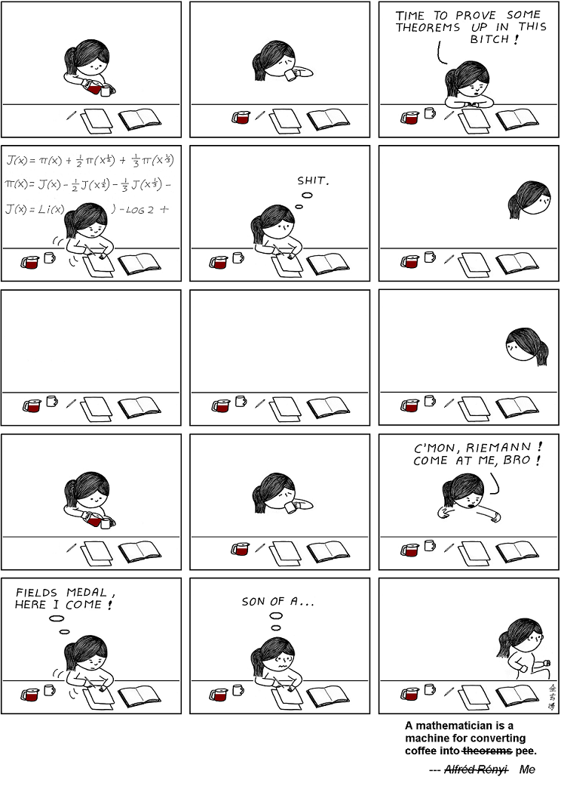
### Comment
The pee-to-theorems ratio among mathematicians is appalling.
# Abstruse Goose Comic 328
## deleted

### Comment
Wintermute will never find me now.
# Abstruse Goose Comic 329
## Behold the pale horse...

### Comment
...we finally really did it.  YOU MANIACS!  OH, DAMN YOU!  GODDAMN YOU ALL TO HELL!!!
# Abstruse Goose Comic 330
## The Problem With Christmas

### Comment
That's why I only celebrate Festivus.
# Abstruse Goose Comic 331
## Nexus S

### Comment
For the past week I've been logging more time on Angry Birds than I have on Black Ops.  That's just wrong.
# Abstruse Goose Comic 332
## Deception

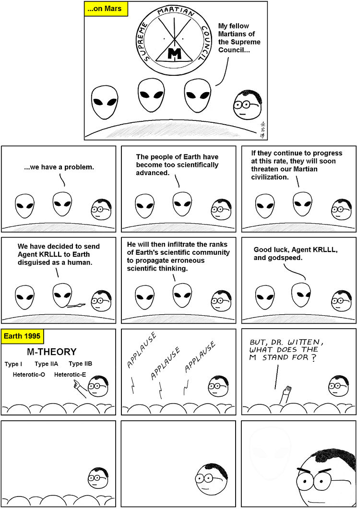
### Comment
Thank you all for attending the seminar.  Afterwards, there will be cake.
# Abstruse Goose Comic 333
## Lazy

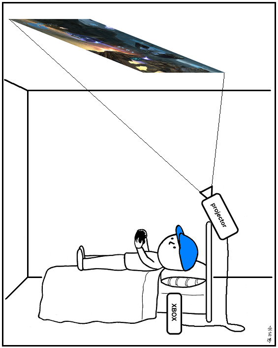
### Comment
I'm probably not the first person to think of this, but why don't more people do this?
# Abstruse Goose Comic 335
## barcode

### Comment
I'm like that guy that always suspects that his wife is cheating on him - simply because he once did it himself.
# Abstruse Goose Comic 336
## party

# Abstruse Goose Comic 337
## Neural Implant

### Comment
Well, that and warp drive.
# Abstruse Goose Comic 338
## Inspiration

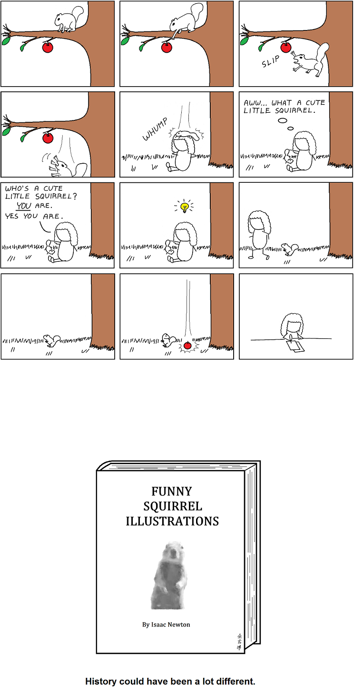
### Comment
Not even an insatiable thirst for knowledge can compete with our innate affinity for cute fuzzy little animals.
# Abstruse Goose Comic 339
## Tree of Life

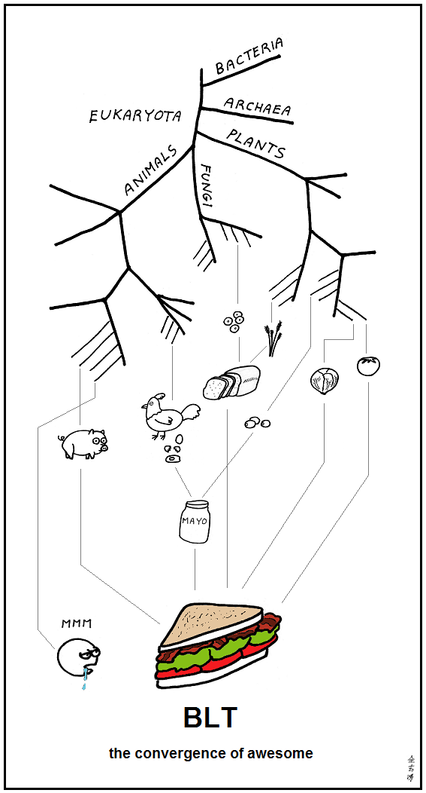
### Comment
This is my best argument for intelligent design.
# Abstruse Goose Comic 340
## Disproportionate Reaction

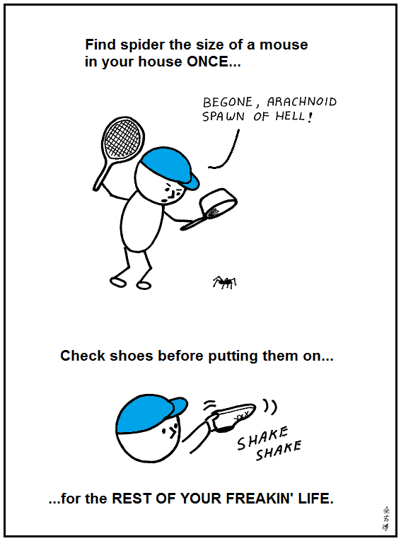
### Comment
The 90000 cumulative seconds that I will spend checking my shoes over the next 50 years of my life will totally be worth it for the peace of mind.
# Abstruse Goose Comic 342
## Moment of Clarity(?) - part 2

### Comment
Fock!
# Abstruse Goose Comic 343
## truth

### Comment
...and consequences.
# Abstruse Goose Comic 344
## Signs

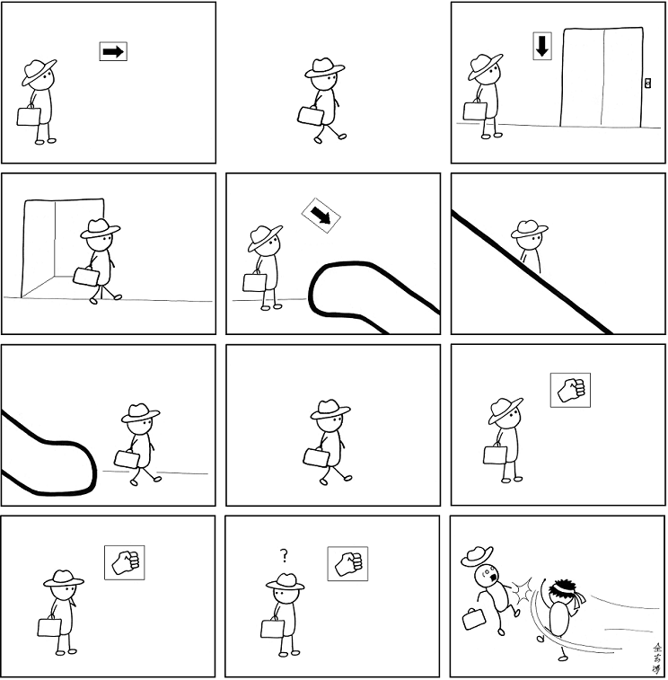
### Comment
S H O R Y U K E N !
# Abstruse Goose Comic 345
## variablekitten

### Comment
\usepackage[variablekitten]{amsmath}
# Abstruse Goose Comic 346
## The Social Network

### Comment
Like the movie, this comic is a highly fictionalized account based on true events.
# Abstruse Goose Comic 347
## The Frontier

### Comment
old fogies represent yo
# Abstruse Goose Comic 348
## Thick Face, Black Heart

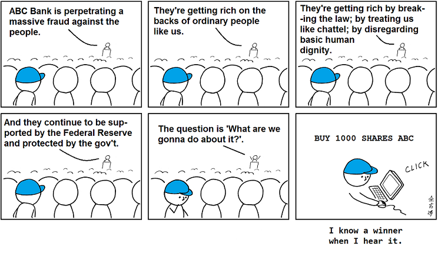
### Comment
I just love it when you whiny commoners unwittingly do my due dilgence for me.
# Abstruse Goose Comic 300
## Now and Then

### Comment
I have a theory that everything you wish for as a kid comes true when you are an adult.  And then life laughs at you.
# Abstruse Goose Comic 301
## DSM IV

### Comment
Also true for Cookie Monster and (of course) corporations.
# Abstruse Goose Comic 302
## be excellent to each other

### Comment
But at least we can all agree to hate the gays, amirite?
# Abstruse Goose Comic 303
## In the Neutral Zone

# Abstruse Goose Comic 304
## One Revolution

### Comment
In the time it takes you to read this sentence, the Earth will have moved about 150 km along its orbit.
# Abstruse Goose Comic 305
## The Biggest Loser

### Comment
I didn't know that life was a contest but, apparently, high school reunions are where we keep score.
# Abstruse Goose Comic 306
## Hello

### Comment
That two human beings can communicate with each other at all is rather remarkable, but cell phones (still) leave me trippin' balls.
# Abstruse Goose Comic 307
## The Purposeful Use of Science

### Comment
Hug an engineer today!
# Abstruse Goose Comic 308
## The Age of Discovery

### Comment
And when Alexander saw the breadth of his domain, he wept, for there were no more worlds to conquer.   ---Me quoting Hans Gruber
# Abstruse Goose Comic 309
## Open-Delta

### Comment
The relationship between Megatron and Optimus Prime is a complicated one.
# Abstruse Goose Comic 313
## years ago in college...

### Comment
SPOILER: I'm awesome in bed.
# Abstruse Goose Comic 314
## Annus Mirabilis

### Comment
Now the Ed Witten of monkeys?... that's a different story.
# Abstruse Goose Comic 315
## package

### Comment
Don't even act like you don't do this too.
# Abstruse Goose Comic 316
## The Horizon Problem

### Comment
Because REAL mathematicians can't be bothered with all those annoying laws of physics.
# Abstruse Goose Comic 317
## Confidence

### Comment
Learn your place, puny carbon units!
# Abstruse Goose Comic 319
## Demonic Encounter

### Comment
THE 2nd LAW OF THERMODYNAMICS COMPELS YOU!!!  THE 2nd LAW OF THERMODYNAMICS COMPELS YOU!!!  THE 2nd LAW OF THERMODYNAMICS COMPELS YOU!!!
# Abstruse Goose Comic 320
## The Flash

### Comment
Comics never follow the laws of physics - unless they do.
# Abstruse Goose Comic 321
## Special Relativity Simply Explained

### Comment
And the scientific community never took him seriously ever again.  The End.
# Abstruse Goose Comic 322
## Reasons

### Comment
Stay in school, kids.
# Abstruse Goose Comic 323
## in the 24th century...

### Comment
The over 220 billion lines of COBOL in existence ain't going away any time soon.
# Abstruse Goose Comic 324
## Band of Brothers

### Comment
We few, we happy few, we band of leptons;
# Abstruse Goose Comic 325
## Storming Fort Riemann

### Comment
The pee-to-theorems ratio among mathematicians is appalling.
# Abstruse Goose Comic 328
## deleted

### Comment
Wintermute will never find me now.
# Abstruse Goose Comic 329
## Behold the pale horse...

### Comment
...we finally really did it.  YOU MANIACS!  OH, DAMN YOU!  GODDAMN YOU ALL TO HELL!!!
# Abstruse Goose Comic 330
## The Problem With Christmas

### Comment
That's why I only celebrate Festivus.
# Abstruse Goose Comic 331
## Nexus S

### Comment
For the past week I've been logging more time on Angry Birds than I have on Black Ops.  That's just wrong.
# Abstruse Goose Comic 332
## Deception

### Comment
Thank you all for attending the seminar.  Afterwards, there will be cake.
# Abstruse Goose Comic 333
## Lazy

### Comment
I'm probably not the first person to think of this, but why don't more people do this?
# Abstruse Goose Comic 335
## barcode

### Comment
I'm like that guy that always suspects that his wife is cheating on him - simply because he once did it himself.
# Abstruse Goose Comic 336
## party

# Abstruse Goose Comic 337
## Neural Implant

### Comment
Well, that and warp drive.
# Abstruse Goose Comic 338
## Inspiration

### Comment
Not even an insatiable thirst for knowledge can compete with our innate affinity for cute fuzzy little animals.
# Abstruse Goose Comic 339
## Tree of Life

### Comment
This is my best argument for intelligent design.
# Abstruse Goose Comic 340
## Disproportionate Reaction

### Comment
The 90000 cumulative seconds that I will spend checking my shoes over the next 50 years of my life will totally be worth it for the peace of mind.
# Abstruse Goose Comic 342
## Moment of Clarity(?) - part 2

### Comment
Fock!
# Abstruse Goose Comic 343
## truth

### Comment
...and consequences.
# Abstruse Goose Comic 344
## Signs

### Comment
S H O R Y U K E N !
# Abstruse Goose Comic 345
## variablekitten

### Comment
\usepackage[variablekitten]{amsmath}
# Abstruse Goose Comic 346
## The Social Network

### Comment
Like the movie, this comic is a highly fictionalized account based on true events.
# Abstruse Goose Comic 347
## The Frontier

### Comment
old fogies represent yo
# Abstruse Goose Comic 348
## Thick Face, Black Heart

### Comment
I just love it when you whiny commoners unwittingly do my due dilgence for me.
