# Abstruse Goose Comic 401
## depression

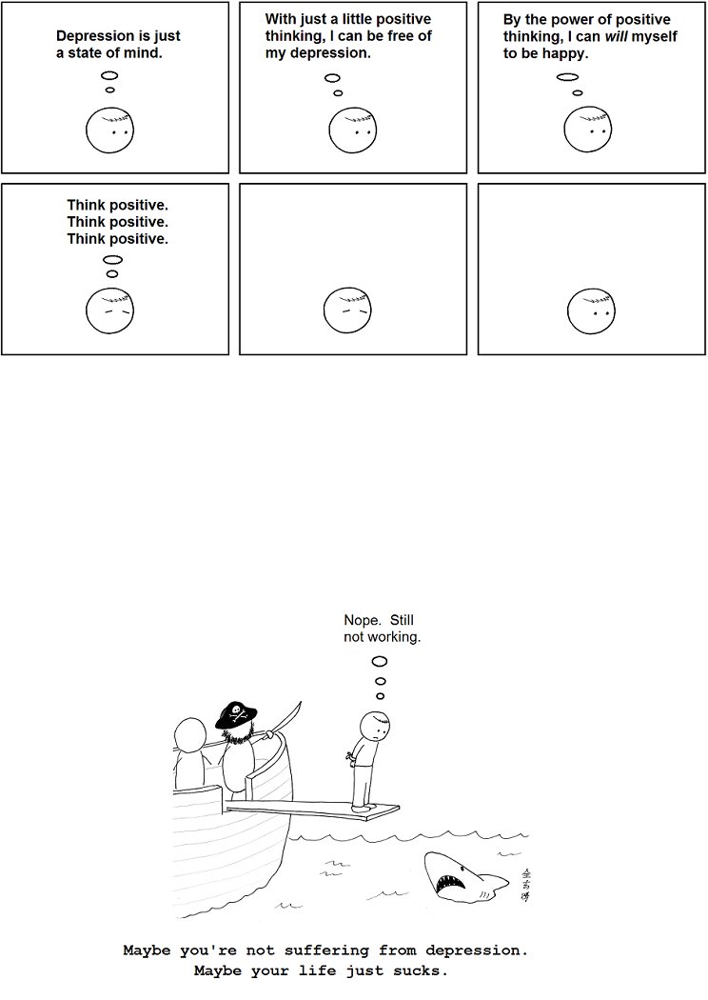
### Comment
You can have mad poker skillz but ultimately you need to be dealt the right cards.
# Abstruse Goose Comic 402
## Forbidden Fruit

# Abstruse Goose Comic 403
## The Badlands

### Comment
I could spend hours there.
# Abstruse Goose Comic 404
## Barbarians at the Gate

### Comment
If the American people knew tonight, exactly how the monetary and banking system worked, the shit would hit the fan tomorrow morning. ---Abraham Lincoln
# Abstruse Goose Comic 405
## Portrait

### Comment
Maybe Picasso was the normal one.
# Abstruse Goose Comic 406
## Spherical Cow

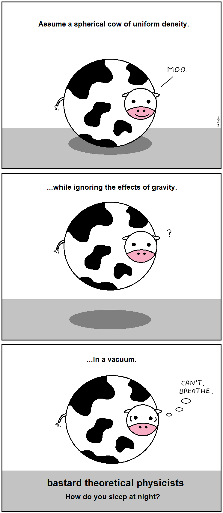
### Comment
Assume the cow is a solid ball.  BanachÂTarski the hell out of it.  Rinse.  Repeat.
# Abstruse Goose Comic 407
## devourer of all things

# Abstruse Goose Comic 409
## formal argument

### Comment
And since the enemy of my enemy is my friend, I am also my own best friend.
# Abstruse Goose Comic 410
## this far, no further

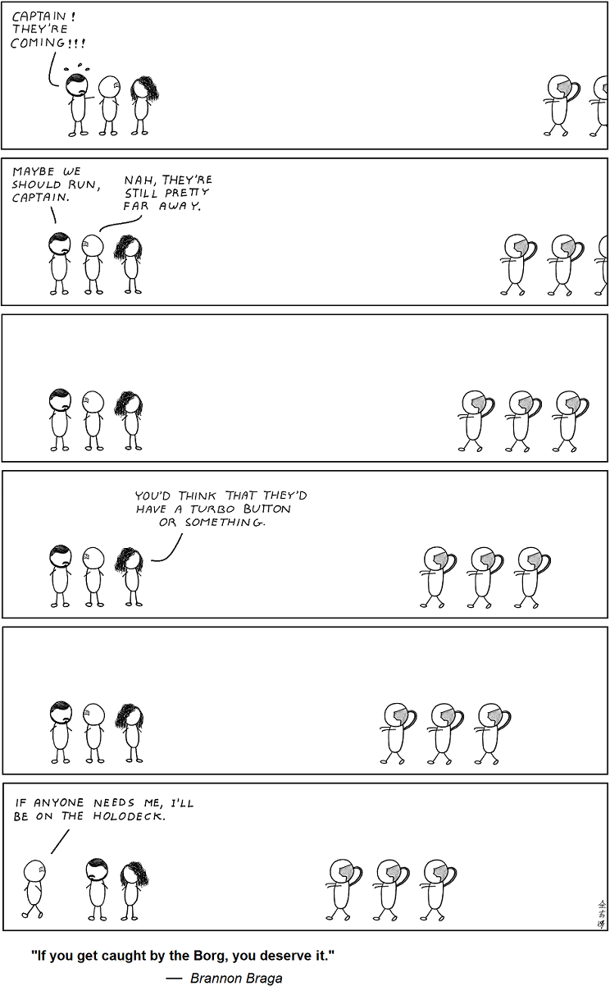
### Comment
Resistance is optional.
# Abstruse Goose Comic 411
## the first casualty

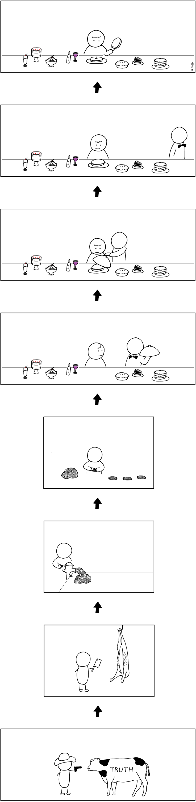
### Comment
Apparently, no cow is safe in my comics.
# Abstruse Goose Comic 412
## Space War

### Comment
I need my space... except when I don't.
# Abstruse Goose Comic 413
## they came like locusts...

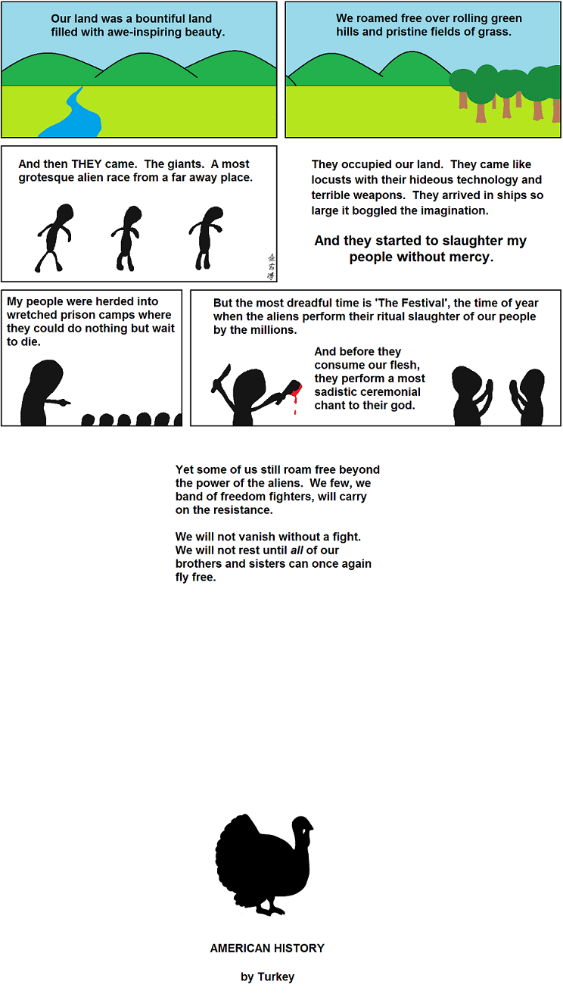
### Comment
This is the book that Howard Zinn SHOULD have written.
# Abstruse Goose Comic 414
## Rear Window

### Comment
Galileo gets what Galileo wants.
# Abstruse Goose Comic 415
## Lecture Fatigue

### Comment
The part where shards of ceiling rain down on my fellow classmates is a very important part of this fantasy of mine.
# Abstruse Goose Comic 416
## The Amygdala Hijack Conspiracy

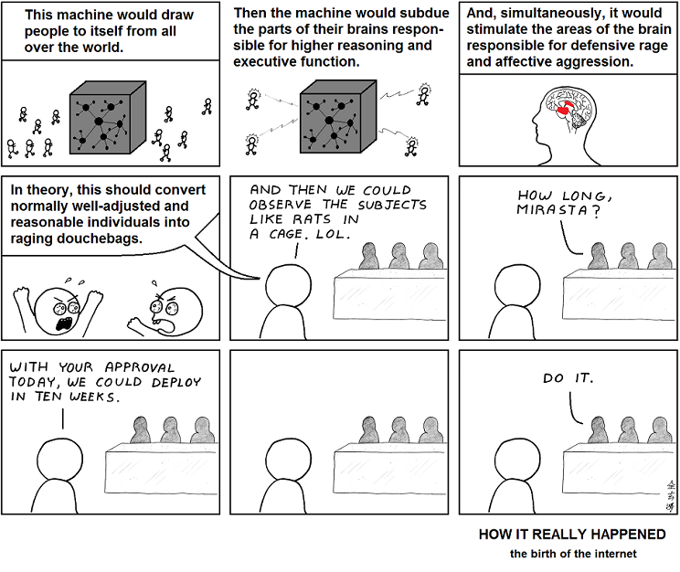
### Comment
The experiment has been successful beyond DARPA's wildest imagination.  My inside sources inform me that 90 percent of their data comes from Xbox live and the YouTube comment system.  I, of course, am immune to the machine's effects.
# Abstruse Goose Comic 417
## unfulfilled

### Comment
I have a six-month supply of SPAM about to reach the 'best by' date... so, yeah.
# Abstruse Goose Comic 418
## alma mater

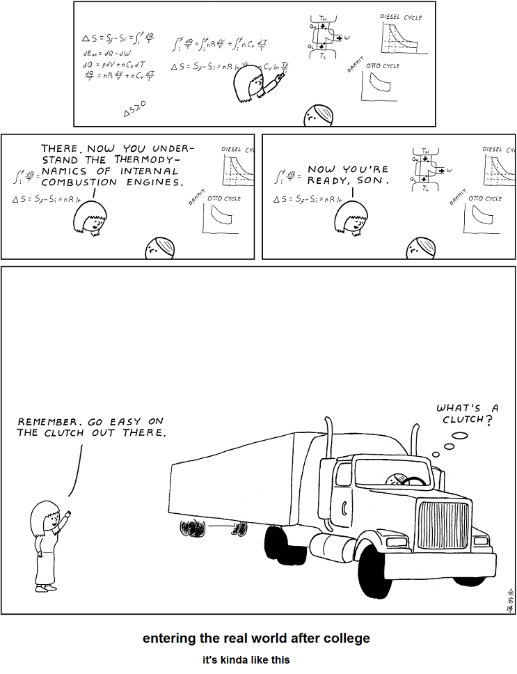
### Comment
Boy, I sure am glad I took that class on differential geometry... y'know, so I can prove theorems between unemployment checks.
# Abstruse Goose Comic 419
## The Commanding Heights

### Comment
It's not the impact so much as it is the excruciatingly slow death afterwards.
# Abstruse Goose Comic 421
## The Sliver of Perception

### Comment
Adding a third dimension of smell proved to be too difficult.
# Abstruse Goose Comic 422
## Voluntary Prison

### Comment
Free your mind.
# Abstruse Goose Comic 424
## The 13.7 Billion Year Experiment

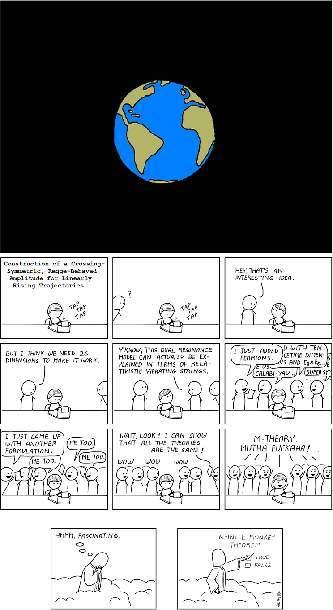
### Comment
Okay, the experiment is over.  Everyone get out.
# Abstruse Goose Comic 425
## YOU

### Comment
I feel that it is important that you are occasionally reminded of this fact.
# Abstruse Goose Comic 426
## 3 AM

### Comment
After many lonely late nights in the lab, I developed an intimate relationship with the hallway ficus plant.  And then things got weird.
# Abstruse Goose Comic 427
## The Alien Agenda

### Comment
I don't know... therefore, aliens.
# Abstruse Goose Comic 428
## ...

# Abstruse Goose Comic 429
## famous

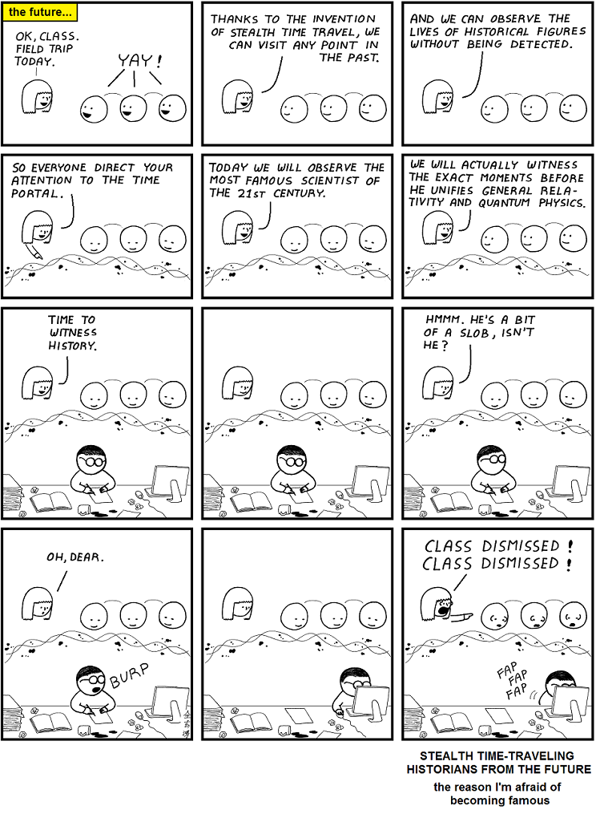
### Comment
If you are famous or destined to be famous, future historians are probably watching you right now.
# Abstruse Goose Comic 430
## Fairy Tale

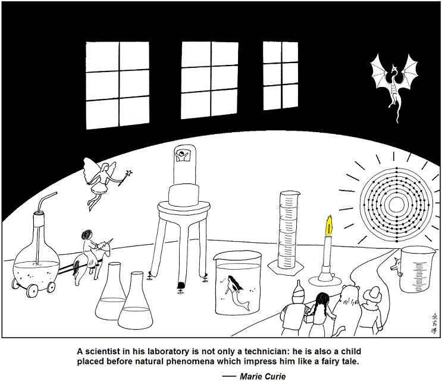
### Comment
I believe that the secret is to keep your child-like wonder without becoming jaded by life.  It's too late for me, but SAVE YOURSELF!
# Abstruse Goose Comic 431
## Red-Letter Date

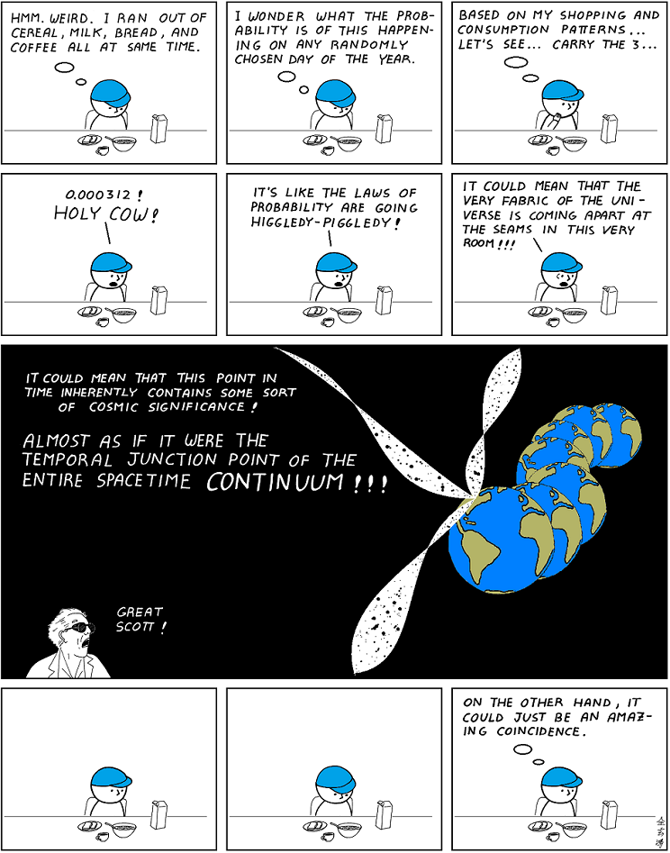
### Comment
'Higgledy-piggledy' means 'a real mess'.
# Abstruse Goose Comic 432
## O.P.C.

### Comment
Cuz if I didn't write it, the code obviously sucks.
# Abstruse Goose Comic 433
## The Watchers

### Comment
I am proud of my unassailable logic.
# Abstruse Goose Comic 434
## Supervillain Secrets

### Comment
Sir Ian McKellen is the consummate method actor.
# Abstruse Goose Comic 435
## Murderer

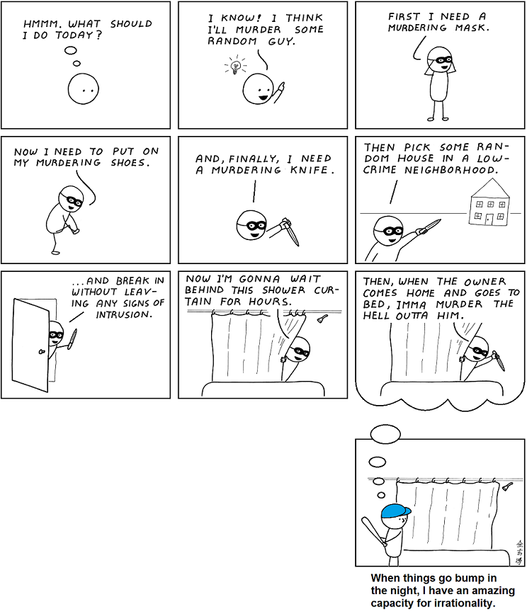
### Comment
Just remember that the murderer is just as scared of you as you are of him.
# Abstruse Goose Comic 436
## Throughput

### Comment
ANSWER: magic
# Abstruse Goose Comic 437
## LINux hack

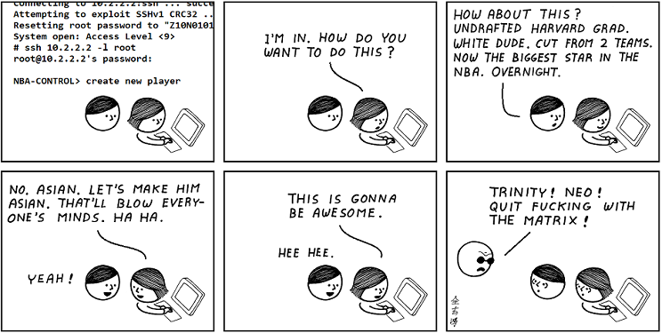
### Comment
OR, it could just be a miracle from God, but I like my explanation better.
# Abstruse Goose Comic 438
## Gmail

### Comment
Google recommends that you stop contacting Jenny.  Send anyway?
# Abstruse Goose Comic 440
## Chrono-Synclastic Infundibulum

### Comment
I like making comics that complain about things that I really don't care that much about at the end of the day.
# Abstruse Goose Comic 442
## The Infinite Canvas

### Comment
Please credit the original artist.
# Abstruse Goose Comic 443
## skillz

### Comment
And that's how I became a legend amongst my coworkers.
# Abstruse Goose Comic 445
## The Elements of Style

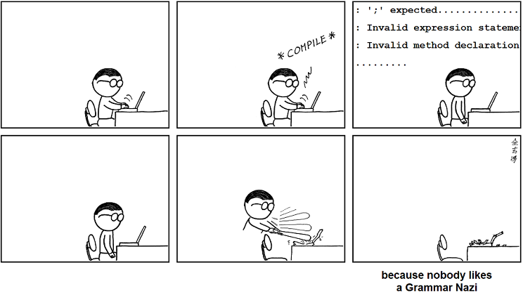
### Comment
//they must be stopped before they become self-aware
# Abstruse Goose Comic 446
## A Walk on Mars

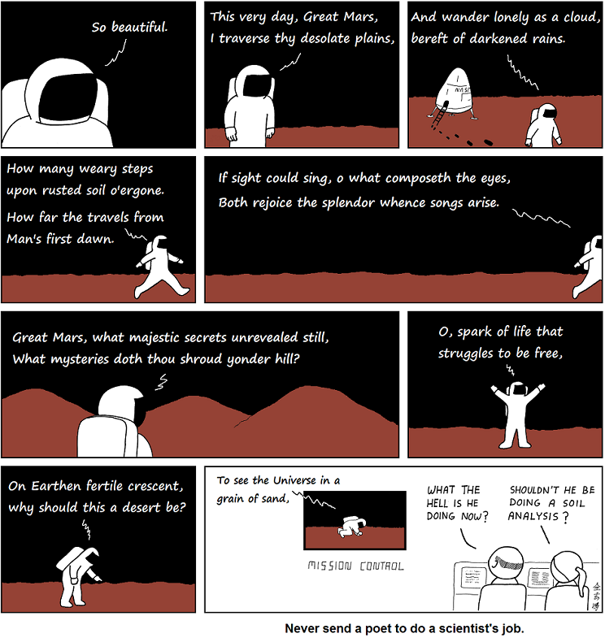
### Comment
Writing bad poetry is harder than you might think.
# Abstruse Goose Comic 447
## Important Messages

### Comment
Wait.  I have to pay a monthly cable bill AND I have to sit through commercials too?  Oh... okay.
# Abstruse Goose Comic 448
## status quo bias

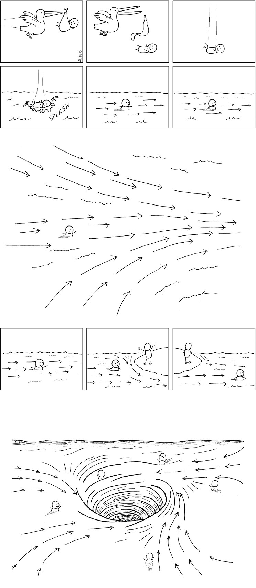
### Comment
Predominant belief systems, societal expectations, accepted gender roles, etc.  We are all born into our own default life currents and the currents only grow stronger as we get older.  Don't fight it.  There's a party at the bottom of the vortex.
# Abstruse Goose Comic 449
## The Great Tragedy

### Comment
The slaying of a beautiful hypothesis by an ugly fact is a close second.
# Abstruse Goose Comic 401
## depression

### Comment
You can have mad poker skillz but ultimately you need to be dealt the right cards.
# Abstruse Goose Comic 402
## Forbidden Fruit

# Abstruse Goose Comic 403
## The Badlands

### Comment
I could spend hours there.
# Abstruse Goose Comic 404
## Barbarians at the Gate

### Comment
If the American people knew tonight, exactly how the monetary and banking system worked, the shit would hit the fan tomorrow morning. ---Abraham Lincoln
# Abstruse Goose Comic 405
## Portrait

### Comment
Maybe Picasso was the normal one.
# Abstruse Goose Comic 406
## Spherical Cow

### Comment
Assume the cow is a solid ball.  BanachÂTarski the hell out of it.  Rinse.  Repeat.
# Abstruse Goose Comic 407
## devourer of all things

# Abstruse Goose Comic 409
## formal argument

### Comment
And since the enemy of my enemy is my friend, I am also my own best friend.
# Abstruse Goose Comic 410
## this far, no further

### Comment
Resistance is optional.
# Abstruse Goose Comic 411
## the first casualty

### Comment
Apparently, no cow is safe in my comics.
# Abstruse Goose Comic 412
## Space War

### Comment
I need my space... except when I don't.
# Abstruse Goose Comic 413
## they came like locusts...

### Comment
This is the book that Howard Zinn SHOULD have written.
# Abstruse Goose Comic 414
## Rear Window

### Comment
Galileo gets what Galileo wants.
# Abstruse Goose Comic 415
## Lecture Fatigue

### Comment
The part where shards of ceiling rain down on my fellow classmates is a very important part of this fantasy of mine.
# Abstruse Goose Comic 416
## The Amygdala Hijack Conspiracy

### Comment
The experiment has been successful beyond DARPA's wildest imagination.  My inside sources inform me that 90 percent of their data comes from Xbox live and the YouTube comment system.  I, of course, am immune to the machine's effects.
# Abstruse Goose Comic 417
## unfulfilled

### Comment
I have a six-month supply of SPAM about to reach the 'best by' date... so, yeah.
# Abstruse Goose Comic 418
## alma mater

### Comment
Boy, I sure am glad I took that class on differential geometry... y'know, so I can prove theorems between unemployment checks.
# Abstruse Goose Comic 419
## The Commanding Heights

### Comment
It's not the impact so much as it is the excruciatingly slow death afterwards.
# Abstruse Goose Comic 421
## The Sliver of Perception

### Comment
Adding a third dimension of smell proved to be too difficult.
# Abstruse Goose Comic 422
## Voluntary Prison

### Comment
Free your mind.
# Abstruse Goose Comic 424
## The 13.7 Billion Year Experiment

### Comment
Okay, the experiment is over.  Everyone get out.
# Abstruse Goose Comic 425
## YOU

### Comment
I feel that it is important that you are occasionally reminded of this fact.
# Abstruse Goose Comic 426
## 3 AM

### Comment
After many lonely late nights in the lab, I developed an intimate relationship with the hallway ficus plant.  And then things got weird.
# Abstruse Goose Comic 427
## The Alien Agenda

### Comment
I don't know... therefore, aliens.
# Abstruse Goose Comic 428
## ...

# Abstruse Goose Comic 429
## famous

### Comment
If you are famous or destined to be famous, future historians are probably watching you right now.
# Abstruse Goose Comic 430
## Fairy Tale

### Comment
I believe that the secret is to keep your child-like wonder without becoming jaded by life.  It's too late for me, but SAVE YOURSELF!
# Abstruse Goose Comic 431
## Red-Letter Date

### Comment
'Higgledy-piggledy' means 'a real mess'.
# Abstruse Goose Comic 432
## O.P.C.

### Comment
Cuz if I didn't write it, the code obviously sucks.
# Abstruse Goose Comic 433
## The Watchers

### Comment
I am proud of my unassailable logic.
# Abstruse Goose Comic 434
## Supervillain Secrets

### Comment
Sir Ian McKellen is the consummate method actor.
# Abstruse Goose Comic 435
## Murderer

### Comment
Just remember that the murderer is just as scared of you as you are of him.
# Abstruse Goose Comic 436
## Throughput

### Comment
ANSWER: magic
# Abstruse Goose Comic 437
## LINux hack

### Comment
OR, it could just be a miracle from God, but I like my explanation better.
# Abstruse Goose Comic 438
## Gmail

### Comment
Google recommends that you stop contacting Jenny.  Send anyway?
# Abstruse Goose Comic 440
## Chrono-Synclastic Infundibulum

### Comment
I like making comics that complain about things that I really don't care that much about at the end of the day.
# Abstruse Goose Comic 442
## The Infinite Canvas

### Comment
Please credit the original artist.
# Abstruse Goose Comic 443
## skillz

### Comment
And that's how I became a legend amongst my coworkers.
# Abstruse Goose Comic 445
## The Elements of Style

### Comment
//they must be stopped before they become self-aware
# Abstruse Goose Comic 446
## A Walk on Mars

### Comment
Writing bad poetry is harder than you might think.
# Abstruse Goose Comic 447
## Important Messages

### Comment
Wait.  I have to pay a monthly cable bill AND I have to sit through commercials too?  Oh... okay.
# Abstruse Goose Comic 448
## status quo bias

### Comment
Predominant belief systems, societal expectations, accepted gender roles, etc.  We are all born into our own default life currents and the currents only grow stronger as we get older.  Don't fight it.  There's a party at the bottom of the vortex.
# Abstruse Goose Comic 449
## The Great Tragedy

### Comment
The slaying of a beautiful hypothesis by an ugly fact is a close second.
