# Abstruse Goose Comic 450
## Gambler's Fallacy

### Comment
Meanwhile, in an alternate universe, I am Mark Cuban.  And right this very minute, he is taunting me.
# Abstruse Goose Comic 451
## supernova

### Comment
Of course SN 1987A is no longer visible to the naked eye but, then again, neither is my child-like imagination.
# Abstruse Goose Comic 453
## the tide

### Comment
Take THAT, growing tide of impending legislation.
# Abstruse Goose Comic 454
## reading in bed

### Comment
...not since I studied for the SATs.
# Abstruse Goose Comic 455
## The Creation - part 3

### Comment
It is not true that Bill Gates actually said this.  But, then again, it is also not true that Bill Gates is God.
# Abstruse Goose Comic 456
## illuminatus

### Comment
Then I decided to weep tears of joy because I remembered that I was rich.
# Abstruse Goose Comic 457
## Many World Problem

### Comment
Somewhere there is a parallel universe where contradictions don't exist.
# Abstruse Goose Comic 458
## wonderful life

### Comment
Dear AllMyFriendsFromCollege.  STFU.
# Abstruse Goose Comic 460
## fill it up with unregulated

### Comment
I am in no way implying that naked credit default swaps exacerbated the European debt crisis.  I'm simply saying that a bear shits in the woods.
# Abstruse Goose Comic 463
## perpetual happy hour

### Comment
Egregious misrepresentations of noble professions for the sake of humor.  It's what I do.
# Abstruse Goose Comic 464
## this comic

### Comment
Who the hell are all you people?!!  And get the hell out of my room!
# Abstruse Goose Comic 466
## Top Wrangler

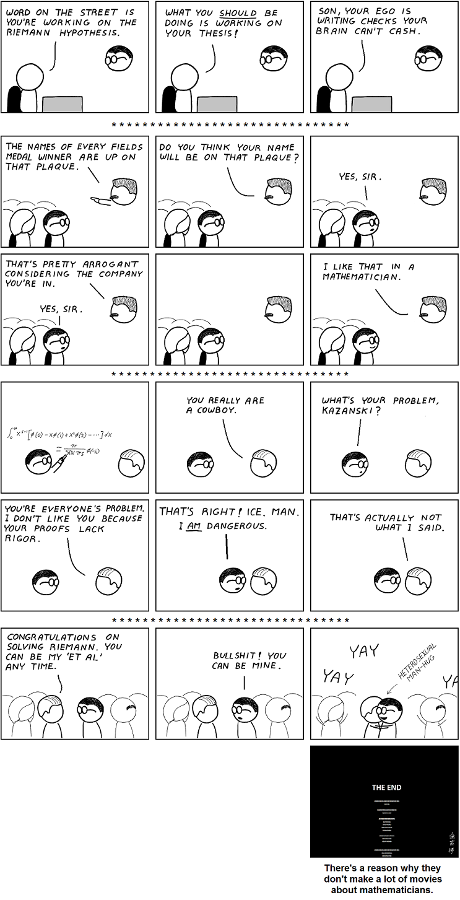
### Comment
I would watch the hell outta this movie.
# Abstruse Goose Comic 467
## The Happy Programmer

### Comment
I was only going to watch for a few minutes.  But before I knew it, I had watched the entire episode and he had programmed a fully functional general-purpose operating system.
# Abstruse Goose Comic 468
## The Invasion

### Comment
In this analogy, the role of Alaric will be played by George Takei.
# Abstruse Goose Comic 469
## cockpit

### Comment
Viper-mode activate!
# Abstruse Goose Comic 471
## Unequal Relationship

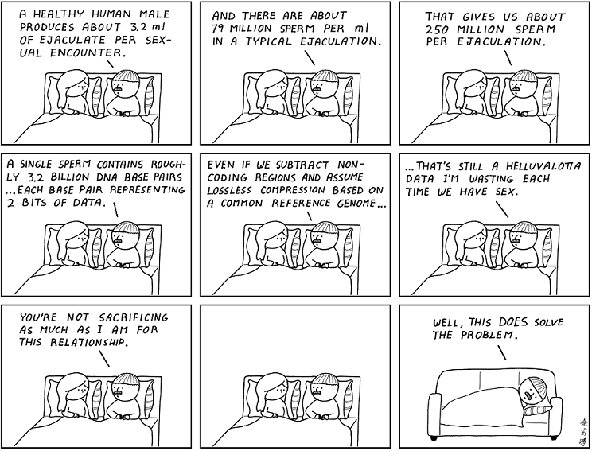
### Comment
What, you think it's easy producing 200 million sperm a day?
# Abstruse Goose Comic 472
## faith

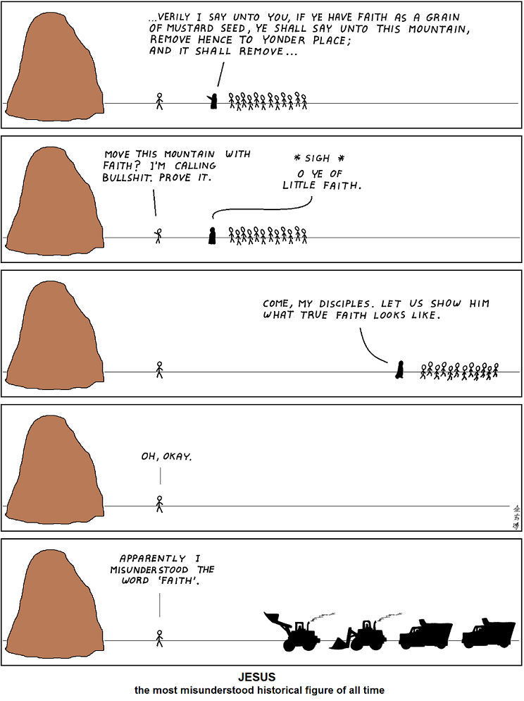
### Comment
...for verily I say unto you, with enough 'faith', nothing shall be impossible unto you.  Not even the stars.
# Abstruse Goose Comic 473
## Programmers Do Not Throw Sausage Pizza Away... Hastily

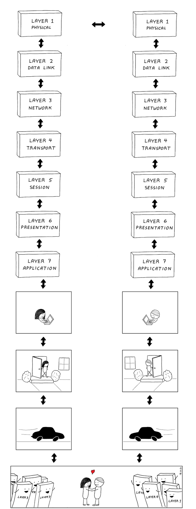
### Comment
It's the hardest layer to learn.
# Abstruse Goose Comic 474
## Arithmetic for Beginners

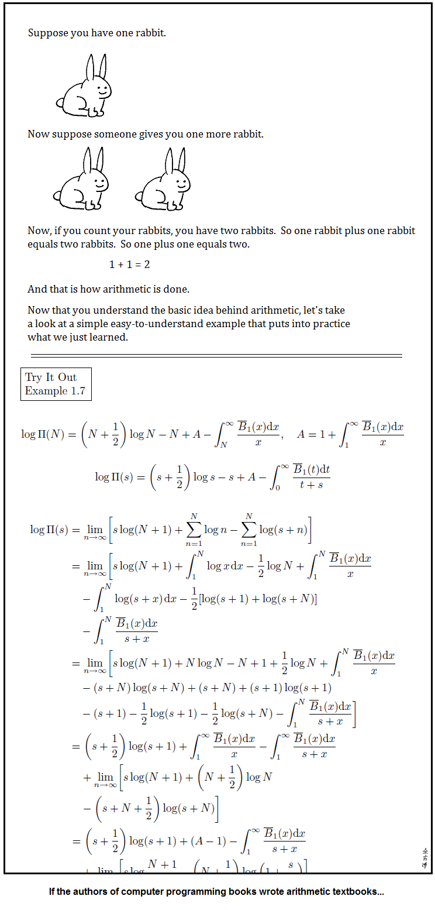
### Comment
I have also intentionally included fatal mistakes in the equations to make it more realistic.  Please see the errata page on our website.
# Abstruse Goose Comic 475
## A Simple Puzzle 4

### Comment
hint: album version
# Abstruse Goose Comic 476
## The Hunted

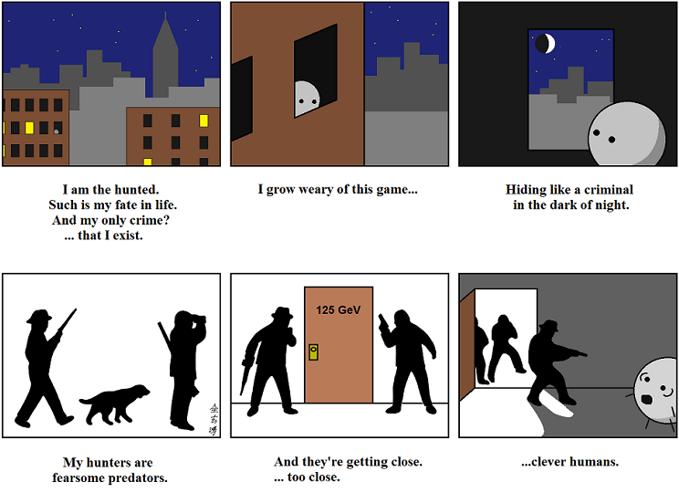
### Comment
Too soon?
# Abstruse Goose Comic 477
## In Cabin'd Ships at Sea

### Comment
I turn everything into science fiction in my head.  In other news, the Epic of Gilgamesh is one of the greatest science fiction stories of all time.
# Abstruse Goose Comic 478
## Job Interview

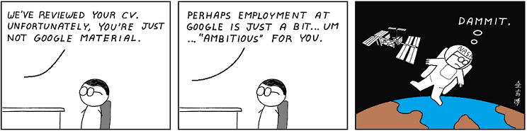
### Comment
And if NASA won't take me, I'll settle for Wall Street.
# Abstruse Goose Comic 479
## The Beneficence of Others

### Comment
...so far.
# Abstruse Goose Comic 480
## Escape Route

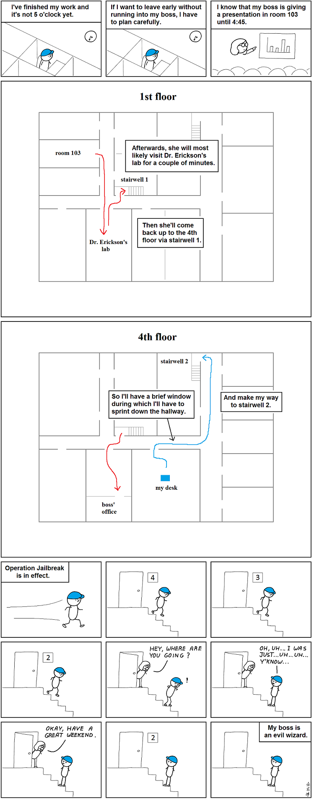
### Comment
Every time.
# Abstruse Goose Comic 482
## the internet

### Comment
Like...for example... right now?
# Abstruse Goose Comic 483
## bad boy

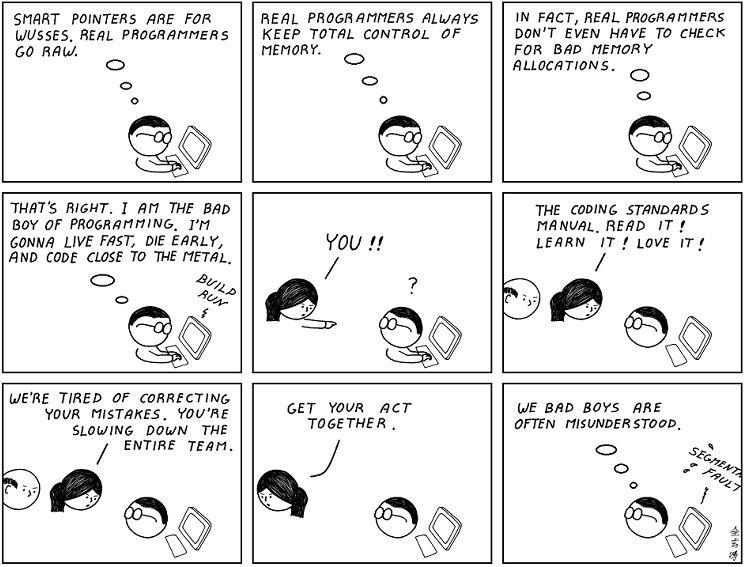
### Comment
I could be a good programmer; it's just more fun to be bad.
# Abstruse Goose Comic 484
## The Wilderness

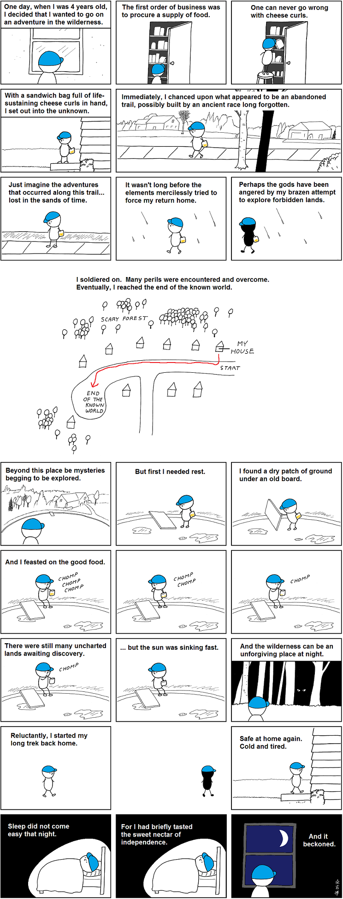
### Comment
In actuality, the entire adventure lasted about 15 minutes.  Or it never ended, depending on your point of view.
# Abstruse Goose Comic 485
## Man in the Mirror

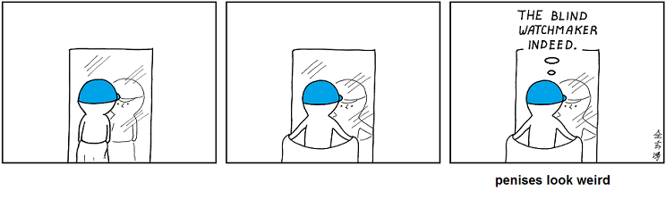
### Comment
For its intended purposes, it is very efficient, though.  But it is also the reason that no man can look tough naked.
# Abstruse Goose Comic 486
## Tribal Warfare

### Comment
Let me sing you the chant of my people. E-A-G-L-E-S EAGLES!
# Abstruse Goose Comic 487
## in the classroom

### Comment
One of my classmates in my Romantic Poetry class was like this.  To make matters worse, he looked exactly like that blond-haired guy in The Karate Kid.  I HATE that guy!
# Abstruse Goose Comic 488
## lurking variable

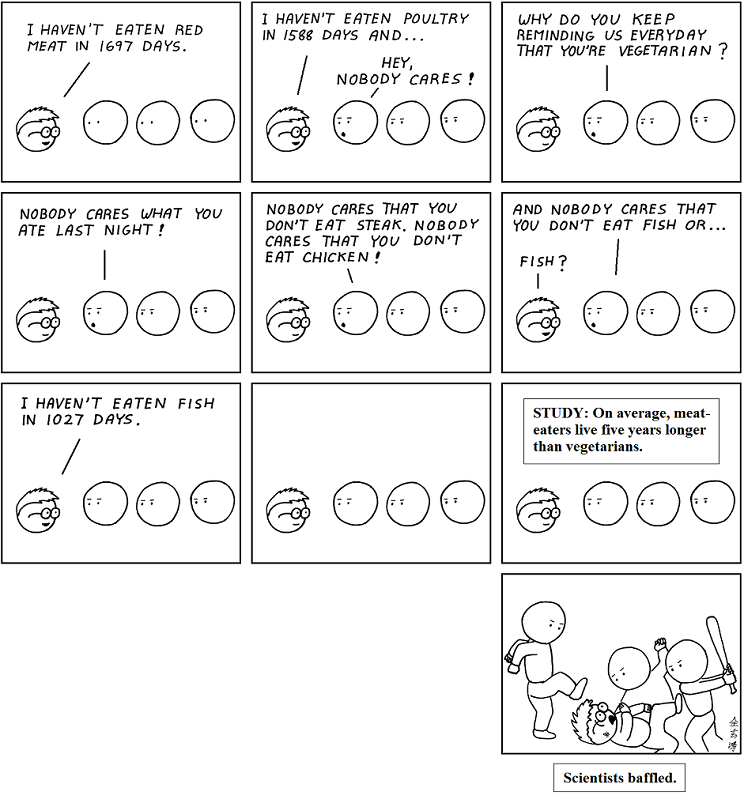
### Comment
Hey, I didn't become the awesome specimen of man that I am by eating salads.
# Abstruse Goose Comic 489
## Apophenia

### Comment
If the ghost ain't quantum mechanically inclined, I don't wanna know it.
# Abstruse Goose Comic 490
## in the classroom 2

### Comment
That overwhelming sensation overtaking your body right now is called awe.
# Abstruse Goose Comic 491
## three

### Comment
The main difference is that Wall Street drools more.
# Abstruse Goose Comic 492
## The Commanding Heights - part 2

### Comment
*uproarious applause*
# Abstruse Goose Comic 493
## far from home

### Comment
Some day, when I am feeling compassionate, I will let him phone home.  Not today.
# Abstruse Goose Comic 494
## the race

### Comment
Unfortunately, I am awesome.
# Abstruse Goose Comic 496
## state of the art

### Comment
According to Hollywood, Blade Runner happens in 7 years.
# Abstruse Goose Comic 497
## RSA-2048

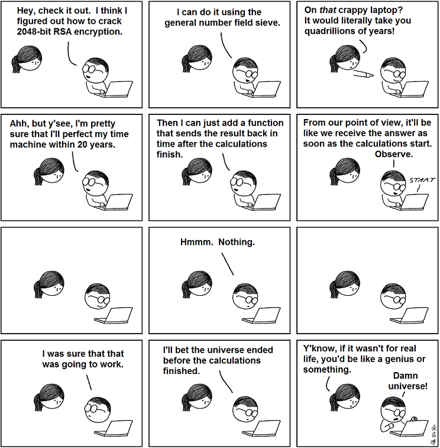
### Comment
If it wasn't for the universe and the laws of physics and stuff, I'd be unstoppable.
# Abstruse Goose Comic 498
## Lydia

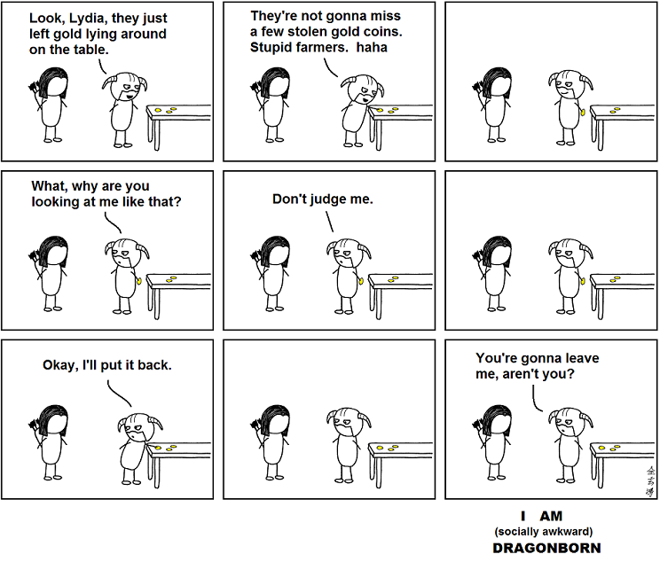
### Comment
I'm sorry I've been away from Skyrim for so long, Aela.  My God, I'm a terrible husband.
# Abstruse Goose Comic 450
## Gambler's Fallacy

### Comment
Meanwhile, in an alternate universe, I am Mark Cuban.  And right this very minute, he is taunting me.
# Abstruse Goose Comic 451
## supernova

### Comment
Of course SN 1987A is no longer visible to the naked eye but, then again, neither is my child-like imagination.
# Abstruse Goose Comic 453
## the tide

### Comment
Take THAT, growing tide of impending legislation.
# Abstruse Goose Comic 454
## reading in bed

### Comment
...not since I studied for the SATs.
# Abstruse Goose Comic 455
## The Creation - part 3

### Comment
It is not true that Bill Gates actually said this.  But, then again, it is also not true that Bill Gates is God.
# Abstruse Goose Comic 456
## illuminatus

### Comment
Then I decided to weep tears of joy because I remembered that I was rich.
# Abstruse Goose Comic 457
## Many World Problem

### Comment
Somewhere there is a parallel universe where contradictions don't exist.
# Abstruse Goose Comic 458
## wonderful life

### Comment
Dear AllMyFriendsFromCollege.  STFU.
# Abstruse Goose Comic 460
## fill it up with unregulated

### Comment
I am in no way implying that naked credit default swaps exacerbated the European debt crisis.  I'm simply saying that a bear shits in the woods.
# Abstruse Goose Comic 463
## perpetual happy hour

### Comment
Egregious misrepresentations of noble professions for the sake of humor.  It's what I do.
# Abstruse Goose Comic 464
## this comic

### Comment
Who the hell are all you people?!!  And get the hell out of my room!
# Abstruse Goose Comic 466
## Top Wrangler

### Comment
I would watch the hell outta this movie.
# Abstruse Goose Comic 467
## The Happy Programmer

### Comment
I was only going to watch for a few minutes.  But before I knew it, I had watched the entire episode and he had programmed a fully functional general-purpose operating system.
# Abstruse Goose Comic 468
## The Invasion

### Comment
In this analogy, the role of Alaric will be played by George Takei.
# Abstruse Goose Comic 469
## cockpit

### Comment
Viper-mode activate!
# Abstruse Goose Comic 471
## Unequal Relationship

### Comment
What, you think it's easy producing 200 million sperm a day?
# Abstruse Goose Comic 472
## faith

### Comment
...for verily I say unto you, with enough 'faith', nothing shall be impossible unto you.  Not even the stars.
# Abstruse Goose Comic 473
## Programmers Do Not Throw Sausage Pizza Away... Hastily

### Comment
It's the hardest layer to learn.
# Abstruse Goose Comic 474
## Arithmetic for Beginners

### Comment
I have also intentionally included fatal mistakes in the equations to make it more realistic.  Please see the errata page on our website.
# Abstruse Goose Comic 475
## A Simple Puzzle 4

### Comment
hint: album version
# Abstruse Goose Comic 476
## The Hunted

### Comment
Too soon?
# Abstruse Goose Comic 477
## In Cabin'd Ships at Sea

### Comment
I turn everything into science fiction in my head.  In other news, the Epic of Gilgamesh is one of the greatest science fiction stories of all time.
# Abstruse Goose Comic 478
## Job Interview

### Comment
And if NASA won't take me, I'll settle for Wall Street.
# Abstruse Goose Comic 479
## The Beneficence of Others

### Comment
...so far.
# Abstruse Goose Comic 480
## Escape Route

### Comment
Every time.
# Abstruse Goose Comic 482
## the internet

### Comment
Like...for example... right now?
# Abstruse Goose Comic 483
## bad boy

### Comment
I could be a good programmer; it's just more fun to be bad.
# Abstruse Goose Comic 484
## The Wilderness

### Comment
In actuality, the entire adventure lasted about 15 minutes.  Or it never ended, depending on your point of view.
# Abstruse Goose Comic 485
## Man in the Mirror

### Comment
For its intended purposes, it is very efficient, though.  But it is also the reason that no man can look tough naked.
# Abstruse Goose Comic 486
## Tribal Warfare

### Comment
Let me sing you the chant of my people. E-A-G-L-E-S EAGLES!
# Abstruse Goose Comic 487
## in the classroom

### Comment
One of my classmates in my Romantic Poetry class was like this.  To make matters worse, he looked exactly like that blond-haired guy in The Karate Kid.  I HATE that guy!
# Abstruse Goose Comic 488
## lurking variable

### Comment
Hey, I didn't become the awesome specimen of man that I am by eating salads.
# Abstruse Goose Comic 489
## Apophenia

### Comment
If the ghost ain't quantum mechanically inclined, I don't wanna know it.
# Abstruse Goose Comic 490
## in the classroom 2

### Comment
That overwhelming sensation overtaking your body right now is called awe.
# Abstruse Goose Comic 491
## three

### Comment
The main difference is that Wall Street drools more.
# Abstruse Goose Comic 492
## The Commanding Heights - part 2

### Comment
*uproarious applause*
# Abstruse Goose Comic 493
## far from home

### Comment
Some day, when I am feeling compassionate, I will let him phone home.  Not today.
# Abstruse Goose Comic 494
## the race

### Comment
Unfortunately, I am awesome.
# Abstruse Goose Comic 496
## state of the art

### Comment
According to Hollywood, Blade Runner happens in 7 years.
# Abstruse Goose Comic 497
## RSA-2048

### Comment
If it wasn't for the universe and the laws of physics and stuff, I'd be unstoppable.
# Abstruse Goose Comic 498
## Lydia

### Comment
I'm sorry I've been away from Skyrim for so long, Aela.  My God, I'm a terrible husband.
