# Abstruse Goose Comic 50
## The Alpha Male

# Abstruse Goose Comic 51
## 936 Little Blobs

### Comment
That last line is directed solely at my own damn self.
# Abstruse Goose Comic 53
## Qapla'!

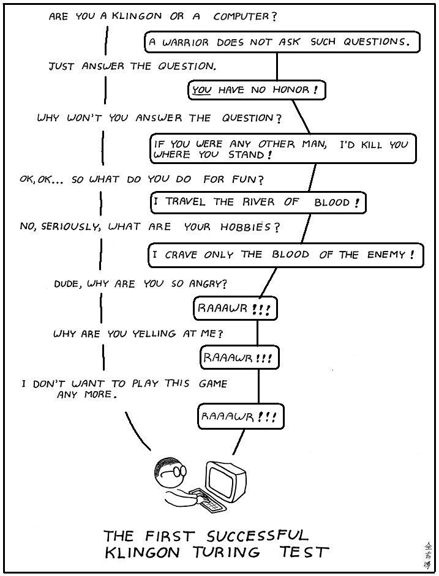
### Comment
The Wookiee Turing Test was even easier.
# Abstruse Goose Comic 54
## Fun with Statistics

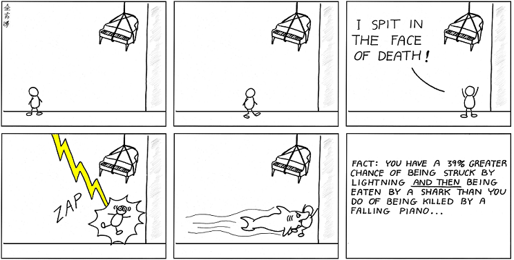
# Abstruse Goose Comic 55
## Fun with Statistics - Part 2

### Comment
This one is true.  Really.
# Abstruse Goose Comic 56
## Family Reunion

### Comment
Inspired by true events.
# Abstruse Goose Comic 57
## say what you mean

### Comment
Don't read too much into this comic.

I do love Star Trek, but during football season,

I bleed Eagles green!!!

# Abstruse Goose Comic 59
## All Good Things...

# Abstruse Goose Comic 60
## Free Pass

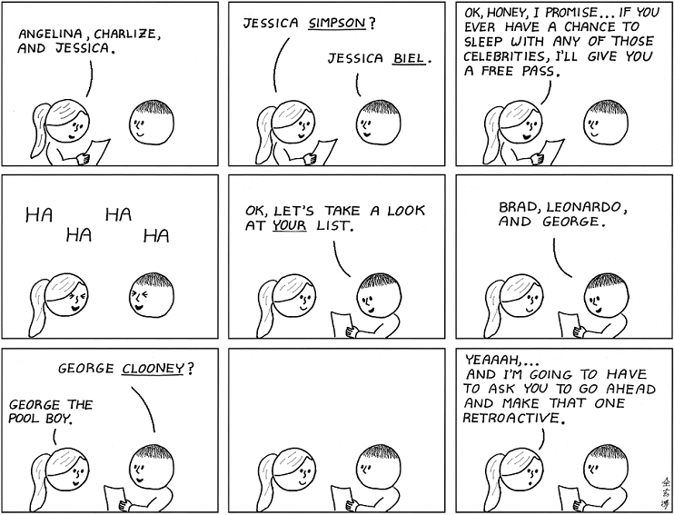
# Abstruse Goose Comic 61
## stop me if you've heard this one

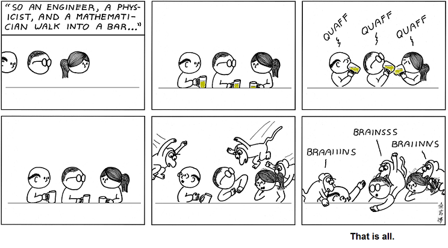
# Abstruse Goose Comic 62
## Science is Supercool

### Comment
Let's get one thing straight.  Aquaman <em>is</em> cool.

When I was little, I wanted to be Aquaman so I could talk to my goldfish.

But what about poor Scienceman?

He may be overly idealistic about the potential of science, but his heart is in the right place.

Unfortunately, he gets no respect.  But you <em>can</em> <a href="https://web.archive.org/web/20180119005817/http://cosmicvariance.com/2008/10/01/donorschoose-challenge/"><strong>help Scienceman</strong></a>.
# Abstruse Goose Comic 63
## NUM63R5

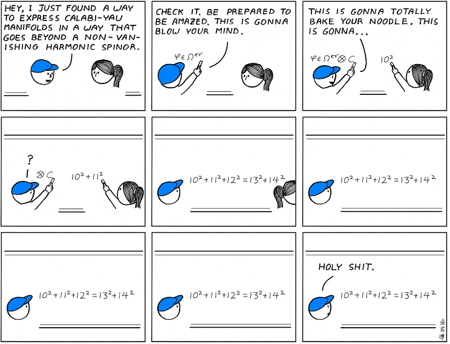
### Comment
It's always the simple things that get me.

OK, maybe you don't find that equation as fascinating as I do.

But I also get distracted by shiny objects and Wheel of Fortune.
# Abstruse Goose Comic 65
## The Cantor Madness

### Comment

<strong>Dangerous Knowledge</strong>

Part 1
<embed id="VideoPlayback" src="https://web.archive.org/web/20180220021236oe_/http://video.google.com/googleplayer.swf?docid=-8492625684649921614&amp;hl=en&amp;fs=true" style="width:400px;height:326px" allowfullscreen="true" allowscriptaccess="always" type="application/x-shockwave-flash"> </embed>

Part 2
<embed id="VideoPlayback" src="https://web.archive.org/web/20180220021236oe_/http://video.google.com/googleplayer.swf?docid=-1663091361786740235&amp;hl=en&amp;fs=true" style="width:400px;height:326px" allowfullscreen="true" allowscriptaccess="always" type="application/x-shockwave-flash"> </embed>
# Abstruse Goose Comic 66
## Cupcakes

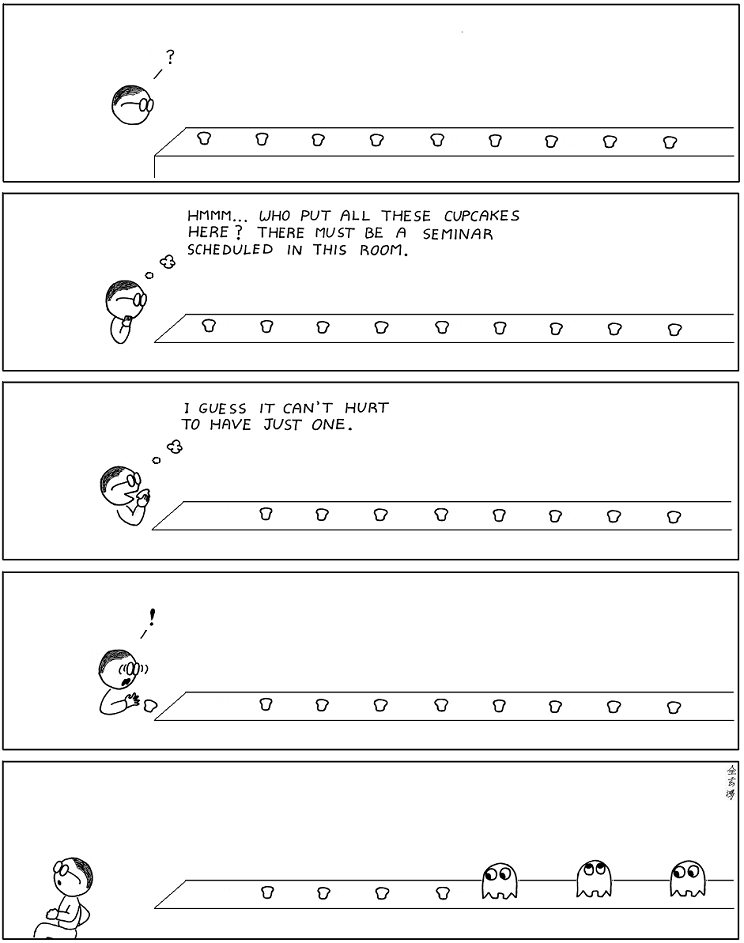
# Abstruse Goose Comic 67
## you're not as cool as you think

# Abstruse Goose Comic 68
## Darmok

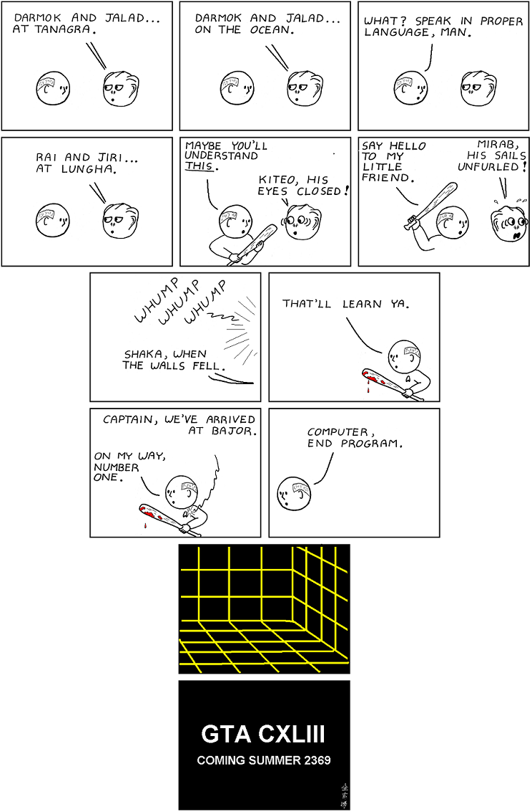
### Comment
I can't wait.
# Abstruse Goose Comic 69
## Blind Date - Part 3

### Comment
C'mon,... you know I wouldn't leave y'all hangin'.
# Abstruse Goose Comic 70
## I, Computer

# Abstruse Goose Comic 72
## The Belt Trick

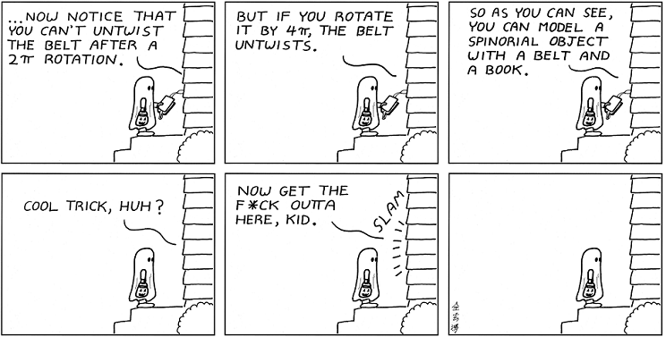
### Comment
Save money this Halloween.  Use the Belt Trick.
# Abstruse Goose Comic 73
## True Things

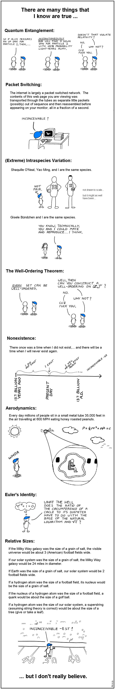
# Abstruse Goose Comic 74
## Schrödinger's (emotional) Miscalculation - Part 3

### Comment
I know that some of you would druther have seen it go <a href="https://web.archive.org/web/20180119013028/http://abstrusegoose.com/secretarchives/in-a-parallel-world" target="_blank">the other way</a>,... you sick bastards.
# Abstruse Goose Comic 76
## A Simple Puzzle

### Comment
This is the way I've always seen it in my head.
# Abstruse Goose Comic 79
## In the Beginning

### Comment
But until we figure it out, I'm going to imagine it however I want.
# Abstruse Goose Comic 80
## All You Zombies

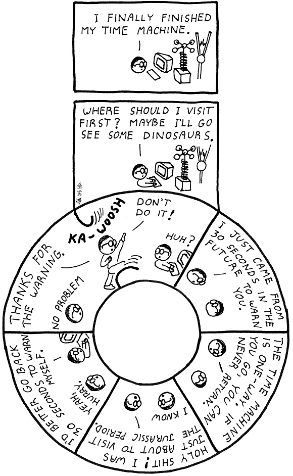
### Comment
People like us, who believe in physics, know that the distinction between past, present, and future is only a stubbornly persistent illusion.
# Abstruse Goose Comic 81
## Batteries Included

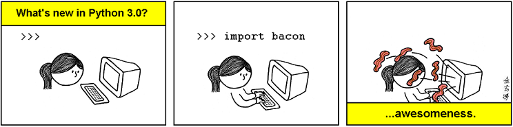
### Comment
In version 3.0, you don't Dive Into Python.  Python Dive Into you.
# Abstruse Goose Comic 84
## Hand Turkey

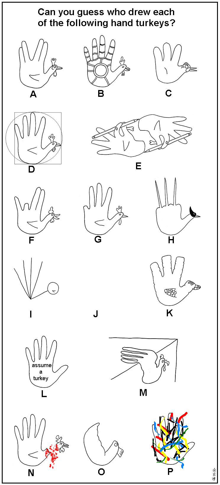
### Comment
To all my friends here in The States, I hope your Thanksgiving was free of incident.
# Abstruse Goose Comic 85
## The Mind of God

### Comment
What you are looking for is who is looking.
# Abstruse Goose Comic 86
## You're a Good Man...

# Abstruse Goose Comic 89
## The Purposeful Life

# Abstruse Goose Comic 90
## Gift Horse

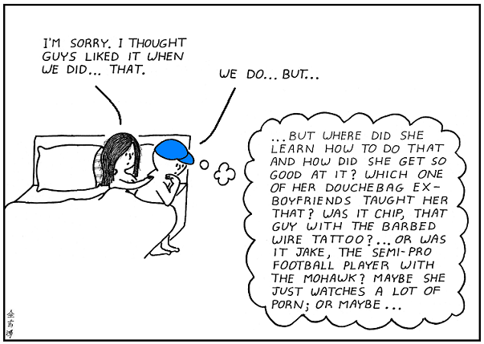
# Abstruse Goose Comic 91
## The Butterfly Effect

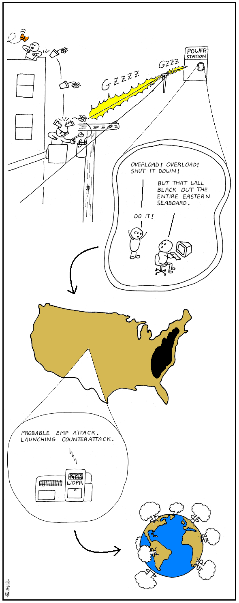
### Comment

<em>For want of a nail the shoe was lost.

For want of a shoe the horse was lost.

For want of a horse the rider was lost.

For want of a rider the battle was lost.

For want of a battle the kingdom was lost.

And all for the want of a horseshoe nail.</em>

# Abstruse Goose Comic 93
## Moment of Clarity

### Comment
Sure, I know you can do the math, but do you really understand it?
# Abstruse Goose Comic 94
## Holiday Tradition

### Comment
Happy Holidays, everyone!
# Abstruse Goose Comic 95
## Scientific Verification

# Abstruse Goose Comic 96
## ask a silly question...

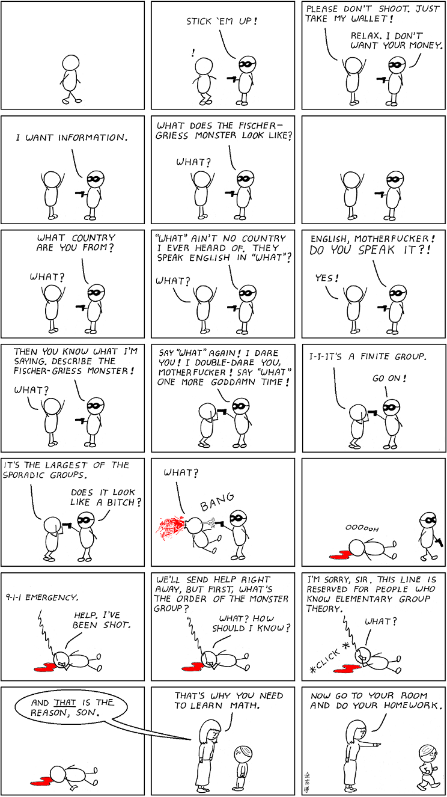
### Comment
...so the next time your kid asks you, "Why do I need to learn this stuff?",

do <a href="https://web.archive.org/web/20180119002544/http://abstrusegoose.com/secretarchives/psa" target="_blank"><strong>what any self-respecting parent would do</strong></a>...
# Abstruse Goose Comic 97
## Happy Zeno Year

### Comment
Happy New Year from Abstruse Goose!
# Abstruse Goose Comic 98
## Computer Programming 101

### Comment
Thank God some people <a href="https://web.archive.org/web/20180120113738/http://abstrusegoose.com/secretarchives/under-the-hood" target="_blank"><strong>don't need to see so far under the hood</strong></a>.
# Abstruse Goose Comic 99
## Lie of Omission

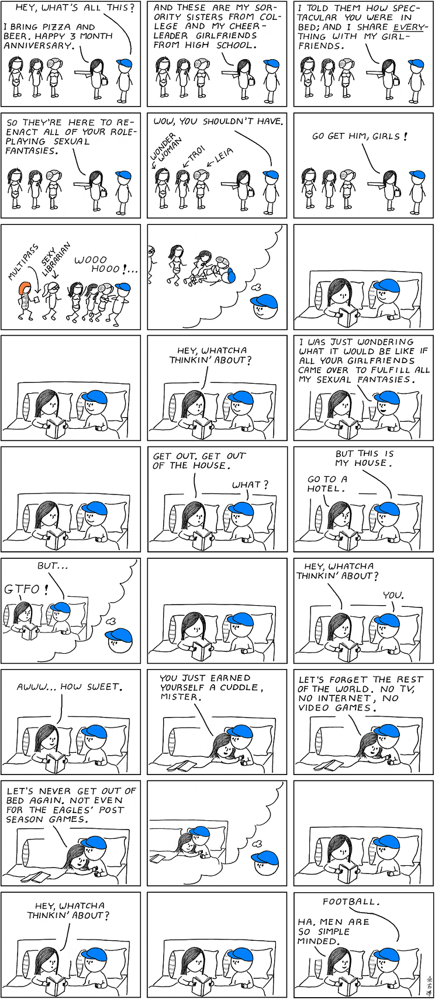
