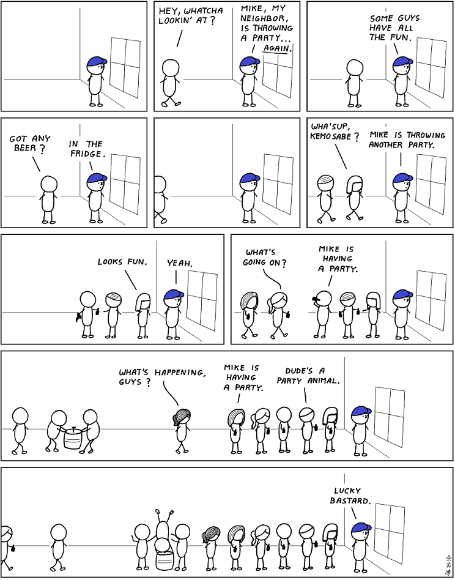
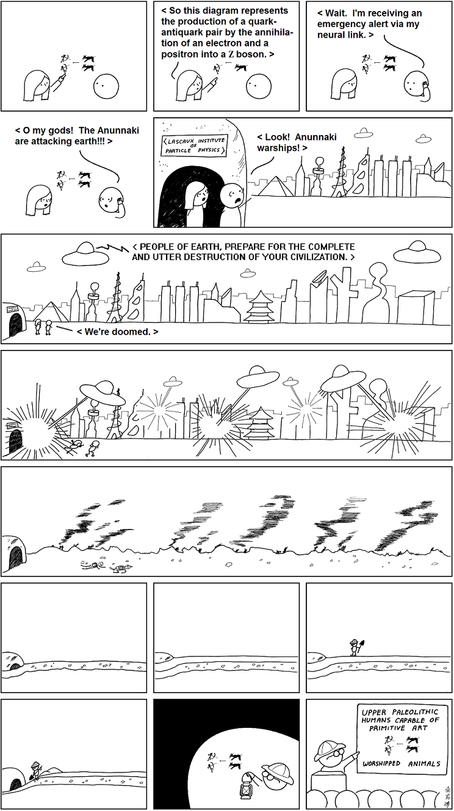

# Abstruse Goose Comic 500
## good idea

### Comment
Corollary: The most prolific people in the world suck 99% of the time.
# Abstruse Goose Comic 501
## Zarathustra

### Comment
And Zarathustra spake thus: MY GOD, WE'RE LIVING IN THE FUTURE!
# Abstruse Goose Comic 502
## Einstein

### Comment
But don't worry.  There are thousands of other Einsteins alive on Earth right now about whom you'll also know nothing.
# Abstruse Goose Comic 503
## BlooP and FlooP and GlooP

### Comment
If I finish reading half of a book before it falls into irrelevance, I consider that a great success.
# Abstruse Goose Comic 504
## Impure Mathematics

### Comment
There is no branch of mathematics, however abstract, which may not someday be applied to the phenomena of the real world. ---Nicolai Lobachevsky
# Abstruse Goose Comic 505
## The Parable of the Talents

### Comment
High five.
# Abstruse Goose Comic 506
## Penultimate Author

### Comment
...and reagent mixers.
# Abstruse Goose Comic 507
## The Story of the Cheese Maze

### Comment
And the rats loved those books even more.
# Abstruse Goose Comic 508
## alone in my room

### Comment
And attack ships on fire off the shoulder of Orion.
# Abstruse Goose Comic 509
## pseudonymous man of mystery

### Comment
I'm pretty sure that the real Satoshi Nakamoto would be a supreme disappointment compared to the image I've built up in my mind.
# Abstruse Goose Comic 510
## Lucasian Throne

### Comment
It took over a century before an accurate value of G was found.  Shit, experimentalists, get it together.
# Abstruse Goose Comic 511
## advanced class

### Comment
One night, I got badly drunk and the double slit experiment made perfect sense for one brief, glorious moment.
# Abstruse Goose Comic 512
## Master of the Universe

### Comment
I once tried feeling superior during a routine medical exam.  NOT POSSIBLE.
# Abstruse Goose Comic 513
## the purchase

### Comment
Feels good, man.
# Abstruse Goose Comic 514
## the party next door

### Comment
To paraphrase Alvy Singer paraphrasing Freud, I would never attend a party that would have somebody like me as a guest.
# Abstruse Goose Comic 515
## what men want

### Comment
Right now, someone at Cosmo is reading this comic and thinking 'Hey, some of those are pretty good ideas'.
# Abstruse Goose Comic 516
## the paragon of primates

### Comment
Alright, I'm not gonna deny it, monkey.  We are pretty awesome.
# Abstruse Goose Comic 517
## all in the family

### Comment
Me too, man.  Me too.
# Abstruse Goose Comic 518
## exclusive club

### Comment
You can still win the Abel Prize but, let's face it, that award is for losers, amarite?
# Abstruse Goose Comic 519
## in the stars

### Comment
Brahe's observations of the motions of the planets lead to Kepler's laws of planetary motion which eventually lead to Newton's laws of motion and universal gravitation which eventually lead to our landing on the moon.  The motions of the planets indeed influence human affairs.  Astrology is for real!
# Abstruse Goose Comic 521
## crowd out

# Abstruse Goose Comic 522
## artifact from the future

### Comment
When me imagine time reversed, Google Glass look like artifact from future.
# Abstruse Goose Comic 523
## Game of Thrones

### Comment
The Wars of the Roses + dragons and shit = Game of Thrones.
# Abstruse Goose Comic 524
## roMEo

### Comment
And make sure Juliet sees you in public with Rosaline... y'know, to make her jealous.  That's how it's done, saaan.
# Abstruse Goose Comic 525
## Site of the Mysteries

### Comment
What, why are you looking at me like that?  It's plausible.
# Abstruse Goose Comic 526
## The Time Traveler's Burden

### Comment
I grew up in America.  All of my heroes are dead white guys.  But that's just a coincidence.
# Abstruse Goose Comic 527
## one star

### Comment
Of course stupid is a subjective concept.  Use your own definition and go with it.
# Abstruse Goose Comic 528
## permissions

### Comment
I just want to be able to find my keys in the dark.  Fuck me, right?
# Abstruse Goose Comic 531
## shelf life

### Comment
I know that you think some of my books are out of order but you are wrong.
# Abstruse Goose Comic 532
## Photoshop CSI

### Comment
Get it?  Because on TV they always... never mind.
# Abstruse Goose Comic 533
## The Gloria Incident

### Comment
Persons attempting to find a motive in this comic will be prosecuted; persons attempting to find a moral in it will be banished; persons attempting to find a plot in it will be shot.
# Abstruse Goose Comic 534
## In the Neutral Zone - part 2

### Comment
This is what you get for hiring Ferengi software engineers to program the Enterprise's computer cores.
# Abstruse Goose Comic 535
## August 4

### Comment
Dear Diary.  Today I climbed a pyramid, pretended to be Tony Montana, and I broke my foot.  It was a good day.
# Abstruse Goose Comic 536
## 100 percent effective

### Comment
If you simply drop any packets that have a destination address, you should be alright.
# Abstruse Goose Comic 537
## Debunko Squad

# Abstruse Goose Comic 538
## GTA V

### Comment
This sentence may or may not have been written by your subconscious.
# Abstruse Goose Comic 539
## The Power of Flight

### Comment
Of course I could fly anywhere in the world too, so there's that.... yeah.
# Abstruse Goose Comic 541
## The Adventures of Flatman

### Comment
Sometimes I think that I'm surrounded by idiots everywhere.  Then I remind myself that that's exactly what an idiot would think.
# Abstruse Goose Comic 542
## amazing

### Comment
It can also potentially create a black hole that will destroy the earth.  That the probability of that happening is infinitesimal is just a technicality.
# Abstruse Goose Comic 543
## The Myriad Creatures of the Night

### Comment
Sorry I've been posting comics so infrequently lately but I've been very busy lately.........GETTING LAID!
# Abstruse Goose Comic 544
## subfield

### Comment
When I grow up, I want to be a cartoonist.  In other words, a mathematician.
# Abstruse Goose Comic 545
## Bizarro

### Comment
In the additive group of the integers, bizarro zero is... well... zero.
# Abstruse Goose Comic 547
## my pet bunny

### Comment
Not a metaphor for my relationship with women.
# Abstruse Goose Comic 548
## the rules of physics

### Comment
My internalized road rage results in some pretty strange justice fantasies.
# Abstruse Goose Comic 549
## Glorious Accident

### Comment
God doesn't make mistakes, just glorious little accidents.
# Abstruse Goose Comic 500
## good idea

### Comment
Corollary: The most prolific people in the world suck 99% of the time.
# Abstruse Goose Comic 501
## Zarathustra

### Comment
And Zarathustra spake thus: MY GOD, WE'RE LIVING IN THE FUTURE!
# Abstruse Goose Comic 502
## Einstein

### Comment
But don't worry.  There are thousands of other Einsteins alive on Earth right now about whom you'll also know nothing.
# Abstruse Goose Comic 503
## BlooP and FlooP and GlooP

### Comment
If I finish reading half of a book before it falls into irrelevance, I consider that a great success.
# Abstruse Goose Comic 504
## Impure Mathematics

### Comment
There is no branch of mathematics, however abstract, which may not someday be applied to the phenomena of the real world. ---Nicolai Lobachevsky
# Abstruse Goose Comic 505
## The Parable of the Talents

### Comment
High five.
# Abstruse Goose Comic 506
## Penultimate Author

### Comment
...and reagent mixers.
# Abstruse Goose Comic 507
## The Story of the Cheese Maze

### Comment
And the rats loved those books even more.
# Abstruse Goose Comic 508
## alone in my room

### Comment
And attack ships on fire off the shoulder of Orion.
# Abstruse Goose Comic 509
## pseudonymous man of mystery

### Comment
I'm pretty sure that the real Satoshi Nakamoto would be a supreme disappointment compared to the image I've built up in my mind.
# Abstruse Goose Comic 510
## Lucasian Throne

### Comment
It took over a century before an accurate value of G was found.  Shit, experimentalists, get it together.
# Abstruse Goose Comic 511
## advanced class

### Comment
One night, I got badly drunk and the double slit experiment made perfect sense for one brief, glorious moment.
# Abstruse Goose Comic 512
## Master of the Universe

### Comment
I once tried feeling superior during a routine medical exam.  NOT POSSIBLE.
# Abstruse Goose Comic 513
## the purchase

### Comment
Feels good, man.
# Abstruse Goose Comic 514
## the party next door

### Comment
To paraphrase Alvy Singer paraphrasing Freud, I would never attend a party that would have somebody like me as a guest.
# Abstruse Goose Comic 515
## what men want

### Comment
Right now, someone at Cosmo is reading this comic and thinking 'Hey, some of those are pretty good ideas'.
# Abstruse Goose Comic 516
## the paragon of primates

### Comment
Alright, I'm not gonna deny it, monkey.  We are pretty awesome.
# Abstruse Goose Comic 517
## all in the family

### Comment
Me too, man.  Me too.
# Abstruse Goose Comic 518
## exclusive club

### Comment
You can still win the Abel Prize but, let's face it, that award is for losers, amarite?
# Abstruse Goose Comic 519
## in the stars

### Comment
Brahe's observations of the motions of the planets lead to Kepler's laws of planetary motion which eventually lead to Newton's laws of motion and universal gravitation which eventually lead to our landing on the moon.  The motions of the planets indeed influence human affairs.  Astrology is for real!
# Abstruse Goose Comic 521
## crowd out

# Abstruse Goose Comic 522
## artifact from the future

### Comment
When me imagine time reversed, Google Glass look like artifact from future.
# Abstruse Goose Comic 523
## Game of Thrones

### Comment
The Wars of the Roses + dragons and shit = Game of Thrones.
# Abstruse Goose Comic 524
## roMEo

### Comment
And make sure Juliet sees you in public with Rosaline... y'know, to make her jealous.  That's how it's done, saaan.
# Abstruse Goose Comic 525
## Site of the Mysteries

### Comment
What, why are you looking at me like that?  It's plausible.
# Abstruse Goose Comic 526
## The Time Traveler's Burden

### Comment
I grew up in America.  All of my heroes are dead white guys.  But that's just a coincidence.
# Abstruse Goose Comic 527
## one star

### Comment
Of course stupid is a subjective concept.  Use your own definition and go with it.
# Abstruse Goose Comic 528
## permissions

### Comment
I just want to be able to find my keys in the dark.  Fuck me, right?
# Abstruse Goose Comic 531
## shelf life

### Comment
I know that you think some of my books are out of order but you are wrong.
# Abstruse Goose Comic 532
## Photoshop CSI

### Comment
Get it?  Because on TV they always... never mind.
# Abstruse Goose Comic 533
## The Gloria Incident

### Comment
Persons attempting to find a motive in this comic will be prosecuted; persons attempting to find a moral in it will be banished; persons attempting to find a plot in it will be shot.
# Abstruse Goose Comic 534
## In the Neutral Zone - part 2

### Comment
This is what you get for hiring Ferengi software engineers to program the Enterprise's computer cores.
# Abstruse Goose Comic 535
## August 4

### Comment
Dear Diary.  Today I climbed a pyramid, pretended to be Tony Montana, and I broke my foot.  It was a good day.
# Abstruse Goose Comic 536
## 100 percent effective

### Comment
If you simply drop any packets that have a destination address, you should be alright.
# Abstruse Goose Comic 537
## Debunko Squad

# Abstruse Goose Comic 538
## GTA V

### Comment
This sentence may or may not have been written by your subconscious.
# Abstruse Goose Comic 539
## The Power of Flight

### Comment
Of course I could fly anywhere in the world too, so there's that.... yeah.
# Abstruse Goose Comic 541
## The Adventures of Flatman

### Comment
Sometimes I think that I'm surrounded by idiots everywhere.  Then I remind myself that that's exactly what an idiot would think.
# Abstruse Goose Comic 542
## amazing

### Comment
It can also potentially create a black hole that will destroy the earth.  That the probability of that happening is infinitesimal is just a technicality.
# Abstruse Goose Comic 543
## The Myriad Creatures of the Night

### Comment
Sorry I've been posting comics so infrequently lately but I've been very busy lately.........GETTING LAID!
# Abstruse Goose Comic 544
## subfield

### Comment
When I grow up, I want to be a cartoonist.  In other words, a mathematician.
# Abstruse Goose Comic 545
## Bizarro

### Comment
In the additive group of the integers, bizarro zero is... well... zero.
# Abstruse Goose Comic 547
## my pet bunny

### Comment
Not a metaphor for my relationship with women.
# Abstruse Goose Comic 548
## the rules of physics

### Comment
My internalized road rage results in some pretty strange justice fantasies.
# Abstruse Goose Comic 549
## Glorious Accident

### Comment
God doesn't make mistakes, just glorious little accidents.
