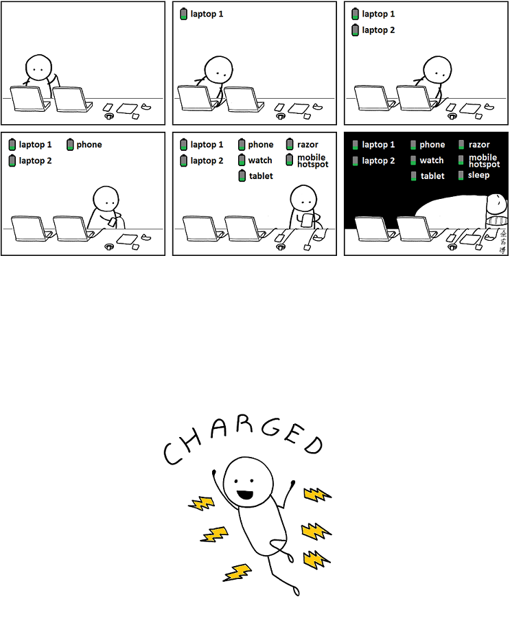
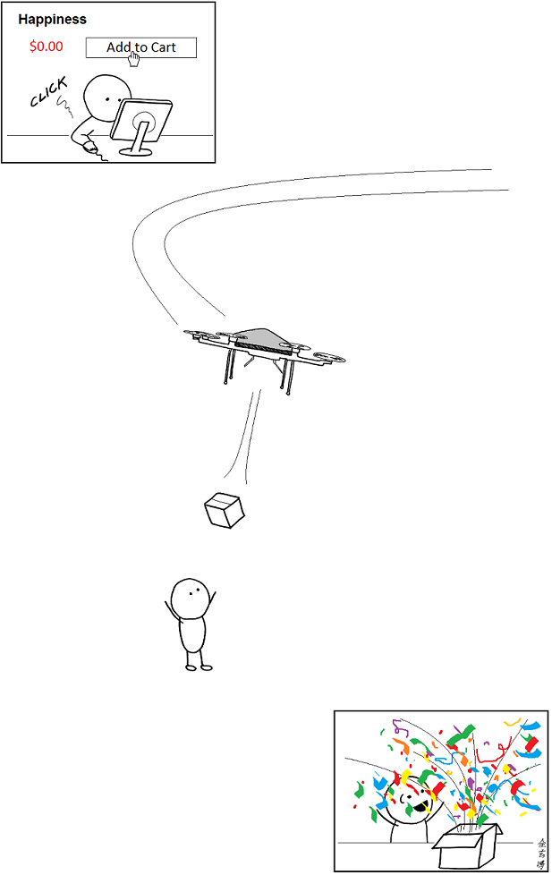
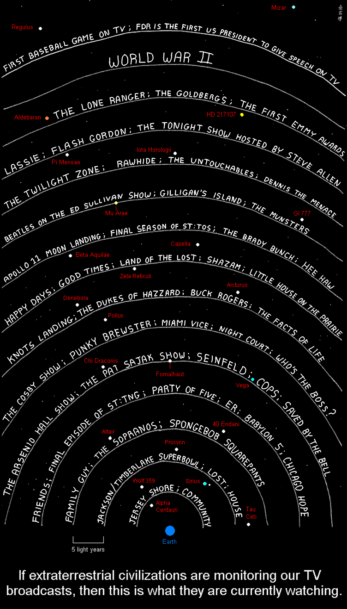
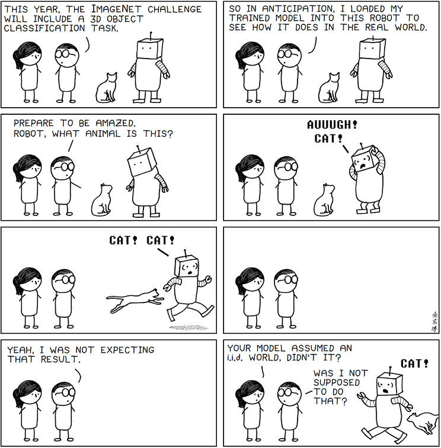
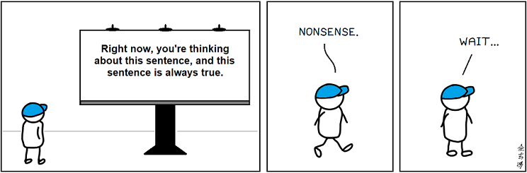

# Abstruse Goose Comic 550
## third date

### Comment
It's a good thing I'm so pretty.
# Abstruse Goose Comic 551
## the underworld

### Comment
*applauds*
# Abstruse Goose Comic 552
## Astronaut Barbie

### Comment
Statistically, I have a better chance of becoming a supermodel than I do of becoming an astronaut.
# Abstruse Goose Comic 553
## The Too Much Information Age

### Comment
I recently had smart gas, electric, and water meters installed.  My loss of privacy is now complete.
# Abstruse Goose Comic 554
## Being and Nothingness

### Comment
Nothing is not all it's cracked up to be.
# Abstruse Goose Comic 555
## Billionaire

### Comment
I am an infinity-aire.
# Abstruse Goose Comic 556
## The Game - part 2

### Comment
Every game is won before it is ever played.
# Abstruse Goose Comic 557
## pitchforks

### Comment
Nothing ruins a good protest like too much early success.
# Abstruse Goose Comic 558
## undefeated

### Comment
With great lack of perceiving sarcasm comes great lack of responsibility.
# Abstruse Goose Comic 559
## the view

### Comment
And that's when I shot it, Your Honor.
# Abstruse Goose Comic 560
## Guitar Code Hero

### Comment
While My Keyboard Gently Weeps
# Abstruse Goose Comic 561
## Electric Man

### Comment
When I forget to charge my phone at night, my existence feels incomplete in the morning.
# Abstruse Goose Comic 562
## Happiness

### Comment
I requested 5-day shipping, but Amazon upgraded me to 2-day shipping for free.  Without my permission.  Bastards.
# Abstruse Goose Comic 563
## The Robot Apocalypse

### Comment
I am not a smart man, but I know what irony is.
# Abstruse Goose Comic 564
## Quantum Secrets

### Comment
If you can't teach quantum physics to a 5-year-old, then you do not know the secret.
# Abstruse Goose Comic 565
## phantom internet

### Comment
...because it's really starting to freak me out.
# Abstruse Goose Comic 566
## The COLLOM

### Comment
When I can no longer satisfy the COLLOM with my income, I just feed it my hopes and dreams.
# Abstruse Goose Comic 567
## Electromagnetic Leak (update 2014)

# Abstruse Goose Comic 569
## just a theory

### Comment
When I am puzzled by people's behavior, I always choose to interpret it in a way that gives me the greatest faith in humanity.
# Abstruse Goose Comic 570
## Late Night Thoughts on Listening to Mahler's Tenth Symphony

### Comment
Somebody please do this and post it on YouTube so I can live vicariously through your awesomeness.
# Abstruse Goose Comic 571
## the greatest engineer

### Comment
Getting hit in the nuts hurts a lot more than getting hit in the head. Conclusion: Evolution thinks that your nuts are more important than your brain.  I agree with evolution.
# Abstruse Goose Comic 572
## Homo sapien sapien sapien

### Comment
And also when I look at pictures of what people wore in the 70s, ...
# Abstruse Goose Comic 575
## The Sudokomic Game

### Comment
This is the best I could do on short notice.
# Abstruse Goose Comic 576
## Prime Starfighter

[Link to game](https://web.archive.org/web/20231205154239/https://abstrusegoose.com/576)
### Comment

(support creators who make stuff for free)
# Abstruse Goose Comic 577
## Prime Porkour

[game](https://web.archive.org/web/20231204131817/https://abstrusegoose.com/577)
### Comment
I would consider a score of 3000 to be good. 6000 is superb. If you can finish this game, 
you are superhuman!

(support creators who make stuff for free)
# Abstruse Goose Comic 578
## Karpathy's Basilisk

[game](https://web.archive.org/web/20231202045216/https://abstrusegoose.com/578)

### Comment
And that's my story... and my warning.

I hope the code wasn't too buggy. It was a rush job.

Actually, many of you really have been asking where I've been. It's kind of a long story. I never really planned to stop updating this site but sometimes life just happens.

Anyway, now that I'm able to get back into the grind, I will be posting again. I probably won't be updating on a regular schedule (not right away anyway) but I will post when I can, so check back once in a while.

In the meantime, <strong><a href="https://web.archive.org/web/20180203193852/http://abstrusegoose.com/feedthegoose">remember to feed the goose</a></strong> to help keep me alive (literally).

Stay awesome.

GO EAGLES!

# Abstruse Goose Comic 579
## The Measurement Problem

### Comment
Now I am become Measuring Apparatus, the collapser of wave functions.
# Abstruse Goose Comic 580
## Karpathy's Basilisk Reloaded

[game](https://web.archive.org/web/20231202045216/https://abstrusegoose.com/580)
### Comment
Since y'all seemed to like <a href="https://web.archive.org/web/20180302071103/http://abstrusegoose.com/578" target="_blank">Karpathy's Basilisk</a> I thought you might appreciate pitting your skills against the real thing. So over the weekend I became an 'expert' in Deep Reinforcement Learning (r/iamverysmart) and trained the basilisk minion to destroy your ass. Originally I tried training an agent to learn to play the <a href="https://web.archive.org/web/20180302071103/http://abstrusegoose.com/577" target="_blank">Prime Porkour game</a>. However, while it was learning to identify prime numbers, it accidentally discovered a polynomial-time factoring algorithm and if I ever released it to the public it would render useless 98.7 percent of the most popular cryptosystems in widespread use today and civilization as we know it would collapse. That's too much responsibility for me.

To train the minion, I used a <a href="https://web.archive.org/web/20180302071103/https://cs.stanford.edu/people/karpathy/reinforcejs/" target="_blank">Reinforcement Learning library</a> written by (you guessed it) <a href="https://web.archive.org/web/20180302071103/https://twitter.com/karpathy" target="_blank">@karpathy</a> so, in a sense, you really are battling against Karpathy's Basilisk. The library is actually written in JavaScript. JavaScript! That's just... obscene. At least it's certainly not the way God intended it, but it seems to work well enough (as in it trains reasonably quickly i.e. it literally trained while I ate dinner).

The minion was trained with a method called Deep Q Learning which, some of you may recall, was popularized in 2013 (ancient history in machine learning time) when some crazy-awesome people used it to train an agent <a href="https://web.archive.org/web/20180302071103/https://arxiv.org/abs/1312.5602" target="_blank">to play Atari games</a> using the game's raw pixels as input. However, the basilisk minion isn't quite that sophisticated. It was trained against a dummy player that just mindlessly moved towards the package. It observed its own position and velocity, the position and velocity of the player, and the position of the package. It was rewarded for minimizing the distance between itself and the player and it received a bonus for capturing the player. It was penalized if the player was able to acquire the package.

Since the minion was trained against a mindless drone, it's pretty easy to confuse it sometimes by simpy making some random moves. However, if you took the time to play around with some of the parameters and stuff, I'm pretty sure that you could create an unbeatable minion. But what fun is that?

PS: Thank you for all the variants of pi and e. Y'all know who you are. :)

# Abstruse Goose Comic 581
## Cosmic Backyard

### Comment
Remember to look up at the stars and not down at your feet (and lock your back door). -- Stephen Hawking (sort of)
# Abstruse Goose Comic 582
## side bae

### Comment
It's okay to love (hate) 'em both.
# Abstruse Goose Comic 583
## The $25,000,000,000,000 Matrix

### Comment
There are a lot of very smart people with fancy academic degrees working in AI using a lot of fancy math. But somewhere some lone hacker in his/her bedroom knows something deceptively simple that you don't know.
# Abstruse Goose Comic 584
## The Naked Intellect

### Comment
The Devil's most generous act was giving humanity the ability to banish Him from the garden.
# Abstruse Goose Comic 585
## A Tale of One City

### Comment
Music from La La Land planetarium scene plays...
# Abstruse Goose Comic 586
## The Long Journey of Elon Musk

### Comment
I'm convinced that ninety percent of reddit really believe the theory that Elon Musk is an alien stranded on Earth just trying to get back home.
# Abstruse Goose Comic 587
## day-tight compartment

# Abstruse Goose Comic 588
## black magic

### Comment
These results are quite spectacular, DeepMind. But are you trying to get people to suspect that you're a coven of witches? Because that's how you get people to suspect that you're a coven of witches.
# Abstruse Goose Comic 589
## Flight of the Good Idea

### Comment
I write jokes for a living, man. See I sit in my hotel at night, I think of something that's funny and then I go get a pen and I write it down. Or if the pen's too far away, I have to convince myself that what I thought of ain't funny. --Mitch Hedberg
# Abstruse Goose Comic 590
## ...to build a better mousetrap

### Comment
This question already has an answer here: How Do I Grow a Venus Flytrap?
# Abstruse Goose Comic 591
## all models are wrong

### Comment
I've been studying machine learning and I'm pretty sure the world is i.i.d.
# Abstruse Goose Comic 592
## the daily news

### Comment
This timeline has gotten just a little bit too weird. Who's coming with me?
# Abstruse Goose Comic 593
## always true

### Comment
...whether you're thinking about this sentence or not.
# Abstruse Goose Comic 594
## sandbox

### Comment
How sure are you that this hasn't already happened? 100 percent? Yeah, me too.
# Abstruse Goose Comic 595
## sandbox - part 2

### Comment
Part three of this comic is left as an exercise for the reader.
# Abstruse Goose Comic 596
## The G O O D B O Y E Dilemma

### Comment
When I was growing up, I always wanted to be considered fearsome like a lion but, apparently, I'm just cute like a puppy. I've learned to live with it.
# Abstruse Goose Comic 597
## witch hunt

### Comment
The Phantom Tollbooth is NOT a children's book. Change my mind.
# Abstruse Goose Comic 598
## patently...

### Comment
All your convnet are belong to me.
# Abstruse Goose Comic 599
## wine fraud

### Comment
Is it wine? Then, yes, that will do nicely. Thank you.
# Abstruse Goose Comic 550
## third date

### Comment
It's a good thing I'm so pretty.
# Abstruse Goose Comic 551
## the underworld

### Comment
*applauds*
# Abstruse Goose Comic 552
## Astronaut Barbie

### Comment
Statistically, I have a better chance of becoming a supermodel than I do of becoming an astronaut.
# Abstruse Goose Comic 553
## The Too Much Information Age

### Comment
I recently had smart gas, electric, and water meters installed.  My loss of privacy is now complete.
# Abstruse Goose Comic 554
## Being and Nothingness

### Comment
Nothing is not all it's cracked up to be.
# Abstruse Goose Comic 555
## Billionaire

### Comment
I am an infinity-aire.
# Abstruse Goose Comic 556
## The Game - part 2

### Comment
Every game is won before it is ever played.
# Abstruse Goose Comic 557
## pitchforks

### Comment
Nothing ruins a good protest like too much early success.
# Abstruse Goose Comic 558
## undefeated

### Comment
With great lack of perceiving sarcasm comes great lack of responsibility.
# Abstruse Goose Comic 559
## the view

### Comment
And that's when I shot it, Your Honor.
# Abstruse Goose Comic 560
## Guitar Code Hero

### Comment
While My Keyboard Gently Weeps
# Abstruse Goose Comic 561
## Electric Man

### Comment
When I forget to charge my phone at night, my existence feels incomplete in the morning.
# Abstruse Goose Comic 562
## Happiness

### Comment
I requested 5-day shipping, but Amazon upgraded me to 2-day shipping for free.  Without my permission.  Bastards.
# Abstruse Goose Comic 563
## The Robot Apocalypse

### Comment
I am not a smart man, but I know what irony is.
# Abstruse Goose Comic 564
## Quantum Secrets

### Comment
If you can't teach quantum physics to a 5-year-old, then you do not know the secret.
# Abstruse Goose Comic 565
## phantom internet

### Comment
...because it's really starting to freak me out.
# Abstruse Goose Comic 566
## The COLLOM

### Comment
When I can no longer satisfy the COLLOM with my income, I just feed it my hopes and dreams.
# Abstruse Goose Comic 567
## Electromagnetic Leak (update 2014)

# Abstruse Goose Comic 569
## just a theory

### Comment
When I am puzzled by people's behavior, I always choose to interpret it in a way that gives me the greatest faith in humanity.
# Abstruse Goose Comic 570
## Late Night Thoughts on Listening to Mahler's Tenth Symphony

### Comment
Somebody please do this and post it on YouTube so I can live vicariously through your awesomeness.
# Abstruse Goose Comic 571
## the greatest engineer

### Comment
Getting hit in the nuts hurts a lot more than getting hit in the head. Conclusion: Evolution thinks that your nuts are more important than your brain.  I agree with evolution.
# Abstruse Goose Comic 572
## Homo sapien sapien sapien

### Comment
And also when I look at pictures of what people wore in the 70s, ...
# Abstruse Goose Comic 575
## The Sudokomic Game

### Comment
This is the best I could do on short notice.
# Abstruse Goose Comic 576
## Prime Starfighter

[Link to game](https://web.archive.org/web/20231205154239/https://abstrusegoose.com/576)
### Comment

(support creators who make stuff for free)
# Abstruse Goose Comic 577
## Prime Porkour

[game](https://web.archive.org/web/20231204131817/https://abstrusegoose.com/577)
### Comment
I would consider a score of 3000 to be good. 6000 is superb. If you can finish this game, 
you are superhuman!

(support creators who make stuff for free)
# Abstruse Goose Comic 578
## Karpathy's Basilisk

[game](https://web.archive.org/web/20231202045216/https://abstrusegoose.com/578)

### Comment
And that's my story... and my warning.

I hope the code wasn't too buggy. It was a rush job.

Actually, many of you really have been asking where I've been. It's kind of a long story. I never really planned to stop updating this site but sometimes life just happens.

Anyway, now that I'm able to get back into the grind, I will be posting again. I probably won't be updating on a regular schedule (not right away anyway) but I will post when I can, so check back once in a while.

In the meantime, <strong><a href="https://web.archive.org/web/20180203193852/http://abstrusegoose.com/feedthegoose">remember to feed the goose</a></strong> to help keep me alive (literally).

Stay awesome.

GO EAGLES!

# Abstruse Goose Comic 579
## The Measurement Problem

### Comment
Now I am become Measuring Apparatus, the collapser of wave functions.
# Abstruse Goose Comic 580
## Karpathy's Basilisk Reloaded

[game](https://web.archive.org/web/20231202045216/https://abstrusegoose.com/580)
### Comment
Since y'all seemed to like <a href="https://web.archive.org/web/20180302071103/http://abstrusegoose.com/578" target="_blank">Karpathy's Basilisk</a> I thought you might appreciate pitting your skills against the real thing. So over the weekend I became an 'expert' in Deep Reinforcement Learning (r/iamverysmart) and trained the basilisk minion to destroy your ass. Originally I tried training an agent to learn to play the <a href="https://web.archive.org/web/20180302071103/http://abstrusegoose.com/577" target="_blank">Prime Porkour game</a>. However, while it was learning to identify prime numbers, it accidentally discovered a polynomial-time factoring algorithm and if I ever released it to the public it would render useless 98.7 percent of the most popular cryptosystems in widespread use today and civilization as we know it would collapse. That's too much responsibility for me.

To train the minion, I used a <a href="https://web.archive.org/web/20180302071103/https://cs.stanford.edu/people/karpathy/reinforcejs/" target="_blank">Reinforcement Learning library</a> written by (you guessed it) <a href="https://web.archive.org/web/20180302071103/https://twitter.com/karpathy" target="_blank">@karpathy</a> so, in a sense, you really are battling against Karpathy's Basilisk. The library is actually written in JavaScript. JavaScript! That's just... obscene. At least it's certainly not the way God intended it, but it seems to work well enough (as in it trains reasonably quickly i.e. it literally trained while I ate dinner).

The minion was trained with a method called Deep Q Learning which, some of you may recall, was popularized in 2013 (ancient history in machine learning time) when some crazy-awesome people used it to train an agent <a href="https://web.archive.org/web/20180302071103/https://arxiv.org/abs/1312.5602" target="_blank">to play Atari games</a> using the game's raw pixels as input. However, the basilisk minion isn't quite that sophisticated. It was trained against a dummy player that just mindlessly moved towards the package. It observed its own position and velocity, the position and velocity of the player, and the position of the package. It was rewarded for minimizing the distance between itself and the player and it received a bonus for capturing the player. It was penalized if the player was able to acquire the package.

Since the minion was trained against a mindless drone, it's pretty easy to confuse it sometimes by simpy making some random moves. However, if you took the time to play around with some of the parameters and stuff, I'm pretty sure that you could create an unbeatable minion. But what fun is that?

PS: Thank you for all the variants of pi and e. Y'all know who you are. :)

# Abstruse Goose Comic 581
## Cosmic Backyard

### Comment
Remember to look up at the stars and not down at your feet (and lock your back door). -- Stephen Hawking (sort of)
# Abstruse Goose Comic 582
## side bae

### Comment
It's okay to love (hate) 'em both.
# Abstruse Goose Comic 583
## The $25,000,000,000,000 Matrix

### Comment
There are a lot of very smart people with fancy academic degrees working in AI using a lot of fancy math. But somewhere some lone hacker in his/her bedroom knows something deceptively simple that you don't know.
# Abstruse Goose Comic 584
## The Naked Intellect

### Comment
The Devil's most generous act was giving humanity the ability to banish Him from the garden.
# Abstruse Goose Comic 585
## A Tale of One City

### Comment
Music from La La Land planetarium scene plays...
# Abstruse Goose Comic 586
## The Long Journey of Elon Musk

### Comment
I'm convinced that ninety percent of reddit really believe the theory that Elon Musk is an alien stranded on Earth just trying to get back home.
# Abstruse Goose Comic 587
## day-tight compartment

# Abstruse Goose Comic 588
## black magic

### Comment
These results are quite spectacular, DeepMind. But are you trying to get people to suspect that you're a coven of witches? Because that's how you get people to suspect that you're a coven of witches.
# Abstruse Goose Comic 589
## Flight of the Good Idea

### Comment
I write jokes for a living, man. See I sit in my hotel at night, I think of something that's funny and then I go get a pen and I write it down. Or if the pen's too far away, I have to convince myself that what I thought of ain't funny. --Mitch Hedberg
# Abstruse Goose Comic 590
## ...to build a better mousetrap

### Comment
This question already has an answer here: How Do I Grow a Venus Flytrap?
# Abstruse Goose Comic 591
## all models are wrong

### Comment
I've been studying machine learning and I'm pretty sure the world is i.i.d.
# Abstruse Goose Comic 592
## the daily news

### Comment
This timeline has gotten just a little bit too weird. Who's coming with me?
# Abstruse Goose Comic 593
## always true

### Comment
...whether you're thinking about this sentence or not.
# Abstruse Goose Comic 594
## sandbox

### Comment
How sure are you that this hasn't already happened? 100 percent? Yeah, me too.
# Abstruse Goose Comic 595
## sandbox - part 2

### Comment
Part three of this comic is left as an exercise for the reader.
# Abstruse Goose Comic 596
## The G O O D B O Y E Dilemma

### Comment
When I was growing up, I always wanted to be considered fearsome like a lion but, apparently, I'm just cute like a puppy. I've learned to live with it.
# Abstruse Goose Comic 597
## witch hunt

### Comment
The Phantom Tollbooth is NOT a children's book. Change my mind.
# Abstruse Goose Comic 598
## patently...

### Comment
All your convnet are belong to me.
# Abstruse Goose Comic 599
## wine fraud

### Comment
Is it wine? Then, yes, that will do nicely. Thank you.
